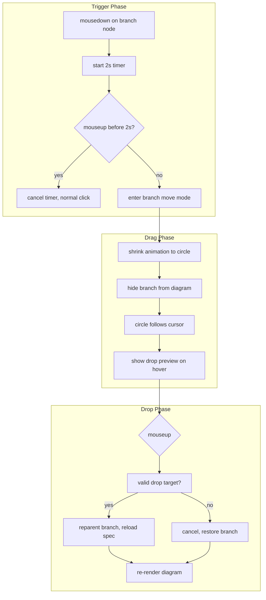

# Branch/Node Drag-and-Drop Implementation Plan

## Current Architecture Summary

- **Rendering**: Vue Flow (DOM-based) in [DiagramCanvas.vue](frontend/src/components/diagram/DiagramCanvas.vue)
- **Data**: [diagram.ts](frontend/src/stores/diagram.ts) store with `data.nodes` and `data.connections`
- **Mind map**: Nodes have `draggable: false` already; spec uses `leftBranches`/`rightBranches` (MindMapBranch tree)
- **Existing ops**: `removeMindMapNodes`, `addMindMapChild`, `findBranchByNodeId` in [mindMap.ts](frontend/src/stores/specLoader/mindMap.ts)

## Scope

**Phase 1**: Mind map only (branch = subtree). Other diagram types (tree map, brace map, concept map) can be extended later using similar patterns.

---

## Implementation Flow




---

## Key Components to Create/Modify

### 1. Composable: `useBranchMoveDrag.ts`

New composable to encapsulate the drag logic:

- **State**: `branchMoveState: { active, draggedNodeId, draggedBranch, cursorPos, dropTarget }`
- **Long-press**: `onNodeMouseDown` starts 2s timer; `onNodeMouseUp` cancels if before 2s
- **Timer**: Use `setTimeout`; clear on mouseup/mouseleave
- **Global listeners**: On 2s fire: add `mousemove`/`mouseup` to `document` (capture phase) so drag continues even if cursor leaves node
- **Cleanup**: Remove listeners on mouseup, reset state

**Conflict prevention**: Mind map nodes already have `draggable: false`, so no Vue Flow drag conflict. For other diagram types (future), we would need to conditionally disable Vue Flow drag when our mode is active.

### 2. Diagram Store: `moveMindMapBranch(branchNodeId, targetType, targetId?)`

New action in [diagram.ts](frontend/src/stores/diagram.ts):

- Use `nodesAndConnectionsToMindMapSpec` + `findBranchByNodeId` to get branch and parent
- Remove branch from `parentArray` (splice)
- Insert at new location:
  - **As child of X**: `targetType: 'child'`, `targetId: parentNodeId` → push to `found.branch.children`
  - **As sibling before/after X**: `targetType: 'sibling'`, `targetId`, `index` → insert into parent array
  - **As top-level**: `targetType: 'topic'` → add to leftBranches or rightBranches based on drop position
- Call `loadMindMapSpec` with updated spec
- Clear `_customPositions` and `_node_styles` (all IDs changed)
- Clear `selectedNodes`
- `pushHistory('Move branch')`

Leverage existing `findBranchByNodeId` and the splice logic from `removeMindMapNodes`.

### 2b. Store and ID Cleanup (Important)

When we call `loadMindMapSpec`, it regenerates **all** node IDs (`branch-{r|l}-{depth}-{globalIndex}`). Every node gets a new ID because the tree structure changed. We must clean up ID-keyed data:


| Store / Data                     | Action                                                                                                                        |
| -------------------------------- | ----------------------------------------------------------------------------------------------------------------------------- |
| `data.nodes`, `data.connections` | Replaced by `loadMindMapSpec` result                                                                                          |
| `data._customPositions`          | Clear entirely (`= {}`) — old IDs are orphaned; mind map has `draggable: false` so this is usually empty                      |
| `data._node_styles`              | Clear entirely — old IDs are orphaned; user loses per-node style overrides on move (acceptable tradeoff)                      |
| `selectedNodes`                  | Clear (`= []`) — old IDs no longer exist                                                                                      |
| `inlineRecommendations`          | Optional: call `invalidateForNode` for old IDs before move to avoid orphaned entries; or leave as-is (orphaned data harmless) |
| History                          | `pushHistory('Move branch')` with new state — already in flow                                                                 |


**No changes needed**: `llmResults` (no node IDs), `conceptMapRelationship` (mind map doesn't use it). Node IDs are internal to the diagram; no other stores depend on stable IDs across a move.

### 3. Drop Target Detection

- **Topic node**: Valid drop → top-level branch. Use topic bounds + cursor position to decide left vs right.
- **Branch node**: Valid drop → child of that branch. Show "drop as child" preview (e.g., subtle highlight or indicator).
- **Between branches**: Optional enhancement — detect proximity to gap between siblings; insert as sibling at that index.
- **Empty pane**: Cancel (restore branch).

Use Vue Flow's `screenToFlowCoordinate` to convert cursor to flow coords. Use `getNodes()` to get node positions and bounds for hit-testing.

### 4. UI Components

**a) Shrink animation + floating circle**

- Add a fixed/absolute overlay (e.g., in DiagramCanvas `#zoom-pane` slot or a sibling div) that renders when `branchMoveState.active`
- Circle: small div (e.g., 24px) positioned at `cursorPos` (in screen coords, or flow coords transformed by viewport)
- Animation: Optional — could show a brief "shrink" from the original node bounds to the circle. Simpler: just show the circle immediately when mode activates.
- Use `transform: translate(cursorX, cursorY)` or `left/top` with `pointer-events: none`

**b) Hide branch during drag**

- Filter `vueFlowNodes` to exclude the dragged branch's node IDs (root + all descendants)
- Add reactive state in diagram store: `branchMoveHiddenIds: Set<string> | null`
- In `vueFlowNodes` computed (mind map branch): filter out nodes whose ID is in `branchMoveHiddenIds`
- Similarly filter `vueFlowEdges` for edges involving those nodes
- Alternative: keep logic in DiagramCanvas and pass a filtered nodes/edges computed — avoids polluting the store. Prefer a composable that returns `filteredNodes`/`filteredEdges` when in branch-move mode.

**c) Drop preview**

- When hovering over a valid drop target: highlight the target (e.g., topic or branch) with a dashed border or background tint
- Optional: show a small label "Drop as child" / "Drop as sibling"
- Store `dropTarget: { type, nodeId, index? }` in branch move state

### 5. Integration Points

**DiagramCanvas.vue**:

- Use `useBranchMoveDrag()` and wire:
  - `onNodeMouseDown` / `onNodeMouseUp` — need to pass these to node components. Vue Flow nodes receive events via the library. Options:
    - **A**: Add `noDragClassName` or use a wrapper: wrap node content in a div with `@mousedown` that we control. But Vue Flow controls the node wrapper.
    - **B**: Use Vue Flow's `onNodeMouseDown` / `onNodeMouseUp` if available (check Vue Flow API).
    - **C**: Emit from node components (BranchNode, etc.) via `@mousedown`/`@mouseup` and handle in parent. Node components are used via `nodeTypes`; they don't have direct parent access. Use `provide/inject` or event bus.
- **Recommended**: Use `eventBus` or provide a `branchMove` context. In BranchNode (and TopicNode for "drop on topic"), add `@mousedown`/`@mouseup` that emit to a shared handler. DiagramCanvas provides the handler via `provide`, and nodes inject it.
- Pass `branchMoveHiddenIds` to filter nodes — either via a new computed in the store that excludes those IDs, or a local computed in DiagramCanvas that filters `nodes` before passing to VueFlow.
- Render the floating circle overlay in the `#zoom-pane` slot (alongside the concept map link preview).

**BranchNode.vue** (and TopicNode for drop target):

- Add `@mousedown` and `@mouseup` that call an injected `onBranchMovePointerDown` / `onBranchMovePointerUp` (only for mind map, only for movable nodes)
- For TopicNode: we need `@mouseenter`/`@mouseleave` or similar for drop target hover — actually the hover will be at the canvas level (mousemove), so we'll hit-test in the composable, not in the node. Nodes just need to be able to report their bounds. Vue Flow nodes have `position` and we can get dimensions from the node element refs via `getNodes()` or `findNode()`.

### 6. Vue Flow API Check

Vue Flow provides `onNodeDragStart`, `onNodeDragStop`, etc. For custom interactions we need `onNodeMouseDown` / `onNodeMouseUp`. The library may expose these — if not, we use `@mousedown`/`@mouseup` on the node component template (the root div of BranchNode). Those events will fire when the user clicks the node. We must ensure they fire before any Vue Flow internal handlers; typically child handlers run first, so we're good.

### 7. File Structure


| File                                                   | Action                                                                              |
| ------------------------------------------------------ | ----------------------------------------------------------------------------------- |
| `frontend/src/composables/useBranchMoveDrag.ts`        | **Create** — long-press, cursor tracking, drop target detection, state              |
| `frontend/src/stores/diagram.ts`                       | **Modify** — add `moveMindMapBranch`, `branchMoveHiddenIds` (or equivalent)         |
| `frontend/src/stores/specLoader/mindMap.ts`            | **Modify** — add `insertBranchAt` helper if needed (or keep logic in diagram store) |
| `frontend/src/components/diagram/DiagramCanvas.vue`    | **Modify** — integrate composable, overlay, filtered nodes                          |
| `frontend/src/components/diagram/nodes/BranchNode.vue` | **Modify** — add mousedown/mouseup, inject handler                                  |
| `frontend/src/components/diagram/nodes/TopicNode.vue`  | **No changes** — topic is drop target via hit-test in composable, not node events   |
| `frontend/src/config/uiConfig.ts`                      | **Modify** — add `LONG_PRESS_MS: 2000` constant                                     |


### 8. Edge Cases

- **Mouse leaves viewport**: On `mouseleave` of document, cancel drag and restore branch.
- **Escape key**: Cancel drag on Escape.
- **Rapid clicks**: If user clicks and releases quickly, timer never fires — normal click/selection.
- **Drop on same branch**: Ignore (no-op) or treat as cancel.
- **Drop on descendant**: Invalid — prevent dropping a branch onto its own descendant (cycle check).

### 9. Animation Details

- **Shrink**: CSS transition on the overlay element from initial size (matching node) to circle. We can approximate node size from layout or use a fixed "pill" size. Simpler: skip shrink, show circle immediately.
- **Circle style**: Reuse branch color from `getMindmapBranchColor` for consistency.

---

## Business/Logic/Code Review (Pre-Implementation)

### Business Logic


| Check                | Status   | Notes                                                                                   |
| -------------------- | -------- | --------------------------------------------------------------------------------------- |
| Move semantics       | OK       | Extract branch from spec, insert at target, reload. Same pattern as removeMindMapNodes. |
| Valid drop targets   | OK       | Topic (top-level), branch (as child). Optional: between siblings.                       |
| Cancel = no mutation | OK       | Branch is only hidden during drag; data unchanged. Cancel = clear hiddenIds.            |
| Cycle prevention     | Required | Reject drop if targetId is inside the dragged subtree (descendant of root).             |


### Code Integration


| Area                     | Finding                                                      | Resolution                                                                                                         |
| ------------------------ | ------------------------------------------------------------ | ------------------------------------------------------------------------------------------------------------------ |
| **Vue Flow events**      | No `onNodeMouseDown`/`onNodeMouseUp` in Vue Flow API         | Add `@mousedown`/`@mouseup` on BranchNode root div. Events fire before Vue Flow handlers.                          |
| **Node event wiring**    | Nodes rendered by Vue Flow; no direct parent access          | Use `provide` in DiagramCanvas, `inject` in BranchNode. Pass `onBranchMovePointerDown`/`Up`.                       |
| **Editing conflict**     | InlineEditableText: user may be editing when mousedown fires | Only enable branch-move when `!isEditing`. BranchNode exposes isEditing; check in handler.                         |
| **Filtering nodes**      | vueFlowNodes is store computed                               | Filter in DiagramCanvas: `computed(() => nodes.filter(n => !hiddenIds?.has(n.id)))`. Composable exposes hiddenIds. |
| **Coordinate transform** | Need screen → flow for hit-test                              | Use `screenToFlowCoordinate` from useVueFlow (already in DiagramCanvas).                                           |
| **Node dimensions**      | Hit-test needs bounds                                        | Topic: 120×50 (layoutConfig). Branch: DEFAULT_NODE_WIDTH 120, DEFAULT_NODE_HEIGHT 50. Use constants.               |


### moveMindMapBranch Logic (Clarified)

```
1. spec = nodesAndConnectionsToMindMapSpec(nodes, connections)
2. sourceFound = findBranchByNodeId(spec.rightBranches, spec.leftBranches, branchNodeId)
   → if !sourceFound return false
3. Extract: branch = sourceFound.branch (reference), parentArray, indexInParent
4. Cycle check: if targetType === 'child' && targetId in getDescendantIds(branchNodeId) → return false
5. parentArray.splice(indexInParent, 1)  // remove
6. Insert:
   - targetType 'topic': add to leftBranches or rightBranches (by cursor X vs topic center)
   - targetType 'child': targetFound = findBranchByNodeId(..., targetId); push branch to targetFound.branch.children
   - targetType 'sibling': targetFound; splice into targetFound.parentArray at index
7. loadMindMapSpec({ topic, leftBranches, rightBranches, preserveLeftRight: true })
8. data.nodes = result.nodes; data.connections = result.connections
9. data._customPositions = {}; data._node_styles = {}
10. selectedNodes = []; pushHistory('Move branch')
```

### Helper: getDescendantIds

Need to collect all IDs in the subtree (root + descendants). Use connections: `childrenMap.get(id)` recursively. Can live in composable or diagram store.

### Edge Cases (Verified)


| Case                                 | Handling                                                                        |
| ------------------------------------ | ------------------------------------------------------------------------------- |
| Drop on same branch (root onto self) | targetType 'child' with targetId === branchNodeId → cycle, reject               |
| Drop on descendant                   | targetId in descendantIds → reject                                              |
| Mouse leaves viewport                | document mouseleave → cancel                                                    |
| Escape key                           | keydown Escape → cancel                                                         |
| Empty pane drop                      | No valid dropTarget → cancel (branch reappears)                                 |
| inlineRecommendations                | Call `invalidateForNode` for moved subtree IDs on successful move (recommended) |


### Scope: BranchNode Only for Trigger

- **Trigger**: BranchNode only (TopicNode is not draggable; we don't move topic).
- **Drop target hit-test**: Composable uses getNodes() + screenToFlowCoordinate; no node events needed for topic/branch hover.
- **TopicNode**: No changes needed for trigger; topic is hit-tested from mousemove in composable.

### Files to Modify (Final)


| File                   | Changes                                                                         |
| ---------------------- | ------------------------------------------------------------------------------- |
| `useBranchMoveDrag.ts` | New. Long-press, cursor, drop target, hiddenIds, getDescendantIds.              |
| `diagram.ts`           | moveMindMapBranch, optionally branchMoveHiddenIds (or composable owns it).      |
| `mindMap.ts`           | No new exports if move logic stays in diagram store.                            |
| `DiagramCanvas.vue`    | provide handlers, useBranchMoveDrag, filtered nodes, overlay in #zoom-pane.     |
| `BranchNode.vue`       | inject handlers, @mousedown/@mouseup on root (only when mindmap && !isEditing). |
| `uiConfig.ts`          | LONG_PRESS_MS: 2000.                                                            |


TopicNode: no changes (drop target via hit-test, not node events).

---

## Implementation Order

1. Add `moveMindMapBranch` to diagram store (with getDescendantIds helper)
2. Add `LONG_PRESS_MS` to uiConfig.ts
3. Create `useBranchMoveDrag` composable (long-press, cursor, drop target, hiddenIds)
4. DiagramCanvas: provide handlers, use composable, filtered nodes, overlay in #zoom-pane
5. BranchNode: inject handlers, @mousedown/@mouseup on root (mindmap only, !isEditing)
6. Wire drop confirmation to `moveMindMapBranch`, invalidate inlineRecommendations on success
7. Escape/mouseleave cancel, cycle-prevention in moveMindMapBranch

