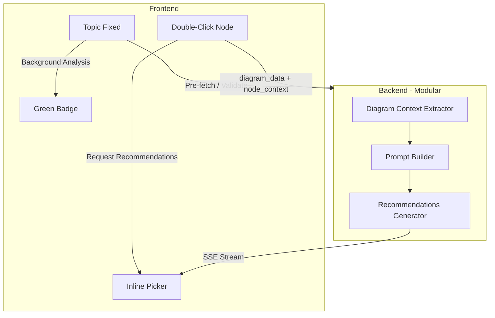

# Diagram Auto-Completion (Inline AI Recommendations)

## Current Architecture Reference

**Concept map relationship labels** (`[useConceptMapRelationship.ts](frontend/src/composables/useConceptMapRelationship.ts)`, `[relationship_labels_generator.py](agents/relationship_labels/relationship_labels_generator.py)`):

- Triggers: new link created, label cleared, or concept node text edited (regenerates empty-label edges)
- SSE streaming from `/thinking_mode/relationship_labels/start`
- Context: topic, concept_a, concept_b, link_direction
- UI: `[ConceptMapLabelPicker](frontend/src/components/canvas/ConceptMapLabelPicker.vue)` in bottom bar; options 1-5, `-`/`=` for pagination

**Node palette** (`[useNodePalette.ts](frontend/src/composables/useNodePalette.ts)`, `[mindmap_palette.py](agents/node_palette/mindmap_palette.py)`, `[prompts/node_palette.py](prompts/node_palette.py)`):

- Stages: branches vs children (mindmap), steps vs substeps (flow_map), etc.
- Prompts: `get_mindmap_branches_prompt`, `get_mindmap_children_prompt`, `get_flow_steps_prompt`, `get_flow_substeps_prompt`
- Context: center_topic, stage, stage_data (branch_name, step_name, etc.)

---

## Architecture Overview

---

## Implementation Plan

### 1. Backend: Modular Auto-Completion Module

**New directory:** `agents/inline_recommendations/`

- `**context_extractors.py`** – Diagram-specific context extraction:
  - `extract_mindmap_context(nodes, connections)` → topic, branch_names[], current_branch_id, children_texts[]
  - `extract_flow_map_context(nodes)` → topic, step_names[], current_step_id, substep_texts[]
  - `extract_tree_map_context(nodes, connections)` → topic, dimension, category_names[], current_category_id, item_texts[]
  - `extract_brace_map_context(nodes, connections)` → whole, dimension, part_names[], current_part_id, subpart_texts[]
  - Reuse logic from `[stageHelpers.ts](frontend/src/composables/nodePalette/stageHelpers.ts)` and `[diagramDataBuilder.ts](frontend/src/composables/nodePalette/diagramDataBuilder.ts)`
- `**prompts.py`** – Context-aware prompts (new, diagram-specific):
  - Mindmap branches: "User is creating a mindmap about {topic}. There are already branch nodes: {branch_names}. Generate {count} branch recommendations."
  - Mindmap children: "User's mindmap is about {topic}. There are {n} branches. User is on branch '{branch_name}'. Existing nodes in this branch: {children_texts}. Generate {count} child recommendations."
  - Flow map steps: "User is creating a flow map about {topic}. Existing steps: {step_names}. Generate {count} step recommendations."
  - Flow map substeps: "Flow is about {topic}. User is on step '{step_name}'. Existing substeps: {substep_texts}. Generate {count} substep recommendations."
  - Similar patterns for tree_map, brace_map. Reference `[prompts/node_palette.py](prompts/node_palette.py)` for tone and format.
- `**generator.py`** – Catapult-style generator (mirror `[relationship_labels_generator.py](agents/relationship_labels/relationship_labels_generator.py)`):
  - 3 LLMs concurrent, stream recommendations, deduplicate
  - Accept `diagram_type`, `stage` (branches|children|steps|substeps|...), `context` dict
  - Output: `recommendation_generated` events (text strings)
- `**router.py`** – New router:
  - `POST /thinking_mode/inline_recommendations/start` – Start streaming (payload: diagram_type, stage, node_id, diagram_data, language)
  - `POST /thinking_mode/inline_recommendations/next_batch` – Fetch more
  - `POST /thinking_mode/inline_recommendations/cleanup` – Session cleanup

### 2. Frontend: Store, Event Coordinator, and Composable

**Store** (`inlineRecommendationsStore.ts`) – Single source of truth, designed for frequent updates:

- **State**: `options`, `activeNodeId`, `isReady`, `generatingNodeIds`, `lastTopicHash` (for change detection)
- **Actions** (all synchronous, no side effects): `setOptions`, `appendOptions`, `setActive`, `clearActive`, `setReady`, `invalidateAll`, `setGenerating`
- `**onTopicUpdated(topic, diagramType)`**: Validate topic → set `isReady`; if topic changed (compare hash) → `invalidateAll()`
- `**invalidateAll()`**: Clear `options`, `activeNodeId`, abort in-flight streams. Call on: topic change, diagram type change, diagram load, pane click.
- `**invalidateForNode(nodeId)**`: Clear options for one node only (e.g. when sibling text changes and picker is open for that branch). Optional optimization.
- **Reset on unmount**: When leaving canvas, call `invalidateAll()` (match `[conceptMapRelationship](frontend/src/stores/conceptMapRelationship.ts)` pattern)

**Event Coordinator** (`useInlineRecommendationsCoordinator.ts` or logic in `CanvasPage`) – Central handler for all update sources:

| Event Source                               | Handler              | Debounce | Action                                                                       |
| ------------------------------------------ | -------------------- | -------- | ---------------------------------------------------------------------------- |
| `node:text_updated` (topic node)           | `onTopicNodeUpdated` | 300ms    | `store.onTopicUpdated(topic)`                                                |
| `node:text_updated` (other node)           | `onOtherNodeUpdated` | —        | If picker open for same branch/step: `store.invalidateForNode(activeNodeId)` |
| `diagram:type_changed` / load              | `onDiagramChanged`   | —        | `store.invalidateAll()`, re-evaluate `isReady`                               |
| `paneClick` / `selectionChange` (deselect) | `onDismiss`          | —        | `store.invalidateAll()` (dismiss picker)                                     |
| `inline_recommendations:requested`         | `onDoubleClick`      | —        | `startRecommendations(nodeId)`                                               |
| SSE stream chunks                          | composable           | —        | `store.setOptions` / `appendOptions`                                         |

- **Single subscription point**: Coordinator subscribes once in `CanvasPage` `onMounted`, unsubscribes in `onUnmounted`. Avoids scattered listeners.
- **Debounce topic updates**: User typing in topic node fires `node:text_updated` repeatedly; debounce 300ms before `onTopicUpdated` to avoid thrashing.

**Composable** (`useInlineRecommendations.ts`):

- `startRecommendations(nodeId, stage)` – Call API, stream into store
- `selectOption(nodeId, index)` – Apply to diagram, then `store.clearActive()`
- `prevPage` / `nextPage` – Pagination (store holds page state)
- `isGeneratingFor`, `optionsFor` – Read from store

### 3. Trigger Timing and Topic Update (Critical)

**When to enable the feature:**

- Enable when the user has **defined the topic** (topic node has non-placeholder, non-empty text)
- Use existing `extractMainTopic()` / `isPlaceholderText()` from `[useAutoComplete.ts](frontend/src/composables/useAutoComplete.ts)` for consistency
- Diagram-specific topic nodes: mindmap/center, flow_map/flow-topic, tree_map/tree-topic, brace_map/whole, etc.

**When user updates the topic:**

- **Invalidate cached state**: Clear any stored recommendations (`options` in store) — they were based on the old topic
- **Dismiss active picker**: If a picker is open, close it (topic context has changed)
- **Re-evaluate readiness**: If topic becomes empty or placeholder again → set `isReady = false`, hide badge. If topic stays valid → keep `isReady = true` but clear options
- **Always send fresh context**: Each double-click request sends current `diagram_data` from the store (no server-side topic caching). This ensures recommendations always reflect the latest topic and diagram content

**Implementation:**

- Listen to `node:text_updated` for topic node IDs (topic, flow-topic, tree-topic, brace-whole, etc.)
- On topic-node update: call `inlineRecommendationsStore.onTopicUpdated(newTopic)` which:
  - Validates topic (non-placeholder)
  - Sets `isReady` accordingly
  - Clears `options` and `activeNodeId` (dismiss picker)
- On diagram load: run same validation to set initial `isReady`

### 4. Background Analysis and Badge

- **Topic-defined detection**: When topic node has valid text (see §3), set `isReady = true`
- **Green badge**: Small badge near Node Palette button or in toolbar when:
  - Topic is defined (non-placeholder)
  - Diagram type supports inline recommendations: mindmap, flow_map, tree_map, brace_map
  - `isReady === true`

### 5. Double-Click Handling and Inline Picker

- **Double-click flow**:
  - `DiagramCanvas` emits `nodeDoubleClick` (already exists)
  - `CanvasPage` (or new handler) listens: if diagram supports inline recommendations and node is branch/step/substep/category/part:
    - Open Node Palette panel **or** show inline picker near node
  - User preference: "inline" = picker attached to node (like concept map label on edge) vs bottom bar
- **Inline picker component** – `InlineRecommendationsPicker.vue`:
  - Similar to `[ConceptMapLabelPicker](frontend/src/components/canvas/ConceptMapLabelPicker.vue)`
  - Props: `nodeId`, `options`, `isGenerating`, `onSelect`, `onDismiss`
  - Position: floating near node (use node position from Vue Flow) or in bottom bar for consistency
  - Keys: 1–5 select, `-` prev, `=` next

### 6. Node Type and Stage Resolution

- **Stage from node**:
  - Mindmap: `branch-l-1-`* / `branch-r-1-`* → stage `branches` if no children yet, else `children` with `branch_id`
  - Flow map: `flow-step-`* → stage `steps`; `flow-substep-`* → stage `substeps` with `step_id`
  - Tree map: `tree-cat-`* → `categories` or `children`; leaf nodes → `children` with `category_id`
  - Brace map: parts → `parts` or `subparts` with `part_id`
  - Reuse `[getStage2ParentsForDiagram](frontend/src/composables/nodePalette/stageHelpers.ts)`, `[buildStageDataForParent](frontend/src/composables/nodePalette/stageHelpers.ts)`

### 7. Integration Points

- `**node:text_updated`** (in `[DiagramCanvas.vue](frontend/src/components/diagram/DiagramCanvas.vue)`):
  - Detect if updated node is the topic node for current diagram type (topic, flow-topic, tree-topic, brace-whole, etc.)
  - If topic node: call `inlineRecommendationsStore.onTopicUpdated()` with current topic text
  - Store logic: validate topic → set `isReady`; if topic changed, clear `options` and `activeNodeId` (dismiss picker)
  - No auto-generation on text update; generation only on double-click
- `**CanvasToolbar.vue`**: Add green badge next to Node Palette button when `isReady` for supported types
- `**DiagramCanvas.vue`**: On `nodeDoubleClick`, emit `inline_recommendations:requested` with `{ nodeId, node }` so CanvasPage or a coordinator can:
  - Determine stage and parent from node
  - Call `startRecommendations(nodeId, stage)`
  - Show picker (inline or in bar)

### 7. File Structure Summary

| Layer               | New/Modified Files                                                                |
| ------------------- | --------------------------------------------------------------------------------- |
| Backend             | `agents/inline_recommendations/` (context_extractors, prompts, generator, router) |
| Routers             | Register new router in `[routers/register.py](routers/register.py)`               |
| Frontend composable | `useInlineRecommendations.ts`, `useInlineRecommendationsCoordinator.ts`           |
| Frontend store      | `stores/inlineRecommendations.ts`                                                 |
| Frontend components | `InlineRecommendationsPicker.vue`, badge in `CanvasToolbar.vue`                   |
| Integration         | `DiagramCanvas.vue`, `CanvasPage.vue` (coordinator setup), event bus types        |

### 8. Diagram Support Matrix

| Diagram   | Topic Node   | Stage 1 (e.g. branches) | Stage 2 (e.g. children) |
| --------- | ------------ | ----------------------- | ----------------------- |
| mindmap   | center/topic | branch nodes            | children of branch      |
| flow_map  | flow-topic   | step nodes              | substeps of step        |
| tree_map  | tree-topic   | category nodes          | items of category       |
| brace_map | whole        | part nodes              | subparts of part        |

---

## Key Design Decisions

1. **Trigger = topic defined**: Feature enables only when the user has defined the topic (non-placeholder text). No topic → no badge, no recommendations.
2. **Topic update invalidates**: When the user updates the topic, clear cached recommendations and dismiss the picker. Each double-click always sends fresh `diagram_data` so recommendations reflect the latest content.
3. **Centralized event coordinator**: One coordinator in CanvasPage subscribes to all events (`node:text_updated`, `paneClick`, `diagram:type_changed`, etc.) and dispatches to store actions. Avoids scattered listeners and makes update flow traceable. Debounce topic-node updates (300ms) to handle rapid typing.
4. **Modular prompts**: Each diagram type has its own prompt builder in `prompts.py`, reading diagram content (topic, existing nodes) to produce focused recommendations.
5. **Reuse streaming pattern**: Same Catapult-style 3-LLM concurrent streaming as relationship_labels and node_palette.
6. **Inline vs panel**: Recommendations can appear in a bottom-bar picker (like ConceptMapLabelPicker) for consistency, or as a floating popover near the node. Plan assumes bottom bar first; floating can be a follow-up.
7. **No overwrite**: Applying a recommendation replaces node text only when user explicitly selects; no auto-apply on first result (unlike concept map which auto-applies first label).

