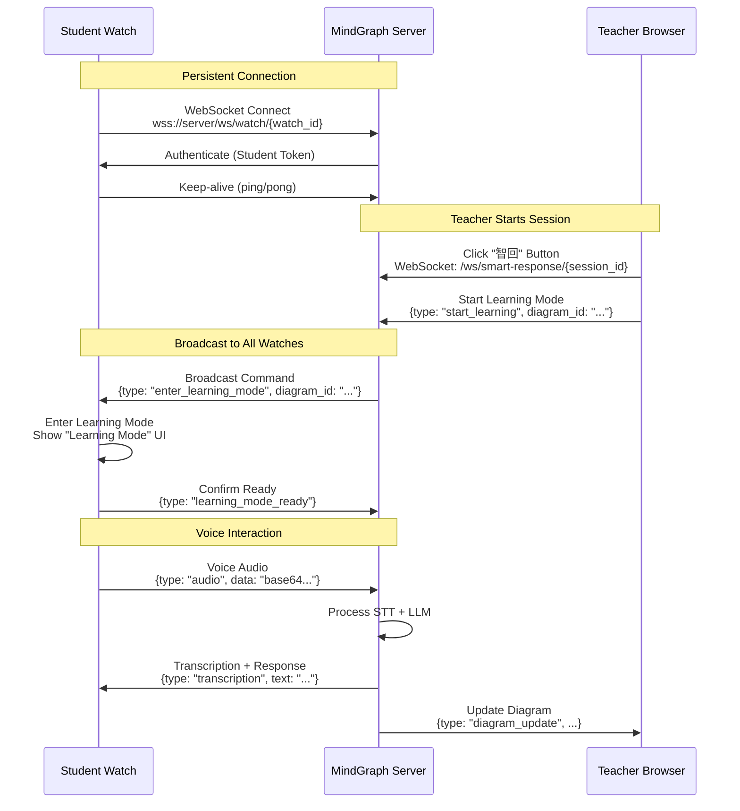
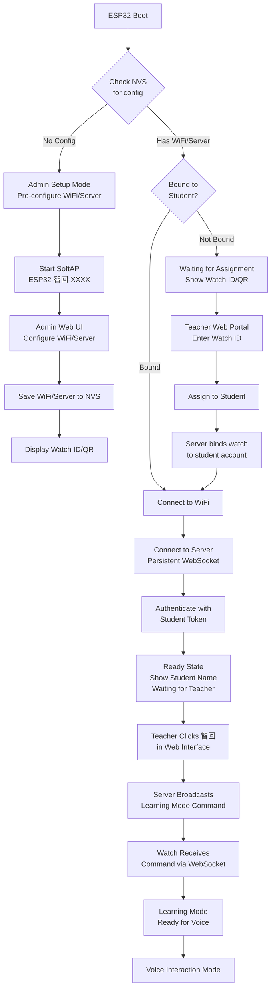

# ESP32 Smart Response (智回) Setup Flow Plan

## Simple Mental Model: Watch = Microphone + WiFi + Speaker

**The watch is essentially a smart microphone/speaker combo with WiFi:**

- **Microphone**: ES7210 dual mic array captures student's voice
- **WiFi**: Sends audio to server, receives audio from server
- **Speaker**: ES8311 plays AI responses back to student
- **Display**: Shows status, transcriptions, and UI feedback

**All AI processing happens on the server:**

- STT (Speech-to-Text): Server uses Qwen Omni API
- LLM: Server uses Qwen to generate responses  
- TTS (Text-to-Speech): Server uses DashScope TTS API

**The watch does NOT run ML models** - it's just the "ears and mouth" connected to the cloud "brain".

## Overview

Create ESP32 watch application for Smart Response (智回) module with **out-of-box ready** experience:

1. **Admin Setup**: Pre-configure WiFi and server settings (bulk or individual)
2. **Teacher Assignment**: Bind watches to students via **Smart Response 智回 web interface** (sidebar module)
3. **Student Use**: Watches ready immediately after assignment - no student setup needed

Key principle: **Watches are assigned to students and bound to student accounts, ready to use immediately.**

**Web Interface**: Teachers manage watches through the "Smart Response 智回" sidebar module, featuring:

- Watch list with status indicators
- QR code scanner for quick assignment
- Student assignment interface
- Real-time watch status updates

## Real-Time Communication Architecture

### WebSocket Connection Flow




### Connection Architecture

**Three WebSocket Endpoints:**

1. **Watch Connection**: `/ws/watch/{watch_id}`
  - Persistent connection from watch to server
  - Maintained as long as watch is powered on
  - Used for receiving commands from teacher
  - Used for sending voice audio to server
2. **Teacher Connection**: `/ws/smart-response/{session_id}`
  - Connection from teacher's browser
  - Used for sending commands to watches
  - Used for receiving diagram updates
  - Session-based (one per Smart Response session)
3. **Voice Connection**: `/ws/voice/{diagram_session_id}` (existing)
  - Used for voice interaction
  - Can be reused or extended for watch voice

**Connection Management:**

```python
# Server-side connection tracking
watch_connections: Dict[str, WebSocket] = {}  # {watch_id: websocket}
teacher_sessions: Dict[str, Dict] = {}  # {session_id: {teacher_ws, watch_ids: []}}
```

## Architecture Flow




## Simplified User Flows

### Flow 1: Admin Pre-Configuration (One-time setup)

1. **Admin powers on watch**
  - Watch boots, no config found
  - Creates SoftAP: `ESP32-智回-XXXX`
  - Shows QR code with Watch ID
2. **Admin connects to watch**
  - Connects phone to SoftAP
  - Opens admin configuration page
  - Enters WiFi credentials (or uses WPS)
  - Enters MindGraph server URL
  - Saves configuration
3. **Watch ready for assignment**
  - Watch displays unique ID (e.g., `WATCH-ABC123`)
  - Shows QR code with Watch ID
  - Waits for teacher assignment

### Flow 2: Teacher Assignment (In classroom)

1. **Teacher opens web portal**
  - Logs into MindGraph admin panel
  - Navigates to "Device Management" → "Assign Watches"
2. **Teacher scans/enters Watch ID**
  - Option A: Scan QR code from watch display
  - Option B: Manually enter Watch ID
  - System shows watch status (unassigned, ready)
3. **Teacher assigns to student**
  - Selects student from class list
  - Clicks "Assign Watch"
  - Server binds watch to student account
  - Watch receives assignment notification
4. **Watch auto-connects**
  - Watch connects to WiFi (pre-configured)
  - Watch connects to server WebSocket
  - Watch authenticates with student credentials
  - Watch shows "Ready - [Student Name]"

### Flow 3: Student Use (Out-of-box ready)

1. **Student receives watch**
  - Watch already assigned by teacher
  - Watch shows student name on display
  - Watch is connected and ready
2. **Student uses watch**
  - Press button or speak to activate
  - Voice interaction works immediately
  - No setup required!

## Hardware Specifications

### ESP32-S3-Touch-AMOLED-2.06 Watch

**Audio Hardware:**

- **ES8311 Audio Codec**: Full-duplex audio codec with ADC/DAC
  - Supports I2S interface
  - Sample rates: 8kHz to 48kHz
  - Bit depth: 16-bit, 24-bit, 32-bit
  - Built-in AGC (Automatic Gain Control)
  - Low power consumption
  - Handles speaker output (DAC) and microphone input (ADC)
- **ES7210 Dual Microphone Array** (Note: User mentioned ES2710, likely referring to ES7210)
  - 4-channel microphone ADC chip
  - Dual microphone inputs for echo cancellation
  - PDM (Pulse Density Modulation) interface
  - Supports beamforming and noise reduction
  - Automatic echo cancellation algorithms
  - Sample rate: 8kHz to 48kHz
  - I2C control interface

**Audio Processing:**

- Dual mic array enables:
  - **Echo Cancellation**: Remove speaker feedback from microphone input
  - **Noise Reduction**: Beamforming to focus on user voice
  - **Directional Audio**: Better voice pickup in noisy environments

**Display:**

- 2.06" AMOLED (410×502 pixels)
- Touch interface
- LVGL graphics library support

## Components to Create

### 1. ESP32 Firmware Structure

**File Structure:**

```
firmware-esp32/
├── main/
│   ├── main.cpp              # Entry point
│   ├── wifi_manager.cpp      # WiFi configuration
│   ├── config_manager.cpp    # NVS configuration storage
│   ├── web_server.cpp        # SoftAP web UI server
│   ├── websocket_client.cpp  # WebSocket connection
│   ├── audio_handler.cpp     # Audio capture/playback
│   ├── audio_codec.cpp       # ES8311 codec driver
│   ├── mic_array.cpp         # ES7210 dual mic array driver
│   ├── echo_cancellation.cpp # Echo cancellation processing
│   ├── display_handler.cpp   # Watch display UI handler
│   ├── ui_manager.cpp        # UI state management and transitions
│   └── auth_manager.cpp      # Authentication
├── components/
│   ├── es8311/               # ES8311 codec driver component
│   ├── es7210/               # ES7210 mic array component
│   ├── lvgl_ui/              # LVGL UI components
│   │   ├── loading_screen.cpp    # Boot/loading screen
│   │   ├── wallpaper_manager.cpp  # Wallpaper loading and management
│   │   ├── icon_set.cpp          # Custom icon set
│   │   ├── animations.cpp        # Animation utilities
│   │   └── qr_generator.cpp      # QR code generation and rendering
│   └── config_ui/            # HTML/CSS/JS for web UI
├── assets/
│   ├── wallpapers/           # Wallpaper images
│   │   ├── default.bmp
│   │   ├── setup_mode.bmp
│   │   └── ready.bmp
│   ├── icons/                # Icon images
│   │   ├── wifi.bmp
│   │   ├── battery.bmp
│   │   ├── microphone.bmp
│   │   └── speaker.bmp
│   └── logos/                # Logo and branding
│       └── smart_response_logo.bmp
└── platformio.ini            # Build configuration
```

### 2. WiFi Configuration Flow

**Two Modes:**

**Mode A: Admin Pre-Configuration (Primary)**

- Admin uses SoftAP web UI to configure WiFi/server
- WiFi credentials saved to NVS
- Watch can auto-connect on boot
- Used for bulk setup before distribution

**Mode B: WPS Push Button (Optional)**

- Watch supports WPS for quick WiFi setup
- Admin presses WPS button on router
- Watch connects automatically
- Simpler for single watch setup

**Recommendation:**

- Primary: Admin pre-configuration via SoftAP
- Fallback: WPS for quick setup
- Manual: Still support manual WiFi entry if needed

### 3. Server Configuration

**Configuration Fields:**

- Server URL (e.g., `https://your-domain.com` or `192.168.1.100:8000`)
- WebSocket path (e.g., `/ws/voice/{session_id}`)
- SSL certificate (for HTTPS/WSS)

**Storage in NVS:**

```cpp
// NVS namespace: "config"
preferences.putString("server_url", "https://your-domain.com");
preferences.putString("ws_path", "/ws/voice");
preferences.putBool("use_ssl", true);
```

### 4. Audio Processing with ES8311 and ES7210

**Hardware Setup:**

The Waveshare ESP32-S3-Touch-AMOLED-2.06 watch includes:

- **ES8311**: Audio codec for speaker output (DAC) and microphone input (ADC)
- **ES7210**: Dual microphone array ADC for echo cancellation

**Audio Pipeline:**

```
Dual Microphones (ES7210)
    ↓ PDM Interface
ES7210 ADC (4 channels)
    ↓ I2S Interface
ESP32-S3 (I2S DMA)
    ↓ Echo Cancellation Processing
ES8311 Codec (ADC path)
    ↓ PCM16 Audio Stream
WebSocket (Base64 encoded)
    ↓
Server (STT Processing)
```

**Echo Cancellation Implementation:**

1. **Dual Mic Input**
  - ES7210 captures audio from two microphones
  - Microphones positioned for optimal voice pickup
  - One mic closer to speaker (reference for echo)
2. **Echo Cancellation Algorithm**
  - Use reference mic signal to estimate echo
  - Subtract estimated echo from primary mic signal
  - Adaptive filtering for dynamic echo cancellation
  - Noise reduction using beamforming
3. **Audio Processing Flow**
  ```cpp
   // Initialize ES7210 dual mic array
   es7210_init();
   es7210_set_sample_rate(16000);  // 16kHz for voice
   es7210_set_channel_mode(ES7210_MODE_DUAL_MIC);

   // Initialize ES8311 codec
   es8311_init();
   es8311_set_sample_rate(16000);
   es8311_set_adc_gain(ES8311_ADC_GAIN_AUTO);

   // Audio capture loop
   while (recording) {
     // Read from ES7210 (dual mic, PDM)
     int16_t mic_left[FRAME_SIZE];
     int16_t mic_right[FRAME_SIZE];
     es7210_read(mic_left, mic_right, FRAME_SIZE);

     // Echo cancellation processing
     int16_t clean_audio[FRAME_SIZE];
     echo_cancellation_process(
       mic_left,      // Primary mic
       mic_right,     // Reference mic (near speaker)
       speaker_output, // Current speaker output (for echo reference)
       clean_audio    // Output: echo-cancelled audio
     );

     // Optional: Noise reduction
     noise_reduction_process(clean_audio, FRAME_SIZE);

     // Send to WebSocket
     send_audio_chunk(clean_audio, FRAME_SIZE);
   }
  ```

**Key Functions:**

```cpp
// ES7210 Dual Mic Array Driver
bool es7210_init();
void es7210_set_sample_rate(uint32_t sample_rate);
void es7210_set_channel_mode(es7210_mode_t mode);
void es7210_read(int16_t* mic1, int16_t* mic2, size_t samples);

// ES8311 Codec Driver
bool es8311_init();
void es8311_set_sample_rate(uint32_t sample_rate);
void es8311_set_adc_gain(es8311_gain_t gain);
void es8311_set_dac_volume(uint8_t volume);
void es8311_write(int16_t* audio, size_t samples);  // Speaker output

// Echo Cancellation
void echo_cancellation_init();
void echo_cancellation_process(
  int16_t* primary_mic,    // Main microphone input
  int16_t* reference_mic,  // Reference mic (near speaker)
  int16_t* speaker_output, // Current speaker output
  int16_t* output          // Echo-cancelled output
);

// Noise Reduction
void noise_reduction_process(int16_t* audio, size_t samples);
```

**Audio Format:**

- **Sample Rate**: 16kHz (optimal for voice, matches MindGraph backend)
- **Bit Depth**: 16-bit PCM
- **Channels**: Mono (after echo cancellation and beamforming)
- **Frame Size**: 4096 samples (~256ms chunks)
- **Encoding**: Base64 for WebSocket JSON transmission

**Benefits of Dual Mic Array:**

1. **Echo Cancellation**: Removes speaker feedback automatically
2. **Noise Reduction**: Beamforming focuses on user voice
3. **Better Voice Quality**: Cleaner audio for STT processing
4. **Hands-free Operation**: Works well even when speaker is playing

**Implementation Notes:**

- ES7210 uses PDM interface, requires PDM-to-PCM conversion
- ES8311 handles I2S interface for both input and output
- Echo cancellation runs in real-time on ESP32-S3
- May need to adjust algorithm parameters for optimal performance
- Consider using ESP-ADF (Espressif Audio Development Framework) for audio processing

### 5. Authentication Flow

**Watch-to-Student Binding:**

1. **Watch Registration**
  - Each watch has unique ID (derived from MAC address)
  - Watch ID format: `WATCH-{MAC_LAST_6_DIGITS}` (e.g., `WATCH-ABC123`)
  - Watch ID displayed on screen and in QR code
2. **Teacher Assignment**
  - Teacher enters Watch ID in web portal
  - Selects student from class list
  - Server creates binding: `watch_id → student_id`
3. **Watch Authentication**
  - Watch connects to server
  - Sends Watch ID
  - Server looks up bound student
  - Server returns student's JWT token
  - Watch stores token in NVS
  - Watch uses token for WebSocket authentication

**Key Point:** Student never needs to enter credentials on watch. Binding happens server-side via teacher portal.

### 5. Real-Time Learning Mode Activation

**Connection Flow:**

1. **Watch Persistent Connection**
  - Watch connects to `/ws/watch/{watch_id}` on boot
  - Maintains persistent WebSocket connection
  - Sends keep-alive (ping/pong) every 30 seconds
  - Reconnects automatically if disconnected
2. **Teacher Starts Session**
  - Teacher clicks "智回" (Smart Response) in web interface
  - Browser connects to `/ws/smart-response/{session_id}`
  - Teacher selects diagram or creates new session
  - Server creates Smart Response session
3. **Server Broadcasts to Watches**
  - Server identifies all watches in class/session
  - Sends command to all watches via their WebSocket connections
  - Command: `{type: "enter_learning_mode", diagram_id: "...", diagram_type: "circle_map"}`
4. **Watches Enter Learning Mode**
  - Watch receives command via WebSocket
  - Watch displays "Learning Mode" screen
  - Watch shows diagram context (if available)
  - Watch is ready for voice interaction

**Message Types:**

**Teacher → Server:**

```json
{
  "type": "start_learning_mode",
  "session_id": "session_123",
  "diagram_id": "diagram_456",
  "diagram_type": "circle_map",
  "watch_ids": ["WATCH-ABC123", "WATCH-DEF456"]  // Optional: specific watches
}
```

**Server → Watch:**

```json
{
  "type": "enter_learning_mode",
  "session_id": "session_123",
  "diagram_id": "diagram_456",
  "diagram_type": "circle_map",
  "diagram_data": {
    "topic": "...",
    "children": [...]
  }
}
```

**Watch → Server (Confirmation):**

```json
{
  "type": "learning_mode_ready",
  "watch_id": "WATCH-ABC123",
  "session_id": "session_123"
}
```

**Watch → Server (Voice Audio):**

```json
{
  "type": "audio",
  "session_id": "session_123",
  "watch_id": "WATCH-ABC123",
  "data": "base64_encoded_pcm16"
}
```

**Server → Watch (Transcription):**

```json
{
  "type": "transcription",
  "session_id": "session_123",
  "text": "Student's transcribed speech",
  "intent": "fill_node",
  "node_id": "context_1"
}
```

**Server → Teacher (Diagram Update):**

```json
{
  "type": "diagram_update",
  "session_id": "session_123",
  "watch_id": "WATCH-ABC123",
  "student_name": "Student A",
  "update": {
    "node_id": "context_1",
    "text": "Student's filled content"
  }
}
```

### 5. Watch Display Interface

**UI Library: LVGL (Light and Versatile Graphics Library)**

LVGL is the **standard embedded UI library** for ESP32 (like Element Plus for web). It provides:

- **30+ Built-in Widgets**: Buttons, labels, sliders, charts, lists, etc.
- **100+ Style Properties**: Colors, fonts, shadows, borders, animations
- **Web-Inspired Layouts**: Flexbox-like layouts, grid systems
- **Animations**: Smooth transitions, fade effects, slide animations
- **Touch Support**: Full touch input handling
- **Anti-aliasing**: Smooth fonts and graphics
- **Multi-language**: UTF-8 text rendering
- **Custom Themes**: Light/dark mode support
- **Low Memory**: Optimized for embedded devices (8KB RAM minimum)

**LVGL is perfect for creating elegant, professional UIs on ESP32 AMOLED displays.**

**Display States:**

1. **Boot/Loading Screen:**
  - Animated loading screen with logo
  - Progress bar or spinner
  - "Smart Response 智回" branding
  - Version number
  - Smooth fade-in animation
2. **Admin Setup Mode:**
  - Custom wallpaper/background
  - "Admin Setup" title with icon
  - SoftAP SSID: `ESP32-智回-XXXX`
  - QR code with Watch ID (centered, large)
  - IP address: `192.168.4.1`
  - Status indicators (WiFi icon, etc.)
3. **Waiting for Assignment:**
  - Custom wallpaper/background
  - "Waiting for Assignment" title
  - Watch ID: `WATCH-ABC123` (large, prominent)
  - QR code with Watch ID (centered)
  - WiFi status icon (connected/disconnected)
  - Animated waiting indicator (pulsing dot or spinner)
4. **Connecting:**
  - Loading animation (spinner or progress bar)
  - "Connecting..." text
  - WiFi SSID being connected to
  - Connection progress indicator
  - Smooth transitions between states
5. **Ready (Bound to Student):**
  - Custom wallpaper (can be personalized per student)
  - "Ready" status badge
  - Student name: `[Student Name]` (large, prominent)
  - Student avatar/icon (optional)
  - Connected status indicator (green dot)
  - Battery level indicator (icon + percentage)
  - Current time/date (optional)
6. **Voice Interaction Mode:**
  - Animated microphone icon when listening
  - Waveform visualization during recording
  - "Listening..." text with animation
  - "Processing..." when sending to server
  - "Speaking..." when playing AI response
7. **Error:**
  - Error icon (red X or warning symbol)
  - Error message (clear, readable)
  - Error code (for debugging)
  - Retry button/option (if applicable)
  - Help text or QR code for support

**Visual Design Elements:**

- **Wallpapers**: Customizable backgrounds
  - Default wallpaper (branded)
  - Student-specific wallpapers (optional)
  - Theme support (light/dark mode)
  - Animated wallpapers (optional, battery-conscious)
- **Icons**: Custom icon set
  - WiFi icon (connected/disconnected)
  - Battery icon (with levels)
  - Microphone icon (idle/listening/speaking)
  - Speaker icon
  - Settings icon
  - Error/warning icons
- **Animations**: Smooth transitions
  - Loading spinners
  - Progress bars
  - Fade in/out transitions
  - Slide animations
  - Pulse effects for status indicators
- **Typography**: Readable fonts
  - Large text for Watch ID and student name
  - Medium text for status messages
  - Small text for details (IP, battery, etc.)
  - Bold for important information
- **Color Scheme**: Consistent branding
  - Primary color for active states
  - Success green for connected/ready
  - Warning yellow for connecting
  - Error red for errors
  - Neutral gray for inactive states

## Implementation Details

### Phase 1: WiFi Manager (`wifi_manager.cpp`)

**Features:**

- WiFi scan functionality
- SoftAP creation
- WiFi connection with saved credentials
- Auto-reconnect on disconnect
- Multiple WiFi profiles support

**Key Functions:**

```cpp
bool scanNetworks();                    // Scan available WiFi
bool connectToWiFi(String ssid, String password);
bool startSoftAP(String ssid, String password);
void saveWiFiCredentials(String ssid, String password);
void loadWiFiCredentials();
```

### Phase 2: Configuration Web Server (`web_server.cpp`)

**Endpoints:**

- `GET /` - Configuration UI (HTML page)
- `GET /api/wifi/scan` - Scan WiFi networks
- `POST /api/wifi/add` - Add WiFi credentials
- `GET /api/wifi/configlist` - List saved WiFi networks
- `POST /api/config/server` - Set server URL
- `POST /api/auth/login` - User login
- `GET /api/status` - Device status

**Web UI Features:**

- WiFi network list with signal strength
- Password input form
- Server URL input
- Login form (username/password)
- Status display
- QR code for easy phone access

### Phase 3: Configuration Manager (`config_manager.cpp`)

**NVS Storage Structure:**

```cpp
// Namespace: "config"
"wifi_ssid"          -> String
"wifi_password"      -> String
"server_url"         -> String
"ws_path"            -> String
"use_ssl"            -> Bool
"auth_token"         -> String
"user_id"            -> Int
"device_id"          -> String (MAC address)
```

**Key Functions:**

```cpp
bool saveConfig(String key, String value);
String loadConfig(String key, String defaultValue);
bool clearConfig();
bool hasConfig();
```

### Phase 5: Display Handler (`display_handler.cpp`)

**For ESP32-S3-Touch-AMOLED-2.06:**

- Use LVGL (Light and Versatile Graphics Library) for rich UI
- Custom wallpapers and loading screens
- Animated transitions and status indicators
- QR code generation and display
- Touch input for manual navigation (optional)
- Battery and status indicators

**Key Functions:**

```cpp
// Initialization
void display_init();
void load_wallpaper(const char* wallpaper_path);
void set_theme(bool dark_mode);

// Screen States
void showLoadingScreen();
void showBootScreen();
void showSetupMode();
void showWaitingForAssignment(String watchId);
void showConnecting(String ssid);
void showReady(String studentName, String wifiSsid);
void showVoiceListening();
void showVoiceProcessing();
void showVoiceSpeaking();
void showError(String message, String errorCode);

// Visual Elements
void showQRCode(String url, int x, int y, int size);
void showBatteryLevel(uint8_t percentage);
void showWiFiStatus(bool connected);
void showConnectionStatus(bool connected);
void showStudentAvatar(String avatarPath);  // Optional

// Animations
void animateLoadingSpinner();
void animateProgressBar(uint8_t progress);
void animateWaveform();  // For voice visualization
void fadeTransition(void (*nextScreen)());

// Utilities
void drawIcon(int iconId, int x, int y, int size, uint16_t color);
void drawText(String text, int x, int y, int fontSize, uint16_t color);
void drawBackground(String wallpaperPath);
void updateDisplay();  // Refresh display
```

**LVGL Integration:**

```cpp
// LVGL objects for UI elements
lv_obj_t* screen_main;
lv_obj_t* label_watch_id;
lv_obj_t* label_student_name;
lv_obj_t* img_qr_code;
lv_obj_t* img_wallpaper;
lv_obj_t* bar_battery;
lv_obj_t* spinner_loading;
lv_obj_t* img_wifi_status;
lv_obj_t* canvas_waveform;  // For voice visualization
```

**Wallpaper System:**

- Store wallpapers in SPIFFS or embedded in firmware
- Support multiple wallpaper themes
- Default wallpaper for unassigned watches
- Optional: Student-specific wallpapers (stored on server, downloaded to watch)
- Format: BMP, PNG, or JPEG (converted to LVGL format)

**Loading Screen:**

- Animated logo/branding
- Progress indicator
- Version information
- Smooth fade-in on boot
- Can be customized per firmware version

**Icon System:**

- Custom icon set for Smart Response
- Icons for: WiFi, Battery, Microphone, Speaker, Settings, Error
- SVG or bitmap format
- Color-coded for status (green=good, yellow=warning, red=error)

### Phase 6: Authentication Manager (`auth_manager.cpp`)

**Login Flow:**

1. User enters username/password in web UI
2. ESP32 sends POST to `/api/auth/login`
3. Server returns JWT token
4. Token saved to NVS
5. Token used for WebSocket authentication

**Key Functions:**

```cpp
bool login(String username, String password);
bool refreshToken();
bool isAuthenticated();
String getAuthToken();
```

## WebSocket Architecture for Real-Time Communication

### Connection Model

**Yes, WebSocket is the right choice!** Here's how it works:

**Three WebSocket Endpoints:**

1. **Watch Persistent Connection**: `/ws/watch/{watch_id}`
  - Watches maintain persistent WebSocket connection
  - Connected immediately after WiFi setup
  - Stays connected as long as watch is powered on
  - Used for receiving commands from teacher
  - Used for sending voice audio to server
2. **Teacher Session Connection**: `/ws/smart-response/{session_id}`
  - Teacher's browser connects when clicking "智回"
  - Session-based (one connection per Smart Response session)
  - Used for sending commands to watches
  - Used for receiving real-time updates
3. **Voice Audio Connection**: `/ws/voice/{diagram_session_id}` (existing, can be reused)
  - Used for voice interaction
  - Can be same connection as watch connection or separate

### Connection Flow

**Step 1: Watches Connect (On Boot)**

```
Watch → Server: WebSocket Connect to /ws/watch/{watch_id}
Server → Watch: Authenticate (validate student token)
Watch → Server: Keep-alive ping every 30 seconds
```

**Step 2: Teacher Clicks "智回"**

```
Teacher Browser → Server: WebSocket Connect to /ws/smart-response/{session_id}
Teacher Browser → Server: {type: "start_learning_mode", diagram_id: "...", watch_ids: [...]}
```

**Step 3: Server Broadcasts to Watches**

```
Server → All Watches (via /ws/watch/{watch_id}): 
  {type: "enter_learning_mode", diagram_id: "...", diagram_type: "circle_map"}
```

**Step 4: Watches Enter Learning Mode**

```
Watch → Server: {type: "learning_mode_ready", watch_id: "WATCH-ABC123"}
Watch Display: Shows "Learning Mode" screen
```

**Step 5: Voice Interaction**

```
Watch → Server: {type: "audio", data: "base64_pcm16", session_id: "..."}
Server → Watch: {type: "transcription", text: "...", intent: "fill_node"}
Server → Teacher: {type: "diagram_update", watch_id: "...", student_name: "...", update: {...}}
```

### Server-Side Connection Management

```python
# Track watch connections
watch_connections: Dict[str, WebSocket] = {}  # {watch_id: websocket}

# Track teacher sessions
teacher_sessions: Dict[str, Dict] = {
    "session_123": {
        "teacher_ws": WebSocket,
        "diagram_id": "diagram_456",
        "watch_ids": ["WATCH-ABC123", "WATCH-DEF456"],
        "created_at": datetime
    }
}

# Track watches by class/session
class_watches: Dict[str, List[str]] = {}  # {class_id: [watch_id, ...]}
```

### WebSocket Message Protocol

**Watch Connection Messages:**

```json
// Watch → Server: Initial connection
{
  "type": "watch_connect",
  "watch_id": "WATCH-ABC123",
  "student_id": 123,
  "token": "jwt_token"
}

// Server → Watch: Authentication result
{
  "type": "watch_authenticated",
  "status": "success",
  "student_name": "Student A"
}

// Server → Watch: Enter learning mode
{
  "type": "enter_learning_mode",
  "session_id": "session_123",
  "diagram_id": "diagram_456",
  "diagram_type": "circle_map",
  "diagram_data": {
    "topic": "Central Topic",
    "children": [
      {"id": "context_1", "text": "待填写", "fillable": true}
    ]
  }
}

// Watch → Server: Learning mode ready
{
  "type": "learning_mode_ready",
  "watch_id": "WATCH-ABC123",
  "session_id": "session_123"
}

// Watch → Server: Voice audio
{
  "type": "audio",
  "session_id": "session_123",
  "watch_id": "WATCH-ABC123",
  "data": "base64_encoded_pcm16"
}

// Server → Watch: Transcription result
{
  "type": "transcription",
  "session_id": "session_123",
  "text": "我想填写第一个节点",
  "intent": "fill_node",
  "node_id": "context_1",
  "proposed_text": "学生提出的内容"
}

// Server → Watch: Fill request result
{
  "type": "fill_request_result",
  "session_id": "session_123",
  "node_id": "context_1",
  "status": "approved",  // or "rejected"
  "message": "你的内容已添加到图表中"
}
```

**Teacher Connection Messages:**

```json
// Teacher → Server: Start learning mode
{
  "type": "start_learning_mode",
  "session_id": "session_123",
  "diagram_id": "diagram_456",
  "diagram_type": "circle_map",
  "watch_ids": ["WATCH-ABC123", "WATCH-DEF456"]  // Optional: all watches if empty
}

// Server → Teacher: Session started
{
  "type": "learning_mode_started",
  "session_id": "session_123",
  "watches_ready": ["WATCH-ABC123", "WATCH-DEF456"],
  "total_watches": 2
}

// Server → Teacher: Watch entered learning mode
{
  "type": "watch_ready",
  "session_id": "session_123",
  "watch_id": "WATCH-ABC123",
  "student_name": "Student A"
}

// Server → Teacher: Fill request notification
{
  "type": "fill_request_notification",
  "session_id": "session_123",
  "watch_id": "WATCH-ABC123",
  "student_name": "Student A",
  "node_id": "context_1",
  "proposed_text": "学生提出的内容"
}

// Teacher → Server: Approve/reject fill request
{
  "type": "fill_request_response",
  "session_id": "session_123",
  "node_id": "context_1",
  "request_id": "req_123",
  "action": "approve",  // or "reject"
  "final_text": "最终确认的内容"  // optional
}

// Server → Teacher: Diagram updated
{
  "type": "diagram_update",
  "session_id": "session_123",
  "watch_id": "WATCH-ABC123",
  "student_name": "Student A",
  "update": {
    "node_id": "context_1",
    "text": "最终确认的内容"
  }
}
```

### Implementation Details

**Watch WebSocket Client (`websocket_client.cpp`):**

```cpp
// Persistent WebSocket connection
WebSocketsClient watchWebSocket;

void connectWatchWebSocket() {
  String url = "wss://" + serverUrl + "/ws/watch/" + watchId;
  watchWebSocket.begin(url);
  watchWebSocket.onEvent(handleWatchWebSocketEvent);
  watchWebSocket.setAuthorization("Bearer " + authToken);
}

void handleWatchWebSocketEvent(WStype_t type, uint8_t* payload, size_t length) {
  switch(type) {
    case WStype_CONNECTED:
      sendWatchConnectMessage();
      break;
    case WStype_TEXT:
      handleWatchMessage((char*)payload);
      break;
    case WStype_DISCONNECTED:
      // Auto-reconnect
      delay(1000);
      connectWatchWebSocket();
      break;
  }
}

void handleWatchMessage(String message) {
  DynamicJsonDocument doc(2048);
  deserializeJson(doc, message);
  
  String msgType = doc["type"];
  
  if (msgType == "enter_learning_mode") {
    String sessionId = doc["session_id"];
    String diagramId = doc["diagram_id"];
    String diagramType = doc["diagram_type"];
    
    // Enter learning mode
    enterLearningMode(sessionId, diagramId, diagramType);
    
    // Confirm ready
    sendLearningModeReady(sessionId);
  }
  
  if (msgType == "transcription") {
    String text = doc["text"];
    String intent = doc["intent"];
    String nodeId = doc["node_id"];
    
    // Display transcription on watch
    displayTranscription(text);
    
    // If intent is fill_node, send fill request
    if (intent == "fill_node") {
      sendFillRequest(nodeId, text);
    }
  }
}
```

**Server STT Integration (`services/features/dashscope_stt.py`):**

```python
from dashscope import Recognition
from dashscope.audio.asr.recognition import RecognitionParam, RecognitionResult

class DashScopeSTTService:
    """DashScope Real-time Speech Recognition Service"""
    
    def __init__(self, api_key: str, model: str = "fun-asr-realtime"):
        self.api_key = api_key
        self.model = model  # fun-asr-realtime, gummy-realtime-v1, paraformer-realtime-v2
    
    async def create_recognition_session(
        self,
        on_transcription: Callable[[str, bool], None],  # text, is_final
        on_error: Callable[[Exception], None]
    ):
        """Create a real-time STT session"""
        param = RecognitionParam.builder()\
            .model(self.model)\
            .apiKey(self.api_key)\
            .format("pcm")\
            .sampleRate(16000)\
            .build()
        
        recognizer = Recognition()
        
        callback = ResultCallback[RecognitionResult]()
        callback.on_event = lambda result: on_transcription(
            result.getSentence().getText(),
            result.isSentenceEnd()
        )
        callback.on_error = on_error
        
        recognizer.call(param, callback)
        return recognizer
    
    async def send_audio_frame(self, recognizer: Recognition, audio_data: bytes):
        """Send audio frame to STT service"""
        recognizer.sendAudioFrame(audio_data)
```

**Server WebSocket Handler (`routers/features/smart_response_ws.py`):**

```python
# Watch WebSocket endpoint
@router.websocket("/ws/watch/{watch_id}")
async def watch_websocket(websocket: WebSocket, watch_id: str):
    await websocket.accept()
    
    # Authenticate watch
    token = websocket.headers.get("Authorization", "").replace("Bearer ", "")
    student = await authenticate_watch(watch_id, token)
    
    if not student:
        await websocket.close(code=4001, reason="Invalid watch or token")
        return
    
    # Store connection
    watch_connections[watch_id] = websocket
    
    try:
        while True:
            data = await websocket.receive_text()
            message = json.loads(data)
            
            if message["type"] == "watch_connect":
                await websocket.send_json({
                    "type": "watch_authenticated",
                    "status": "success",
                    "student_name": student.username
                })
            
            elif message["type"] == "audio":
                # Process voice audio with DashScope Real-time STT
                await process_watch_audio(websocket, watch_id, message)

async def process_watch_audio(websocket: WebSocket, watch_id: str, message: dict):
    """Process audio from watch using DashScope Real-time STT"""
    audio_data = base64.b64decode(message["data"])  # PCM16, 16kHz
    
    # Get or create STT session for this watch
    stt_session = get_stt_session(watch_id)
    if not stt_session:
        stt_service = get_stt_service()
        stt_session = await stt_service.create_recognition_session(
            on_transcription=lambda text, is_final: handle_transcription(
                websocket, watch_id, text, is_final
            ),
            on_error=lambda e: handle_stt_error(websocket, watch_id, e)
        )
        set_stt_session(watch_id, stt_session)
    
    # Send audio frame to STT service
    await stt_service.send_audio_frame(stt_session, audio_data)

async def handle_transcription(websocket: WebSocket, watch_id: str, text: str, is_final: bool):
    """Handle transcription result from STT"""
    # Send intermediate or final transcription to watch
    await websocket.send_json({
        "type": "transcription",
        "watch_id": watch_id,
        "text": text,
        "is_final": is_final
    })
    
    # If final, process with LLM
    if is_final:
        await process_with_llm(websocket, watch_id, text)
            
            elif message["type"] == "learning_mode_ready":
                # Notify teacher
                await notify_teacher_watch_ready(message["session_id"], watch_id)
    
    except WebSocketDisconnect:
        watch_connections.pop(watch_id, None)

# Teacher WebSocket endpoint
@router.websocket("/ws/smart-response/{session_id}")
async def teacher_smart_response_ws(websocket: WebSocket, session_id: str, current_user: User = Depends(get_current_user)):
    await websocket.accept()
    
    teacher_sessions[session_id] = {
        "teacher_ws": websocket,
        "diagram_id": None,
        "watch_ids": [],
        "created_at": datetime.utcnow()
    }
    
    try:
        while True:
            data = await websocket.receive_text()
            message = json.loads(data)
            
            if message["type"] == "start_learning_mode":
                diagram_id = message["diagram_id"]
                watch_ids = message.get("watch_ids", [])
                
                # Broadcast to watches
                await broadcast_learning_mode(session_id, diagram_id, watch_ids)
    
    except WebSocketDisconnect:
        teacher_sessions.pop(session_id, None)

async def broadcast_learning_mode(session_id: str, diagram_id: str, watch_ids: List[str]):
    """Broadcast learning mode command to watches"""
    diagram = await get_diagram(diagram_id)
    
    # Get watches to broadcast to
    if watch_ids:
        target_watches = watch_ids
    else:
        # Get all watches for teacher's class
        target_watches = await get_class_watches(current_user.class_id)
    
    # Broadcast to each watch
    for watch_id in target_watches:
        if watch_id in watch_connections:
            ws = watch_connections[watch_id]
            await ws.send_json({
                "type": "enter_learning_mode",
                "session_id": session_id,
                "diagram_id": diagram_id,
                "diagram_type": diagram["diagram_type"],
                "diagram_data": diagram["spec"]
            })
```

## Backend API Requirements

### New Endpoints Needed:

**1. Watch Registration (Admin/Setup):**

```python
POST /api/devices/register
{
  "watch_id": "WATCH-ABC123",
  "mac_address": "AA:BB:CC:DD:EE:FF"
}

Response:
{
  "watch_id": "WATCH-ABC123",
  "status": "unassigned",
  "created_at": "2026-02-03T10:30:00Z"
}
```

**2. Watch Assignment (Teacher):**

```python
POST /api/devices/{watch_id}/assign
Headers: Authorization: Bearer {teacher_token}
{
  "student_id": 123,
  "class_id": 456  # optional
}

Response:
{
  "watch_id": "WATCH-ABC123",
  "student_id": 123,
  "student_name": "Student Name",
  "assigned_at": "2026-02-03T10:30:00Z"
}
```

**3. Watch Authentication (Watch → Server):**

```python
POST /api/devices/{watch_id}/authenticate
{
  "watch_id": "WATCH-ABC123"
}

Response:
{
  "token": "jwt_token_here",
  "student_id": 123,
  "student_name": "Student Name",
  "expires_in": 3600
}
```

**4. List Unassigned Watches (Teacher):**

```python
GET /api/devices/unassigned
Headers: Authorization: Bearer {teacher_token}

Response:
{
  "watches": [
    {
      "watch_id": "WATCH-ABC123",
      "status": "ready",
      "last_seen": "2026-02-03T10:30:00Z"
    }
  ]
}
```

**5. Watch Status:**

```python
GET /api/devices/{watch_id}/status
Headers: Authorization: Bearer {token}

Response:
{
  "watch_id": "WATCH-ABC123",
  "student_id": 123,
  "student_name": "Student Name",
  "connected": true,
  "last_seen": "2026-02-03T10:30:00Z",
  "battery_level": 85
}
```

## User Experience Flow

### First Time Setup:

### Admin Setup Flow (One-time, before distribution):

1. **Admin powers on watch**
  - Watch boots, no config found
  - Creates SoftAP: `ESP32-智回-XXXX`
  - Shows Watch ID and QR code on display
2. **Admin connects to watch**
  - Connects phone to SoftAP
  - Opens admin configuration page (captive portal)
  - Or scans QR code to open page
3. **Admin configures WiFi**
  - Option A: Scan networks, select, enter password
  - Option B: Use WPS button on router
  - Option C: Manual entry
  - WiFi credentials saved to NVS
4. **Admin configures server**
  - Enters MindGraph server URL
  - Or selects from preset options
  - Server URL saved to NVS
5. **Watch ready for assignment**
  - Watch displays Watch ID: `WATCH-ABC123`
  - Shows QR code with Watch ID
  - Shows "Waiting for Assignment" status
  - Admin can now distribute watch

### Teacher Assignment Flow (In classroom):

1. **Teacher opens MindGraph web portal**
  - Logs into admin panel
  - Navigates to "Device Management"
2. **Teacher scans watch QR code**
  - Uses phone camera or web portal scanner
  - Or manually enters Watch ID
  - System shows watch status
3. **Teacher assigns to student**
  - Selects student from class list
  - Clicks "Assign Watch"
  - Server creates binding
4. **Watch receives assignment**
  - Watch polls server or receives push notification
  - Connects to WiFi (pre-configured)
  - Authenticates with server
  - Receives student token
  - Shows "Ready - [Student Name]"

### Student Use Flow (Out-of-box ready):

1. **Student receives watch**
  - Watch already assigned by teacher
  - Watch shows student name on display
  - Watch is connected to server via WebSocket
  - Watch shows "Ready - Waiting for Teacher" status
2. **Teacher starts Smart Response session**
  - Teacher opens Smart Response 智回 in web interface
  - Teacher selects or creates circle map diagram
  - Teacher clicks "Start Learning Mode" button
  - Server broadcasts command to all watches in class
3. **Watch enters learning mode**
  - Watch receives command via WebSocket (< 1 second latency)
  - Watch displays "Learning Mode" screen
  - Watch shows diagram context (topic, fillable nodes)
  - Watch is ready for voice interaction
4. **Student uses watch**
  - Student speaks to watch
  - Watch captures audio (with echo cancellation)
  - Watch sends audio to server via WebSocket
  - Server processes and returns transcription
  - Watch displays transcription
  - If student wants to fill node, watch sends fill request
  - Teacher sees notification on web interface
  - Teacher approves/rejects
  - Watch shows result to student

### Subsequent Boots:

1. ESP32 loads config from NVS
2. Auto-connects to WiFi (pre-configured)
3. Auto-connects to server
4. Authenticates with stored student token
5. Ready for voice interaction
6. Shows student name on display

## Frontend Web Interface (Smart Response 智回)

### Sidebar Integration

**Add to `AppSidebar.vue`:**

```vue
<el-menu-item
  v-if="isAuthenticated && isAdminOrManager"
  index="smart-response"
>
  <el-icon><Watch /></el-icon>
  <template #title>Smart Response 智回</template>
</el-menu-item>
```

**Add route handling:**

```typescript
// In setMode function
else if (index === 'smart-response') {
  router.push('/smart-response')
}

// In currentMode computed
if (path.startsWith('/smart-response')) return 'smart-response'
```

### Router Configuration

**Add to `router/index.ts`:**

```typescript
{
  path: '/smart-response',
  name: 'SmartResponse',
  component: () => import('@/pages/SmartResponsePage.vue'),
  meta: { 
    requiresAuth: true, 
    requiresAdmin: true, // Or requiresTeacher role
    layout: 'main' 
  },
}
```

### Main Page Component (`SmartResponsePage.vue`)

**Features:**

- Watch list view (all watches with status)
- Filter by status (unassigned, assigned, connected, offline)
- Search by Watch ID or student name
- QR code scanner for quick watch assignment
- Bulk operations (assign multiple watches)
- **Start Learning Mode** button - Broadcasts to all watches
- Real-time watch status (connected/learning mode/offline)
- Diagram selector (select which diagram to use)

**Layout:**

```
┌─────────────────────────────────────────┐
│  Smart Response 智回                    │
│  ┌──────────┐  ┌──────────┐            │
│  │  Search  │  │ QR Scan  │  [+ Add]   │
│  └──────────┘  └──────────┘            │
│                                         │
│  ┌──────────────────────────────────┐ │
│  │ Select Diagram: [Circle Map ▼]    │ │
│  │ [Start Learning Mode] [Stop]      │ │
│  └──────────────────────────────────┘ │
│                                         │
│  Filters: [All] [Unassigned] [Assigned]│
│                                         │
│  ┌──────────────────────────────────┐ │
│  │ Watch ID    │ Status  │ Student   │ │
│  ├──────────────────────────────────┤ │
│  │ WATCH-ABC123│ Learning│ Student A │ │
│  │ WATCH-DEF456│ Learning│ Student B │ │
│  │ WATCH-GHI789│ Ready   │ [Assign]  │ │
│  └──────────────────────────────────┘ │
└─────────────────────────────────────────┘
```

**Learning Mode Control:**

- **Start Learning Mode** button:
  - Opens diagram selector (if not already selected)
  - Connects to WebSocket: `/ws/smart-response/{session_id}`
  - Sends `start_learning_mode` command to server
  - Server broadcasts to all watches
  - Shows real-time status of watches entering learning mode
- **Stop Learning Mode** button:
  - Sends `stop_learning_mode` command
  - Server broadcasts to all watches
  - Watches return to ready state

### Component Structure

**1. WatchList.vue**

- Displays table/list of watches
- Shows: Watch ID, Status, Assigned Student, Last Seen, Actions
- Supports sorting and filtering
- Click to view details or assign

**2. WatchAssignmentModal.vue**

- Modal dialog for assigning watch to student
- Student selector (searchable dropdown)
- Shows watch info (ID, current status)
- Confirmation before assignment

**3. QRCodeScanner.vue**

- Uses browser camera API or file upload
- Scans QR code from watch display
- Extracts Watch ID
- Auto-opens assignment modal

**4. WatchStatusCard.vue**

- Individual watch card component
- Shows watch status with color coding
- Battery level indicator
- Connection status
- Quick actions (assign, unassign, view details)

**5. StudentSelector.vue**

- Searchable student list
- Filter by class/grade
- Shows student info (name, avatar, class)
- Multi-select for bulk assignment

### Store (`stores/smartResponse.ts`)

**State:**

```typescript
interface SmartResponseState {
  watches: Watch[]
  selectedWatch: Watch | null
  filters: {
    status: 'all' | 'unassigned' | 'assigned' | 'offline'
    search: string
  }
  loading: boolean
  error: string | null
}
```

**Actions:**

```typescript
- fetchWatches() - Load all watches
- fetchWatch(watchId) - Load single watch details
- assignWatch(watchId, studentId) - Assign watch to student
- unassignWatch(watchId) - Unassign watch
- scanQRCode(image) - Scan QR code from image
- updateWatchStatus(watchId) - Refresh watch status
- startLearningMode(diagramId, watchIds?) - Start learning mode, broadcast to watches
- stopLearningMode(sessionId) - Stop learning mode
- connectSmartResponseWebSocket(sessionId) - Connect to teacher WebSocket
```

### Composable (`composables/useSmartResponse.ts`)

**Functions:**

```typescript
- useWatchList() - Watch list management
- useWatchAssignment() - Assignment operations
- useQRScanner() - QR code scanning
- useWatchStatus() - Real-time status updates
- useLearningMode() - Learning mode control (start/stop)
- useSmartResponseWebSocket() - WebSocket connection for real-time updates
```

### API Integration

**Endpoints Used:**

- `GET /api/devices` - List all watches
- `GET /api/devices/{watch_id}` - Get watch details
- `POST /api/devices/{watch_id}/assign` - Assign watch
- `DELETE /api/devices/{watch_id}/assign` - Unassign watch
- `GET /api/devices/unassigned` - Get unassigned watches
- `GET /api/students` - Get student list (for assignment)
- `WS /ws/smart-response/{session_id}` - Teacher WebSocket connection
- `WS /ws/watch/{watch_id}` - Watch WebSocket connection (from watch firmware)

### UI/UX Features

1. **Real-time Updates**
  - WebSocket connection for live watch status
  - Auto-refresh watch list every 30 seconds
  - Show connection status indicators
  - Real-time learning mode status (watches entering/exiting)
  - Live notifications when watches send fill requests
2. **QR Code Scanning**
  - Camera access for live scanning
  - File upload for QR code images
  - Visual feedback during scan
3. **Bulk Operations**
  - Select multiple watches
  - Bulk assign to students
  - Export watch list (CSV)
4. **Status Indicators**
  - Color-coded status badges
  - Battery level icons
  - Connection status (online/offline)
  - Last seen timestamp
5. **Responsive Design**
  - Works on desktop and tablet
  - Touch-friendly for tablet use
  - Mobile-optimized QR scanner

## Technical Considerations

### 1. Display Capabilities

- ESP32-S3-Touch-AMOLED-2.06: 2.06" AMOLED (410×502 pixels)
- High-quality AMOLED display with good color reproduction
- Touch interface for user interaction
- LVGL graphics library support for rich UI
- Can display:
  - Custom wallpapers and backgrounds
  - Loading screens with animations
  - Icons and status indicators
  - QR codes (recommended: 200x200 pixels minimum)
  - Text with various sizes and styles
  - Progress bars and spinners
  - Waveform visualizations for voice

### 2. Storage

- NVS (Non-Volatile Storage) for config persistence
- Limited space (~4000 bytes typical)
- Store only essential config

### 3. Security

- WiFi passwords encrypted in NVS (ESP32 built-in encryption)
- Auth tokens stored securely
- HTTPS/WSS for server communication
- SSL certificate validation

### 4. Error Handling

- WiFi connection failures → Retry with saved credentials
- Server connection failures → Show error, allow retry
- Authentication failures → Return to login screen
- Network timeout → Show timeout message

## Files to Create

### Backend (Python):

- `routers/api/devices.py` - Device registration, assignment, authentication endpoints
- `services/device_auth.py` - Device authentication and binding service
- `models/domain/device.py` - Device model (watch_id, student_id binding)
- `routers/admin/device_management.py` - Teacher web portal for watch assignment

### Frontend Web Interface (Vue 3):

- `frontend/src/pages/SmartResponsePage.vue` - Main Smart Response management page
- `frontend/src/components/smart-response/` - Smart Response components
  - `WatchList.vue` - List of all watches with status
  - `WatchAssignmentModal.vue` - Modal for assigning watch to student
  - `QRCodeScanner.vue` - QR code scanner component
  - `WatchStatusCard.vue` - Individual watch status card
  - `StudentSelector.vue` - Student selection dropdown/list
- `frontend/src/stores/smartResponse.ts` - Smart Response store (watch management state)
- `frontend/src/composables/useSmartResponse.ts` - Composable for watch operations
- `frontend/src/router/index.ts` - Add `/smart-response` route
- `frontend/src/components/sidebar/AppSidebar.vue` - Add "Smart Response 智回" menu item

### Frontend ESP32 Firmware (C++):

- `main/audio_codec.cpp` - ES8311 codec driver (speaker output, mic input)
- `main/mic_array.cpp` - ES7210 dual microphone array driver
- `main/echo_cancellation.cpp` - Echo cancellation and noise reduction processing
- `main/wifi_manager.cpp` - WiFi configuration
- `main/config_manager.cpp` - NVS configuration
- `main/web_server.cpp` - SoftAP web server
- `main/display_handler.cpp` - Watch display handler
- `main/ui_manager.cpp` - UI state management and transitions
- `components/lvgl_ui/` - LVGL UI components
  - `loading_screen.cpp` - Boot/loading screen
  - `wallpaper_manager.cpp` - Wallpaper loading and management
  - `icon_set.cpp` - Custom icon set
  - `animations.cpp` - Animation utilities
  - `qr_generator.cpp` - QR code generation and rendering
- `main/auth_manager.cpp` - Authentication
- `components/es8311/` - ES8311 codec component
- `components/es7210/` - ES7210 mic array component
- `components/config_ui/index.html` - Web configuration UI

## Testing Strategy

1. **Unit Tests:**
  - WiFi scan functionality
  - NVS read/write operations
  - Configuration validation
2. **Integration Tests:**
  - Full setup flow (WiFi → Server → Auth)
  - Error scenarios (wrong password, server down)
  - Reconnection after disconnect
3. **Hardware Tests:**
  - Display rendering on actual watch
  - Loading screen and wallpaper display
  - Animation smoothness and performance
  - Touch interface responsiveness
  - WiFi connection stability
  - Battery consumption during setup and operation
  - Audio quality testing (ES7210 + ES8311)
  - Echo cancellation effectiveness
  - Dual mic array performance
  - Speaker output quality
  - Visual elements readability in different lighting conditions

## Timeline

- **Phase 1:** Audio Hardware Drivers (ES7210, ES8311, Echo Cancellation) (1.5 weeks)
- **Phase 2:** WiFi Manager with WPS support (1 week)
- **Phase 3:** Admin Web Server & UI (1 week)
- **Phase 4:** Configuration Manager & Watch ID generation (3 days)
- **Phase 5:** Display Handler with LVGL UI, loading screens, wallpapers, and visual elements (1.5 weeks)
- **Phase 6:** Watch-to-Student Binding & Authentication (1 week)
- **Phase 7:** Backend API (Device registration, assignment, auth) (1 week)
- **Phase 8:** Teacher Web Portal (Device assignment UI) (1 week)
- **Phase 9:** Frontend Web Interface (Smart Response sidebar & management page) (1 week)
- **Phase 10:** WebSocket Real-Time Communication (Watch & Teacher connections, broadcast system) (1 week)
- **Phase 11:** Integration & Testing (1 week)

**Total: 10.5-11.5 weeks**

## Key Improvements Over Initial Design

### Simplified User Experience

1. **No Student Setup Required**
  - Students receive watches that are already configured and assigned
  - Watch shows student name immediately after assignment
  - Zero technical knowledge needed from students
2. **Centralized Management**
  - Admin pre-configures WiFi/server settings (one-time bulk setup)
  - Teacher assigns watches via web portal (simple drag-and-drop or scan)
  - All configuration happens server-side
3. **Out-of-Box Ready**
  - Watch displays unique ID and QR code for easy identification
  - Teacher scans QR code → assigns to student → watch is ready
  - No manual WiFi/server configuration needed in classroom
4. **Better Security**
  - Student credentials never entered on watch
  - Binding happens server-side via teacher portal
  - Watch authenticates using server-provided student token

### Technical Benefits

- **Watch ID System**: Unique identifier (WATCH-ABC123) for easy tracking
- **QR Code Integration**: Quick scanning for assignment
- **Polling/Push Notifications**: Watch checks for assignment automatically
- **Pre-configured WiFi**: Supports WPS for even faster setup
- **Teacher Portal**: Web-based UI for managing watch assignments

## Audio Hardware Support Summary

### ES8311 + ES7210 Integration

**Yes, we can handle this!** The plan includes full support for:

1. **ES8311 Audio Codec**
  - Speaker output (DAC) for AI voice responses
  - Microphone input (ADC) as backup/alternative
  - I2S interface for audio data
  - Built-in AGC for automatic gain control
2. **ES7210 Dual Microphone Array**
  - Primary microphone for user voice capture
  - Reference microphone for echo cancellation
  - PDM interface with I2S conversion
  - Real-time echo cancellation processing
3. **Echo Cancellation**
  - Adaptive algorithm running on ESP32-S3
  - Uses reference mic signal to estimate echo
  - Subtracts echo from primary mic signal
  - Enables hands-free operation (listen while speaking)

**Audio Quality Benefits:**

- No echo feedback from speaker
- Better voice recognition accuracy
- Works in noisy classroom environments
- Professional-grade audio processing

**Implementation:**

- Phase 1 includes ES7210 and ES8311 driver development
- Echo cancellation algorithm implementation
- Real-time audio processing pipeline
- Optimized for ESP32-S3 performance

## Audio Hardware Support Summary

### ES8311 + ES7210 Integration

**Yes, we can handle this!** The plan includes full support for:

1. **ES8311 Audio Codec**
  - Speaker output (DAC) for AI voice responses
  - Microphone input (ADC) as backup/alternative
  - I2S interface for audio data
  - Built-in AGC for automatic gain control
  - I2C interface for configuration
2. **ES7210 Dual Microphone Array** (Note: User mentioned ES2710, likely referring to ES7210)
  - Primary microphone for user voice capture
  - Reference microphone for echo cancellation
  - PDM interface with I2S conversion
  - Real-time echo cancellation processing
  - I2C interface for configuration
3. **Echo Cancellation**
  - Adaptive algorithm running on ESP32-S3
  - Uses reference mic signal to estimate echo
  - Subtracts echo from primary mic signal
  - Enables hands-free operation (listen while speaking)
  - Optional noise reduction and beamforming

**Audio Quality Benefits:**

- No echo feedback from speaker
- Better voice recognition accuracy
- Works in noisy classroom environments
- Professional-grade audio processing

**Implementation:**

- Phase 1 includes ES7210 and ES8311 driver development
- Echo cancellation algorithm implementation
- Real-time audio processing pipeline
- Optimized for ESP32-S3 performance
- Audio format: 16kHz, 16-bit PCM, Mono (after processing)

## References

- ElatoAI WiFi Manager: `ElatoAI-main/firmware-arduino/src/WifiManager.cpp`
- XiaoZhi BluFi: `xiaozhi-esp32-main/docs/blufi.md`
- ESP32 NVS Documentation: [https://docs.espressif.com/projects/esp-idf/en/latest/esp32/api-reference/storage/nvs_flash.html](https://docs.espressif.com/projects/esp-idf/en/latest/esp32/api-reference/storage/nvs_flash.html)
- ES8311 Datasheet: [https://www.everest-semi.com/pdf/ES8311%20DS.pdf](https://www.everest-semi.com/pdf/ES8311%20DS.pdf)
- ES7210 Datasheet: [https://www.everest-semi.com/pdf/ES7210%20DS.pdf](https://www.everest-semi.com/pdf/ES7210%20DS.pdf)
- ESP-ADF Documentation: [https://docs.espressif.com/projects/esp-adf/en/latest/](https://docs.espressif.com/projects/esp-adf/en/latest/)
- LVGL Official Website: [https://lvgl.io/](https://lvgl.io/)
- LVGL ESP32 Port: [https://github.com/lvgl/lv_port_esp32](https://github.com/lvgl/lv_port_esp32)
- LVGL Documentation: [https://docs.lvgl.io/](https://docs.lvgl.io/)
- LVGL Examples: [https://docs.lvgl.io/master/examples.html](https://docs.lvgl.io/master/examples.html)
- DashScope Real-time Speech Recognition: [https://help.aliyun.com/zh/model-studio/real-time-speech-recognition](https://help.aliyun.com/zh/model-studio/real-time-speech-recognition)
- DashScope STT API Reference: [https://help.aliyun.com/zh/model-studio/api-reference](https://help.aliyun.com/zh/model-studio/api-reference)
- DashScope STT SDK: [https://github.com/aliyun/alibabacloud-dashscope-sdk](https://github.com/aliyun/alibabacloud-dashscope-sdk)

## Implementation Status Summary (Updated: 2026-02-03)

### ✅ Completed Components

1. **Backend Infrastructure**
  - ✅ Device model (`models/domain/device.py`) - Database model for watch storage
  - ✅ Device API endpoints (`routers/api/devices.py`) - Registration, assignment, status endpoints
  - ✅ WebSocket router file (`esp32/backend/routers/smart_response_ws.py`) - Basic structure exists
2. **Frontend Infrastructure**
  - ✅ Sidebar menu item (`frontend/src/components/sidebar/AppSidebar.vue`) - Smart Response 智回 menu added
  - ✅ Router configuration (`frontend/src/router/index.ts`) - Route added (needs duplicate cleanup)
  - ✅ Smart Response page (`frontend/src/pages/SmartResponsePage.vue`) - Basic page structure
  - ✅ Smart Response store (`frontend/src/stores/smartResponse.ts`) - Basic store implementation
  - ✅ Smart Response composable (`frontend/src/composables/useSmartResponse.ts`) - WebSocket composable
  - ✅ Watch assignment modal (`frontend/src/components/smart-response/WatchAssignmentModal.vue`) - Basic modal
3. **ESP32 Firmware**
  - ✅ WiFi manager - Implemented with SoftAP support
  - ✅ Config manager - NVS storage implemented
  - ✅ Display handler - Full LVGL implementation with all screens
  - ✅ Loading screens - Complete with progress bar and animations
  - ✅ Wallpapers - 6 state-specific wallpapers implemented
  - ✅ Icons - Complete icon system (14 icon types)
  - ✅ QR code generation - Watch ID QR code display
  - ✅ Audio hardware drivers - ES7210, ES8311, echo cancellation (NLMS)
  - ✅ Audio handler - Complete audio capture/playback integration
  - ✅ Smart Response app - Enhanced UI with status indicators
  - ✅ Main application structure (`esp32/firmware/src/main.cpp`) - Complete app framework

### 🚧 In Progress / Partial Implementation

1. **Backend**
  - 🚧 WebSocket router - File exists but has issues:
    - Missing `APIRouter` import in `smart_response_ws.py`
    - Router not registered in `routers/register.py`
    - Import error in `main.py` (line 28 syntax error)
  - 🚧 Device API - Endpoints exist but need testing and integration
2. **Frontend**
  - 🚧 Smart Response page - Basic structure exists, needs:
    - Diagram selector integration
    - Watch list display improvements
    - QR code scanner component
    - Learning mode controls
  - 🚧 Watch components - Only WatchAssignmentModal exists, missing:
    - WatchList component
    - QRCodeScanner component
    - WatchStatusCard component
    - StudentSelector component
  - 🚧 Store - Basic implementation, needs:
    - WebSocket integration
    - Real-time status updates
    - Error handling
  - 🚧 Router - Has duplicate entries, needs cleanup
3. **ESP32 Firmware**
  - ✅ Display handler - Complete implementation with all screens
  - ✅ Smart Response app - Enhanced with icons, wallpapers, status indicators

### ❌ Pending / Not Started

1. **ESP32 Firmware**
  - ❌ Admin web server (SoftAP configuration UI)
  - ❌ Watch ID generator (MAC address → Watch ID) - Partially done (config_get_watch_id exists)
  - ✅ QR code display on watch - Implemented in display screens
  - ❌ Watch-to-student binding flow (polling)
  - ❌ Authentication manager (student token)
  - ❌ WebSocket client implementation (basic structure exists)
  - ✅ Visual elements (wallpapers, icons, animations) - All implemented
2. **Backend**
  - ❌ DashScope STT integration (`services/features/dashscope_stt.py` - needs implementation)
  - ❌ WebSocket router registration and fixes
  - ❌ Watch authentication flow
  - ❌ Error handling and retry logic
3. **Frontend**
  - ❌ Complete watch management UI
  - ❌ QR code scanner integration
  - ❌ Real-time WebSocket connection
  - ❌ Learning mode controls
  - ❌ Error handling and user feedback

### 🔧 Critical Issues to Fix

1. **Backend Router Registration**
  - Fix import error in `main.py` line 28
  - Add `APIRouter` import to `smart_response_ws.py`
  - Register WebSocket router in `routers/register.py`
2. **Frontend Router**
  - Remove duplicate `/smart-response` route entries in `router/index.ts`
  - Fix route configuration syntax errors
3. **ESP32 Firmware**
  - Complete WebSocket client implementation
  - Implement watch authentication flow
  - Add error handling and reconnection logic

### 📊 Completion Statistics

- **Backend**: ~40% complete (Device API done, WebSocket router partial)
- **Frontend**: ~30% complete (Basic structure exists, needs components)
- **ESP32 Firmware**: ~65% complete (Audio drivers ✅, Display UI ✅, Core infrastructure ✅)
- **Overall**: ~45% complete (up from 32%)

### 🎯 Next Priority Tasks

1. **ESP32 Firmware** (Watch End - Priority):
  - Implement Watch ID generator (MAC → Watch ID format)
  - Complete WebSocket client implementation
  - Implement watch authentication flow
  - Add watch-to-student binding polling
  - Create admin web server (SoftAP configuration UI)
2. **Backend**:
  - Fix WebSocket router registration (import errors)
  - Add DashScope STT integration
  - Implement watch authentication flow
  - Add error handling and retry logic
3. **Frontend**:
  - Fix duplicate route entries in router
  - Complete watch management components (WatchList, QRCodeScanner)
  - Integrate WebSocket for real-time updates
  - Add learning mode controls

