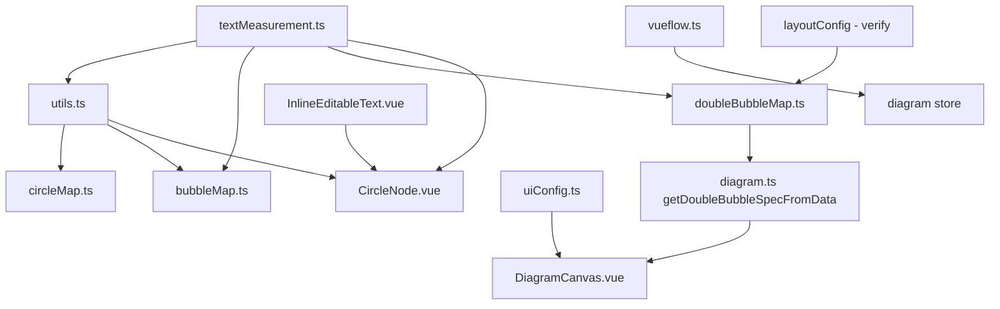

# Huangyi's Map Fixes - Code Review and Application Plan

## Summary of Fixes (7 Issues)

| #   | Issue (Chinese)           | English                                                             | Root Cause                                                          |
| --- | ------------------------- | ------------------------------------------------------------------- | ------------------------------------------------------------------- |
| 1   | 主题词节点多行显示                 | Theme word node multi-line display                                  | Context/topic nodes need wrap support for long text                 |
| 2   | 圆圈图添加节点文字后，整体放大过多，图形显示不完整 | Circle map zoom too much, graph incomplete after adding text        | No refit after text edit; layout grows but viewport doesn't update  |
| 3   | 气泡图修改后图形不在中心，右下偏移         | Bubble map shifts bottom-right after edit                           | Layout uses content-dependent center instead of fixed canvas center |
| 4   | 加长气泡图主题词时，主题词气泡位置不在中心     | Theme bubble not centered when lengthening (bubble + double bubble) | Same as #3; also needs text-adaptive topic sizing                   |
| 5   | 英文字符过长时会超出气泡范围            | Long English text exceeds bubble                                    | Fixed max-width; need text-adaptive sizing and no-wrap              |
| 6   | 若编辑添加文字为多类型字符组合，会换行显示     | Mixed character types cause unwanted wrapping                       | Need explicit `noWrap` for circle/bubble/double-bubble nodes        |
| 7   | 编辑后双气泡图气泡大小不一致            | Double bubble bubbles inconsistent after edit                       | Fixed radii; need text-adaptive radii and reload on edit            |

---

## File-by-File Comparison

### 1. CircleNode.vue

**Huangyi changes (apply):**

- **Bubble/double-bubble support**: Extend from circle_map-only to `circle_map`, `bubble_map`, `double_bubble_map`
- **Topic sizing**: Use `getTopicCircleDiameter()` from utils (DOM-based measurement) instead of `calculateAdaptiveCircleSize()` character bands
- **Capsule nodes**: Add `isCapsuleNode` for double-bubble similarity/diff nodes (pill shape)
- **Text wrapper**: Add `circle-node__text-wrapper` with `centerBlockInCircle` and `noWrap` for proper centering and single-line
- **textMaxWidth**: Use `circleSize - 2*border` instead of `circleSize - 16`
- **handleTextUpdated**: Include `bubble_map` and `double_bubble_map`; use `getTopicCircleDiameter` for topic, `calculateAdaptiveCircleSize` for context
- **InlineEditableText props**: `fullWidth`, `centerBlockInCircle`, `noWrap`, `truncate`, `textMaxWidth` from `textMaxWidth` computed

**MindGraph current**: Only supports circle_map; uses `calculateAdaptiveCircleSize` for both topic and context; no wrapper, no `noWrap`/`centerBlockInCircle`.

---

### 2. InlineEditableText.vue

**Huangyi changes (apply):**

- **New props**: `noWrap`, `fullWidth`, `centerBlockInCircle`
- **Display classes**: `inline-edit-display--center-block`, `inline-edit-display--center-in-circle` for circle/bubble topic centering
- **Input/display**: Use `noWrap || shouldPreventWrap` for `whitespace-nowrap` (fixes #6 mixed-char wrapping)
- **Wrapper**: Add `inline-editable-text--full-width` class when `fullWidth`

**MindGraph current**: Has `shouldPreventWrap` (Chinese chars < 5) but no `noWrap` prop; no center-block/center-in-circle styles.

---

### 3. BubbleNode.vue

**Both versions are identical** - fixed `max-width="100px"`, no text-adaptive sizing. The bubble map attribute nodes get their size from the spec loader (`uniformRadius * 2` in `style.size`). The BubbleNode does not read `data.style?.size` for dimensions. **Action**: BubbleNode needs to use `data.style?.size` for width/height when present (bubble_map), so long text doesn't overflow (#5). Huangyi's BubbleNode is unchanged; the fix may be in the spec loader setting `size` and the node needing to respect it. Checking: BubbleNode has no width/height in template - it uses CSS `min-width/min-height`. Vue Flow passes dimensions via the node's `width`/`height` from `diagramNodeToVueFlowNode`. For bubble nodes, we don't set width/height - so Vue Flow uses default. The bubble map loader sets `style.size` (diameter) but that's in `data.style`, not on the Vue Flow node's `width`/`height`. We need to ensure bubble nodes get `width` and `height` from `style.size` when converting to Vue Flow - similar to boundary nodes. This may require changes in `vueflow.ts` and/or BubbleNode to use `data.style.size` for dimensions.

---

### 4. textMeasurement.ts

**Huangyi changes (apply):**

- **computeTopicRadiusForCircleMap**: Return radius to outer edge including `BORDER_TOPIC` (MindGraph omits it)
- **TOPIC_FONT_SIZE**: Both use 18; no change needed
- **calculateBubbleMapRadius**, **doubleBubbleRequiredRadius**, **doubleBubbleDiffRequiredRadius**: Huangyi has these; MindGraph has them too. Same logic.

**Key fix**: `computeTopicRadiusForCircleMap` - Huangyi returns `contentR + BORDER_TOPIC` so diameter = 2*(contentR + BORDER_TOPIC). MindGraph returns `contentR` only. This affects circle/bubble topic sizing.

---

### 5. utils.ts (specLoader)

**Huangyi changes (apply):**

- **getTopicCircleDiameter**: New function `2 * computeTopicRadiusForCircleMap(text)` - use for topic nodes
- **calculateAdaptiveCircleSize**: For topic, call `getTopicCircleDiameter(text)` instead of character bands

**MindGraph current**: Topic uses character bands (10/20/30 chars); no `getTopicCircleDiameter`.

---

### 6. bubbleMap.ts (specLoader)

**Huangyi changes (apply):**

- **Fixed center**: Use `DEFAULT_CENTER_X`, `DEFAULT_CENTER_Y` instead of `centerX = childrenRadius + uniformRadius + padding`
- **Topic radius**: Use `computeTopicRadiusForCircleMap(topicText)` (text-adaptive) instead of `DEFAULT_TOPIC_RADIUS`
- **Import**: Add `computeTopicRadiusForCircleMap` from textMeasurement

**Root cause of #3, #4**: Original uses content-dependent center, so when nodes grow the center moves and the diagram shifts. Huangyi uses fixed canvas center.

---

### 7. doubleBubbleMap.ts (specLoader)

**Huangyi version is a full rewrite** - text-adaptive radii, capsule layout, `_doubleBubbleMapNodeSizes` for empty nodes.

**MindGraph current**: Uses fixed `DEFAULT_TOPIC_RADIUS`, `DEFAULT_BUBBLE_RADIUS`, `DEFAULT_DIFF_RADIUS`; different layout.

**Apply**: Replace MindGraph's doubleBubbleMap.ts with Huangyi's implementation. This fixes #7 (inconsistent bubble sizes) and enables proper text-adaptive layout.

---

### 8. types/vueflow.ts

**Huangyi changes (apply):**

- **Double-bubble capsule dimensions**: For `double_bubble_map` bubble nodes with `style.width`/`style.height`, pass them to Vue Flow node's `width`/`height`
- **concept_map**: Huangyi doesn't have concept_map in nodeTypeMap; MindGraph does. Preserve MindGraph's concept_map handling.

---

### 9. diagram.ts (store)

**Huangyi changes (apply):**

- **getDoubleBubbleSpecFromData**: Add this function to rebuild spec from current nodes (with `_doubleBubbleMapNodeSizes` for empty nodes) for reload-on-edit flow
- **getSpecForSave**: For double_bubble_map, may need to use `getDoubleBubbleSpecFromData` and reload - verify if MindGraph already has equivalent

**Note**: MindGraph does not have `getDoubleBubbleSpecFromData` or the text_updated reload flow for double_bubble_map. We need to add it.

---

### 10. DiagramCanvas.vue

**Huangyi changes (apply):**

- **node:text_updated handler**: Add refit for circle_map, bubble_map, double_bubble_map:
  - circle_map: `setTimeout(() => fitDiagram(true), CIRCLE_MAP_FIT_DELAY)`
  - bubble_map: `setTimeout(() => fitDiagram(true), BUBBLE_MAP_FIT_DELAY)`
  - double_bubble_map: get spec via `getDoubleBubbleSpecFromData`, `loadFromSpec`, then `setTimeout(() => fitDiagram(true), DOUBLE_BUBBLE_MAP_FIT_DELAY)`

**MindGraph current**: Only handles concept_map (regenerate edges); no refit for circle/bubble/double-bubble.

---

### 11. uiConfig.ts

**Huangyi changes (apply):**

- Add `CIRCLE_MAP_FIT_DELAY: 180`
- Add `BUBBLE_MAP_FIT_DELAY: 180`
- Add `DOUBLE_BUBBLE_MAP_FIT_DELAY: 180`

---

### 12. layoutConfig.ts

**Huangyi**: Has `DEFAULT_COLUMN_SPACING`, `DOUBLE_BUBBLE_MAX_CAPSULE_HEIGHT` (same as MindGraph). MindGraph also has `DEFAULT_DIFF_TO_TOPIC_SPACING` which Huangyi's doubleBubbleMap doesn't use (different layout). No layoutConfig changes needed when applying Huangyi's doubleBubbleMap.

---

### 13. BubbleNode.vue - Text overflow (#5)

**Gap**: Both versions use fixed `max-width="100px"`. For bubble map attribute nodes:

- Size comes from spec loader (`uniformRadius * 2` → `style.size`)
- BubbleNode does not use `data.style.size` for its dimensions
- Vue Flow node dimensions: we need to pass `width`/`height` from `style.size` when converting diagram nodes to Vue Flow for bubble_map

**Action**: In `diagramNodeToVueFlowNode`, for bubble_map nodes with `type === 'bubble'` and `node.style?.size`, set `width: node.style.size` and `height: node.style.size` on the Vue Flow node. Then BubbleNode (or CircleNode when bubble_map uses circle type) will get proper dimensions. Currently bubble_map uses `circle` type for both topic and bubbles (from vueflow.ts: `bubble: isCircleMap || isBubbleMap ? 'circle' : 'bubble'`). So bubble attributes render as CircleNode. CircleNode already uses `circleSize` from `props.data.style?.size`. So the flow is: bubbleMap loader sets `style: { size: uniformDiameter }` → stored in node → passed to CircleNode via data.style. CircleNode's `circleSize` uses `props.data.style?.size`. So it should work. The issue might be that InlineEditableText has `max-width="100px"` hardcoded in some nodes. In CircleNode (Huangyi), `textMaxWidth` is `circleSize - 2*border` and passed to InlineEditableText. So the fix is in CircleNode using dynamic maxWidth. For BubbleNode - bubble map attributes use CircleNode (bubble type maps to circle for bubble_map). So we don't use BubbleNode for bubble map attributes. Let me verify: `bubble: isCircleMap || isBubbleMap ? 'circle' : 'bubble'` - so bubble_map uses CircleNode for both topic and attributes. So BubbleNode is only for... when would we use BubbleNode? For double_bubble_map, `bubble: isCircleMap || isBubbleMap || isDoubleBubbleMap ? 'circle' : 'bubble'` - so double bubble also uses circle. So BubbleNode might be unused for these three map types. The NODE_MIN_DIMENSIONS has both 'bubble' and 'circle'. So BubbleNode exists for potential other uses. For bubble_map, we use CircleNode. So the fix for #5 is in CircleNode - using `textMaxWidth` from circle size. Huangyi's CircleNode already has that. Good.

---

## Dependency Order for Application

---

## Recommended Application Order

1. **uiConfig.ts** - Add fit delays
2. **textMeasurement.ts** - Fix `computeTopicRadiusForCircleMap` to include border
3. **utils.ts** - Add `getTopicCircleDiameter`, update `calculateAdaptiveCircleSize`
4. **InlineEditableText.vue** - Add `noWrap`, `fullWidth`, `centerBlockInCircle` props and styles
5. **CircleNode.vue** - Apply Huangyi's full implementation (bubble/double-bubble support, capsule, textMaxWidth, noWrap, etc.)
6. **bubbleMap.ts** - Fixed center, text-adaptive topic radius
7. **doubleBubbleMap.ts** - Replace with Huangyi's implementation
8. **vueflow.ts** - Add double-bubble capsule width/height pass-through (preserve concept_map)
9. **diagram.ts** - Add `getDoubleBubbleSpecFromData`, wire for double_bubble_map save/reload
10. **DiagramCanvas.vue** - Add text_updated refit for circle_map, bubble_map, double_bubble_map

---

## Risks and Considerations

1. **loadGenericSpec / saved diagrams**: Saved double bubble maps use generic format. After applying Huangyi's doubleBubbleMap, new saves will use the new format. Old saves loaded via loadGenericSpec keep raw nodes - they won't get the new layout. Consider: on load of generic spec, if `type === 'double_bubble_map'`, rebuild spec from nodes and run through loadDoubleBubbleMapSpec for consistent layout. This may be a follow-up.
2. **concept_map**: Huangyi's vueflow.ts doesn't have concept_map. MindGraph does. Preserve MindGraph's concept_map handling when merging.
3. **Circle map context node type**: Both use `type: 'bubble'` for context nodes. Circle map loader uses `context-` id prefix. No change needed.
4. **File length**: User rule says max 600-800 lines per file. diagram.ts and DiagramCanvas.vue may exceed this. Monitor during implementation.

---

## Verification Checklist

After applying fixes, verify:

- Circle map: Add long text to topic/context → refit runs, diagram fully visible
- Circle map: Multi-line theme word displays correctly (wrap when appropriate)
- Bubble map: Edit topic/attribute → diagram stays centered (no bottom-right shift)
- Bubble map: Long English text stays within bubble
- Double bubble: Edit any node → reload layout, bubbles consistent size
- Mixed Chinese+English text: No unwanted wrapping (noWrap)
- Saved diagrams: Load and save still work for all three map types

