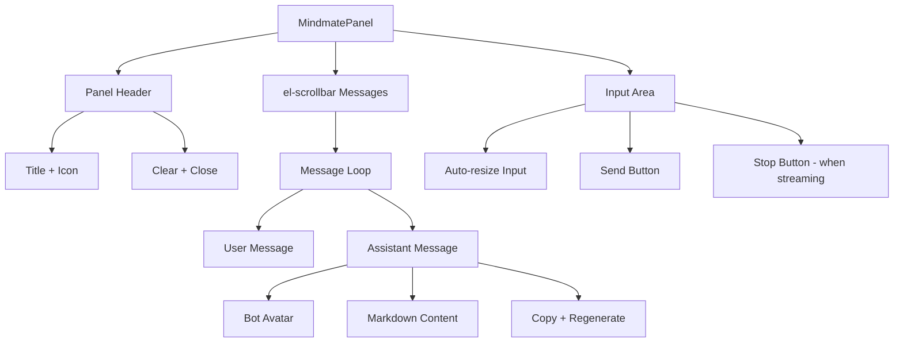

# MindMate Panel Full ChatGPT-Style Upgrade

## Current State Analysis

The current [`MindmatePanel.vue`](frontend/src/components/panels/MindmatePanel.vue) is a basic chat interface with:

- Simple text display (no markdown rendering)
- Native scrollbar instead of Element Plus
- Fixed 2-row textarea
- No message actions (copy, regenerate, stop)
- No code highlighting
- Basic styling

The archived [`mindmate-manager.js`](archive/static/js/managers/mindmate-manager.js) has features we need:

- markdown-it for rendering
- DOMPurify for sanitization
- Image enhancement with save/lightbox
- Auto-resize textarea

## Implementation Plan

### 1. Upgrade Message Rendering with Markdown

Replace plain text with proper markdown rendering using `markdown-it` (already installed):

```typescript
import MarkdownIt from 'markdown-it'
import DOMPurify from 'dompurify'

const md = new MarkdownIt({
  html: false,
  linkify: true,
  breaks: true
})

function renderMarkdown(content: string): string {
  return DOMPurify.sanitize(md.render(content))
}
```

Use `v-html` with sanitized content for assistant messages.

### 2. Replace Native Scroll with Element Plus Scrollbar

```vue
<el-scrollbar ref="scrollbarRef" class="flex-1">
  <div class="messages-wrapper p-4 space-y-4">
    <!-- messages here -->
  </div>
</el-scrollbar>
```

### 3. Add Message Actions (Copy, Regenerate)

For each assistant message, add action buttons:

- **Copy** - Copy message content to clipboard
- **Regenerate** - Re-send the previous user message

For user messages:

- **Edit** - Allow editing and re-sending

### 4. Add Stop Generation Button

When streaming, show a stop button to abort the response:

```vue
<el-button v-if="mindMate.isStreaming.value" @click="stopGeneration">
  <el-icon><VideoPause /></el-icon>
  Stop
</el-button>
```

Add `abortController` to the composable to support cancellation.

### 5. Auto-Resize Textarea

Replace fixed `rows="2"` with auto-resize using Element Plus input or manual resize:

```vue
<el-input
  v-model="inputText"
  type="textarea"
  :autosize="{ minRows: 1, maxRows: 6 }"
  @keydown="handleKeydown"
/>
```

### 6. Code Block Styling with Copy Button

Add CSS for code blocks and a copy button overlay:

```vue
<template>
  <div class="code-block-wrapper">
    <pre><code v-html="highlightedCode"></code></pre>
    <el-button class="copy-btn" @click="copyCode">
      <el-icon><CopyDocument /></el-icon>
    </el-button>
  </div>
</template>
```

### 7. Improved Typing Indicator

Use Element Plus Loading or a custom animation matching the theme.

### 8. Better Welcome Message

Show a styled welcome card instead of a plain text message.

## File Changes

| File | Changes |

|------|---------|

| [`frontend/src/components/panels/MindmatePanel.vue`](frontend/src/components/panels/MindmatePanel.vue) | Full rewrite with Element Plus components, markdown, actions |

| [`frontend/src/composables/useMindMate.ts`](frontend/src/composables/useMindMate.ts) | Add abort controller for stop, regenerate support |

## Component Structure



## UI/UX Features to Match ChatGPT

1. **Message bubbles** - User right-aligned, assistant left-aligned
2. **Avatars** - User avatar from auth, bot gradient icon
3. **Timestamp** - Subtle, on hover or always visible
4. **Hover actions** - Copy/regenerate appear on hover
5. **Smooth animations** - Fade in for new messages
6. **Code blocks** - Dark theme with language label and copy button
7. **Links** - Open in new tab
8. **Lists/Tables** - Proper markdown rendering