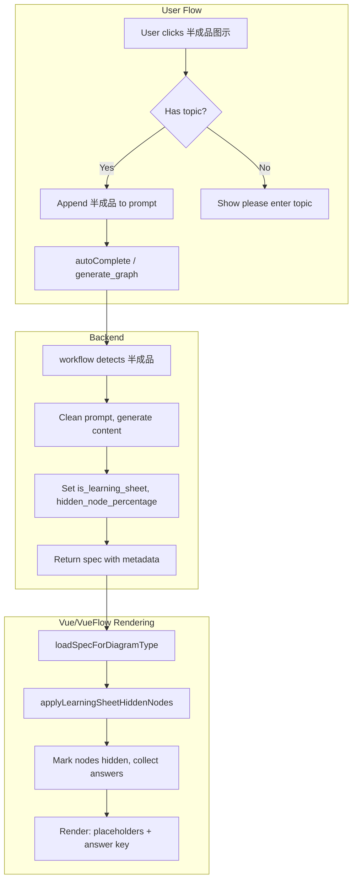

# 半成品图示 (Learning Sheet) Implementation Plan

**Scope**: Empty nodes in the canvas + answers at the bottom. **Count must match** (each empty node = one answer). Vue/VueFlow only. No D3, no PNG export.

## Code Review Summary

### Current State

**1. 半成品图示 Button (Placeholder)**

- [CanvasToolbar.vue](frontend/src/components/canvas/CanvasToolbar.vue) lines 180-195: "半成品图示" is in the More Apps dropdown with desc "随机留空，学习复习好搭子"
- `handleMoreApp(app.name)` (line 756) shows `notify.info('半成品图示功能开发中')` - placeholder only

**2. Backend - Learning Sheet Logic (Already Implemented)**

- [learning_sheet.py](agents/core/learning_sheet.py): Detects keywords `['半成品', '学习单']`, cleans prompt for LLM
- [workflow.py](agents/core/workflow.py) (generate_graph): Sets `is_learning_sheet`, `hidden_node_percentage=0.2` in spec

**3. Critical Gap - Metadata Never Consumed**

- `is_learning_sheet` and `hidden_node_percentage` are set in spec but **never used**:
  - Frontend spec loaders ([mindMap.ts](frontend/src/stores/specLoader/mindMap.ts), [bubbleMap.ts](frontend/src/stores/specLoader/bubbleMap.ts), etc.) do not check these
  - No "answer at bottom" UI anywhere
- **Rendering**: Main canvas uses **Vue Flow** (Vue/VueFlow), not D3. All logic will live in the Vue stack.

**4. Data Flow**

```
User prompt with "半成品" → generate_graph
  → workflow detects, cleans prompt, sets spec.is_learning_sheet, spec.hidden_node_percentage
  → Frontend receives spec → loadSpecForDiagramType() → ignores metadata
  → Diagram renders full content (no hidden nodes, no answer key)
```

---

## Implementation Plan

### Phase 1: Frontend - Spec Loaders and Hidden Node Logic

**1.1 Add learning sheet support to spec loader pipeline**

- In [specLoader/index.ts](frontend/src/stores/specLoader/index.ts): After loader returns, if `spec.is_learning_sheet` and `spec.hidden_node_percentage > 0`:
  - Collect all "hideable" nodes (leaf/child nodes - diagram-type specific)
  - Randomly select `hidden_node_percentage` of them (e.g., 20%)
  - Mark selected nodes with `data.hidden = true`, `data.hiddenAnswer = originalText`
  - Add `hiddenAnswers: string[]` to result metadata
  - For hidden nodes: replace `text` with placeholder (e.g., `"___"` or `"填空"`)
- Create shared utility `applyLearningSheetHiddenNodes(spec, result, diagramType)` in [specLoader/utils.ts](frontend/src/stores/specLoader/utils.ts) that each loader can call, or centralize in `loadSpecForDiagramType` after loader runs

**1.2 Diagram store and types**

- [types/vueflow.ts](frontend/src/types/vueflow.ts): Add `data.hidden?: boolean`, `data.hiddenAnswer?: string` to node data
- [stores/diagram.ts](frontend/src/stores/diagram.ts): Store `hiddenAnswers: string[]` and `isLearningSheet: boolean` when loading spec; pass to canvas

**1.3 Node display for hidden nodes**

- [InlineEditableText.vue](frontend/src/components/diagram/nodes/InlineEditableText.vue) or node components: When `node.data?.hidden === true`, show placeholder (e.g., `___`) instead of editable text; optionally dim or style differently
- Branch/child nodes in mindmap, bubble, etc. need to read `data.hidden` and render placeholder

**1.4 Keyboard shortcut: `-` to empty a node**

- **半成品图示 mode**: When user presses `-` on a node, empty the node (show placeholder) AND add the original text to the answer key at the bottom
- **Regular mode**: When user presses `-`, just empty the node (clear text) - no answer tracking

**1.5 Answer key section at bottom**

- [DiagramCanvas.vue](frontend/src/components/diagram/DiagramCanvas.vue) or [CanvasPage.vue](frontend/src/pages/CanvasPage.vue): When `isLearningSheet` and `hiddenAnswers.length > 0`, render a collapsible "参考答案" (Answer Key) section below the diagram
- Answers come from: (a) auto knock-out when loading spec, (b) manual empty via `-` key in 半成品图示 mode
- **Invariant**: Number of empty nodes = number of answers (one-to-one)

---

### Phase 2: Wire Up 半成品图示 Button

**2.1 CanvasToolbar - handleMoreApp for 半成品图示**

- In [CanvasToolbar.vue](frontend/src/components/canvas/CanvasToolbar.vue), change `handleMoreApp` to handle "半成品图示" specially:
  - **Option A (recommended)**: If user has topic in input (from diagramStore or prompt input): append " 半成品" to prompt and call `autoComplete()` - backend will detect and return learning sheet spec
  - **Option B**: If user already has a diagram: add `is_learning_sheet: true`, `hidden_node_percentage: 0.2` to current spec and re-load (client-side conversion)
  - Need access to prompt/topic input - check how [useAutoComplete](frontend/src/composables/useAutoComplete.ts) gets topic (e.g., `extractMainTopic()` from diagramStore)
  - If no topic: show "请先输入主题或创建图示" (Please enter topic or create diagram first)

**2.2 Integration with prompt input**

- The prompt/topic may live in a sidebar or DiagramTemplateInput. Ensure 半成品图示 can append " 半成品" and trigger generation. May need to expose a method from useAutoComplete or diagramStore to "generate with 半成品 mode"

---

## Architecture Diagram




---

## Key Files to Modify

All changes are in the **Vue/VueFlow stack** - no D3.


| File                                                                   | Changes                                                                                  |
| ---------------------------------------------------------------------- | ---------------------------------------------------------------------------------------- |
| [CanvasToolbar.vue](frontend/src/components/canvas/CanvasToolbar.vue)  | handleMoreApp: implement 半成品图示 (append " 半成品", trigger autoComplete)                     |
| [specLoader/index.ts](frontend/src/stores/specLoader/index.ts)         | After loader: call applyLearningSheetHiddenNodes when spec has metadata                  |
| [specLoader/utils.ts](frontend/src/stores/specLoader/utils.ts)         | Add applyLearningSheetHiddenNodes(spec, result, diagramType) - **shared business logic** |
| [stores/diagram.ts](frontend/src/stores/diagram.ts)                    | Store hiddenAnswers, isLearningSheet; pass to load pipeline                              |
| [types/vueflow.ts](frontend/src/types/vueflow.ts)                      | Add hidden, hiddenAnswer to node data                                                    |
| Node components (mindmap, bubble, etc.)                                | Render placeholder when data.hidden                                                      |
| [DiagramCanvas.vue](frontend/src/components/diagram/DiagramCanvas.vue) | Answer key section at bottom                                                             |
| [useKeyboard.ts](frontend/src/composables/useKeyboard.ts)              | Add `-` shortcut: in 半成品图示 mode empty node + add to answers; in regular mode just empty  |


---

## Edge Cases

- **Count match**: Each empty node must have exactly one corresponding answer in the list at the bottom
- **Empty diagram**: 半成品图示 needs at least one node to hide - show message if diagram has no hideable nodes
- **Determinism**: Use seeded random (e.g., from spec hash or fixed seed) so same spec produces same hidden set for reproducibility
- **Diagram types**: Not all types have clear "children" - define hideable nodes per type (mindmap: leaves, bubble: attributes, flow: steps, etc.)

