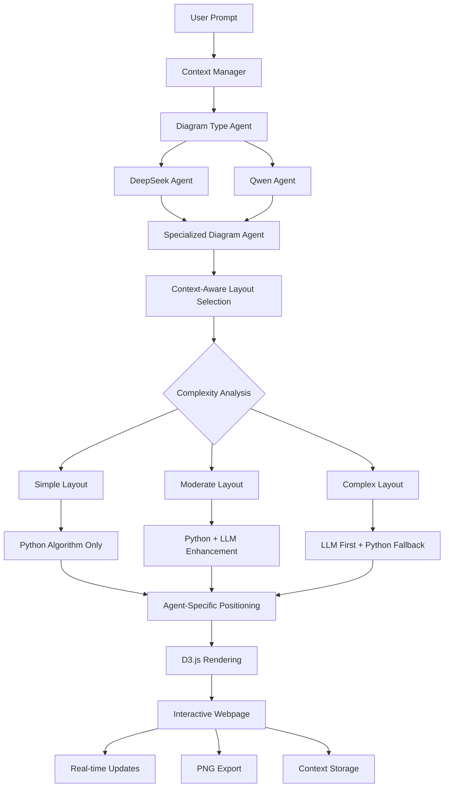

# Comprehensive Agent Architecture for Diagram Generation

## Overview

This document provides a complete reference for developing diagram agents in MindGraph, combining dynamic positioning principles, layout algorithms, and architectural patterns. It serves as the definitive guide for building new diagram agents and understanding the hybrid LLM + Python algorithm approach.

## Table of Contents

1. [Core Architecture](#core-architecture)
2. [Dynamic Positioning System](#dynamic-positioning-system)
3. [Layout Algorithms](#layout-algorithms)
4. [Hybrid LLM + Python Approach](#hybrid-llm--python-approach)
5. [Agent Development Guidelines](#agent-development-guidelines)
6. [Implementation Patterns](#implementation-patterns)
7. [Testing and Validation](#testing-and-validation)
8. [Performance Optimization](#performance-optimization)
9. [Future Enhancements](#future-enhancements)

## Core Architecture

### Agent Workflow



### Agent Roles

1. **Context Manager**: Stores and manages user prompts, preferences, and session data
2. **Diagram Type Agent**: Classifies user prompts into diagram types
3. **DeepSeek Agent**: Generates specialized prompts for complex reasoning tasks
4. **Qwen Agent**: Handles routine tasks like spec generation and calculations
5. **Diagram-Specific Agents**: Implement specialized logic and positioning for each diagram type
6. **Client-Side Layout Engine**: Handles real-time interactive updates

### Context Management System

The context management system enables personalized diagram generation by storing and utilizing user preferences and prompt history.

#### **Context Functions**

```python
class ContextManager:
    def __init__(self):
        self.user_sessions = {}
        self.prompt_history = {}
        self.preferences = {}
    
    def store_user_prompt(self, user_id: str, prompt: str, diagram_type: str):
        """Store user prompt for context-aware generation"""
        if user_id not in self.prompt_history:
            self.prompt_history[user_id] = []
        
        self.prompt_history[user_id].append({
            'prompt': prompt,
            'diagram_type': diagram_type,
            'timestamp': datetime.now(),
            'session_id': self._get_current_session(user_id)
        })
    
    def get_user_context(self, user_id: str) -> Dict:
        """Retrieve user context for personalized generation"""
        context = {
            'recent_prompts': self.prompt_history.get(user_id, [])[-5:],
            'preferences': self.preferences.get(user_id, {}),
            'session_data': self.user_sessions.get(user_id, {})
        }
        return context
    
    def update_preferences(self, user_id: str, preferences: Dict):
        """Update user preferences for future generations"""
        if user_id not in self.preferences:
            self.preferences[user_id] = {}
        self.preferences[user_id].update(preferences)
    
    def alter_diagram_based_on_context(self, spec: Dict, context: Dict) -> Dict:
        """Modify diagram specification based on stored context"""
        modified_spec = spec.copy()
        
        # Apply user preferences
        if 'style_preferences' in context['preferences']:
            modified_spec['style'] = context['preferences']['style_preferences']
        
        # Apply context from recent prompts
        recent_prompts = context['recent_prompts']
        if recent_prompts:
            # Analyze recent prompts for patterns
            common_themes = self._extract_common_themes(recent_prompts)
            modified_spec['context_themes'] = common_themes
        
        return modified_spec
```

## Individual Agent Positioning System

### Core Principles

Each diagram agent handles its own positioning internally, ensuring specialized positioning logic optimized for each diagram type. This approach provides better performance, more accurate positioning, and agent-specific optimizations.

### Agent-Specific Positioning

#### **Brace Map Agent Positioning**

```python
class BraceMapAgent:
    def __init__(self):
        self.debugger = DiagramDebugger()
        self.context_manager = ContextManager()
        self.user_preferences = {}
    
    def _handle_positioning(self, spec: Dict, dimensions: Dict, theme: Dict) -> LayoutResult:
        """Brace map specific positioning logic"""
        # Agent-specific positioning algorithms
        algorithm = self._select_layout_algorithm(spec, dimensions)
        return self._execute_layout_algorithm(algorithm, spec, dimensions, theme)
    
    def _validate_positioning(self, nodes: List[NodePosition], dimensions: Dict) -> List[NodePosition]:
        """Brace map specific positioning validation"""
        # Brace map specific boundary checks
        # Collision detection for brace elements
        # Validation of part-subpart relationships
        return self._validate_and_adjust_boundaries(nodes, dimensions)
```

#### **Concept Map Agent Positioning**

```python
class ConceptMapAgent:
    def __init__(self):
        self.debugger = DiagramDebugger()
        self.context_manager = ContextManager()
        self.user_preferences = {}
    
    def _handle_positioning(self, spec: Dict, dimensions: Dict, theme: Dict) -> LayoutResult:
        """Concept map specific positioning logic"""
        # Force-directed layout for concept maps
        # Relationship line optimization
        # Node clustering algorithms
        return self._force_directed_layout(spec, dimensions, theme)
    
    def _validate_positioning(self, nodes: List[NodePosition], dimensions: Dict) -> List[NodePosition]:
        """Concept map specific positioning validation"""
        # Validate relationship connections
        # Check for overlapping relationship lines
        # Ensure proper node spacing
        return self._validate_concept_map_layout(nodes, dimensions)
```

#### **Mind Map Agent Positioning**

```python
class MindMapAgent:
    def __init__(self):
        self.debugger = DiagramDebugger()
        self.context_manager = ContextManager()
        self.user_preferences = {}
    
    def _handle_positioning(self, spec: Dict, dimensions: Dict, theme: Dict) -> LayoutResult:
        """Mind map specific positioning logic"""
        # Radial layout for mind maps
        # Branch balancing algorithms
        # Hierarchical positioning
        return self._radial_layout(spec, dimensions, theme)
    
    def _validate_positioning(self, nodes: List[NodePosition], dimensions: Dict) -> List[NodePosition]:
        """Mind map specific positioning validation"""
        # Validate radial distribution
        # Check branch balance
        # Ensure proper hierarchical spacing
        return self._validate_radial_layout(nodes, dimensions)
```

### Positioning Integration Pattern

```python
class BaseDiagramAgent:
    def __init__(self):
        self.debugger = DiagramDebugger()
        self.context_manager = ContextManager()
        self.user_preferences = {}
    
    def generate_diagram(self, spec: Dict, user_id: str = None) -> Dict:
        """Main entry point with context-aware generation"""
        # Get user context
        if user_id:
            context = self.context_manager.get_user_context(user_id)
            spec = self.context_manager.alter_diagram_based_on_context(spec, context)
        
        # Agent-specific positioning
        layout_result = self._handle_positioning(spec, self.dimensions, self.theme)
        
        # Validate positioning
        layout_result.nodes = self._validate_positioning(layout_result.nodes, layout_result.dimensions)
        
        # Generate SVG
        svg_data = self._generate_svg_data(layout_result, self.theme)
        
        # Store context
        if user_id:
            self.context_manager.store_user_prompt(user_id, spec.get('prompt', ''), self.diagram_type)
        
        return {
            'success': True,
            'svg_data': svg_data,
            'layout_result': layout_result
        }
    
    def _handle_positioning(self, spec: Dict, dimensions: Dict, theme: Dict) -> LayoutResult:
        """Override in each agent for specific positioning logic"""
        raise NotImplementedError
    
    def _validate_positioning(self, nodes: List[NodePosition], dimensions: Dict) -> List[NodePosition]:
        """Override in each agent for specific validation logic"""
        raise NotImplementedError
```

### Node Positioning Data Structure

```python
@dataclass
class NodePosition:
    x: float          # X-coordinate (center point)
    y: float          # Y-coordinate (center point)
    width: float      # Element width
    height: float     # Element height
    text: str         # Display text
    node_type: str    # 'topic', 'part', 'subpart', 'concept', 'relationship'
    part_index: Optional[int] = None
    subpart_index: Optional[int] = None
    relationship_id: Optional[str] = None
```

### Dynamic Positioning Rules

#### 1. Main Topic Positioning

**Rule**: Main topic position depends on number of parts (odd/even)

**Examples**:
- 3 parts: topic next to part 2
- 4 parts: topic between parts 2 and 3
- 5 parts: topic next to part 3

**Implementation**:
```python
def _calculate_main_topic_position(self, parts: List, dimensions: Dict) -> Tuple[float, float]:
    """Calculate main topic position with validation and fallback"""
    num_parts = len(parts)
    
    # Calculate position based on number of parts
    if num_parts % 2 == 0:  # Even number of parts
        main_topic_part_index = num_parts // 2 - 1
    else:  # Odd number of parts
        main_topic_part_index = num_parts // 2
    
    # Get the corresponding part position
    if 0 <= main_topic_part_index < len(parts):
        part_x = dimensions['padding'] + 50
        part_y = self._calculate_part_y_position(main_topic_part_index, parts, dimensions)
        return (part_x - 100, part_y)  # Left of the part
    
    # Fallback: center of canvas
    return (dimensions['width'] / 2, dimensions['height'] / 2)
```

#### 2. Part-Subpart Centering

**Rule**: Part Y-position should center with its subparts based on subpart count

**Examples**:
- 3 subparts: part centered with subpart 2
- 4 subparts: part centered between subparts 2 and 3
- 5 subparts: part centered with subpart 3

**Implementation**:
```python
def _calculate_part_center_with_subparts(self, subparts: List, node_group_height: float) -> float:
    """Calculate part Y-position to center with subparts"""
    if not subparts:
        return node_group_height / 2
    
    num_subparts = len(subparts)
    
    if num_subparts % 2 == 0:  # Even number of subparts
        # Center between two middle subparts
        middle_index = num_subparts // 2 - 1
        subpart_center = self._calculate_subpart_y_position(middle_index, subparts, node_group_height)
        next_subpart_center = self._calculate_subpart_y_position(middle_index + 1, subparts, node_group_height)
        return (subpart_center + next_subpart_center) / 2
    else:  # Odd number of subparts
        # Center with middle subpart
        middle_index = num_subparts // 2
        return self._calculate_subpart_y_position(middle_index, subparts, node_group_height)
```

#### 3. Canvas Optimization

**Rule**: Canvas dimensions should be optimized based on actual content positions

**Implementation**:
```python
def _optimize_canvas_dimensions(self, nodes: List[NodePosition], dimensions: Dict) -> Dict:
    """Optimize canvas dimensions based on actual content positions"""
    if not nodes:
        return dimensions
    
    # Calculate actual content boundaries
    min_x = min(node.x - node.width/2 for node in nodes)
    max_x = max(node.x + node.width/2 for node in nodes)
    min_y = min(node.y - node.height/2 for node in nodes)
    max_y = max(node.y + node.height/2 for node in nodes)
    
    # Add padding
    padding = dimensions.get('padding', 40)
    optimized_width = max_x - min_x + 2 * padding
    optimized_height = max_y - min_y + 2 * padding
    
    # Ensure minimum dimensions
    optimized_width = max(optimized_width, 400)
    optimized_height = max(optimized_height, 300)
    
    return {
        **dimensions,
        'width': optimized_width,
        'height': optimized_height
    }
```

#### 4. Boundary Validation

**Rule**: All nodes should be positioned within canvas boundaries with proper padding

**Implementation**:
```python
def _validate_and_adjust_boundaries(self, nodes: List[NodePosition], dimensions: Dict) -> List[NodePosition]:
    """Validate node boundaries and adjust if necessary"""
    adjusted_nodes = []
    
    for node in nodes:
        # Check if node extends beyond canvas boundaries
        if node.x - node.width/2 < dimensions['padding']:
            node.x = dimensions['padding'] + node.width/2
        if node.x + node.width/2 > dimensions['width'] - dimensions['padding']:
            node.x = dimensions['width'] - dimensions['padding'] - node.width/2
        if node.y - node.height/2 < dimensions['padding']:
            node.y = dimensions['padding'] + node.height/2
        if node.y + node.height/2 > dimensions['height'] - dimensions['padding']:
            node.y = dimensions['height'] - dimensions['padding'] - node.height/2
        
        adjusted_nodes.append(node)
    
    return adjusted_nodes
```

### Collision Detection System

```python
class CollisionDetector:
    @staticmethod
    def detect_node_collisions(nodes: List[NodePosition], padding: float = 10.0)
    @staticmethod
    def resolve_collisions(nodes: List[NodePosition], padding: float = 10.0)
```

**Functionality**:
- Detects overlapping nodes using bounding box calculations
- Resolves collisions by adjusting node positions
- Uses iterative approach with maximum iteration limit
- Maintains minimum padding between elements

## Layout Algorithms

### Algorithm Selection Strategy

```python
def _select_layout_algorithm(self, spec: Dict, dimensions: Dict) -> LayoutAlgorithm:
    """Enhanced algorithm selection based on content characteristics"""
    num_parts = len(spec['parts'])
    max_subparts = max([len(part.get('subparts', [])) for part in spec['parts']], default=0)
    total_subparts = sum([len(part.get('subparts', [])) for part in spec['parts']])
    
    # User preference for no braces
    if self.user_preferences.get('no_braces', False):
        return LayoutAlgorithm.VERTICAL_NODE_GROUP
    
    # Specific structure requirements
    if num_parts == 3 and all(len(part.get('subparts', [])) == 3 for part in spec['parts']):
        return LayoutAlgorithm.HORIZONTAL_BRACE
    
    # Content-based selection
    if num_parts <= 3 and max_subparts <= 5:
        return LayoutAlgorithm.VERTICAL_STACK
    elif num_parts <= 6:
        return LayoutAlgorithm.VERTICAL_NODE_GROUP
    else:
        return LayoutAlgorithm.VERTICAL_NODE_GROUP  # Most scalable
```

### Available Layout Algorithms

#### 1. VERTICAL_NODE_GROUP Layout

**Purpose**: Clean vertical arrangement without braces, optimized for readability

**Positioning Logic**:
- **Main Topic**: Positioned automatically based on number of parts
- **Parts**: Left-aligned, vertically stacked with equal spacing
- **Subparts**: Right-aligned, vertically distributed within each node group
- **Node Groups**: Each part + its subparts form a discrete unit

**Strengths**:
- Clean, readable layout
- No visual clutter from braces
- Scalable for any number of parts/subparts
- Automatic positioning based on content

**Implementation**:
```python
def _vertical_node_group_layout(self, spec: Dict, dimensions: Dict, theme: Dict) -> LayoutResult:
    """Vertical node group layout without braces"""
    start_time = datetime.now()
    nodes = []
    braces = []
    
    # Calculate positions for all parts and subparts
    for i, part in enumerate(spec['parts']):
        # Position part
        part_x = dimensions['padding'] + 50
        part_y = self._calculate_part_y_position(i, spec['parts'], dimensions)
        
        nodes.append(NodePosition(
            x=part_x, y=part_y,
            width=self._calculate_text_width(part['name'], theme['fontPart']),
            height=theme['fontPart'] + 20,
            text=part['name'], node_type='part', part_index=i
        ))
        
        # Position subparts
        if 'subparts' in part and part['subparts']:
            subpart_x = part_x + 200  # Right of part
            for j, subpart in enumerate(part['subparts']):
                subpart_y = self._calculate_subpart_y_position(j, part['subparts'], dimensions)
                
                nodes.append(NodePosition(
                    x=subpart_x, y=subpart_y,
                    width=self._calculate_text_width(subpart['name'], theme['fontSubpart']),
                    height=theme['fontSubpart'] + 20,
                    text=subpart['name'], node_type='subpart',
                    part_index=i, subpart_index=j
                ))
    
    # Position main topic
    topic_x, topic_y = self._calculate_main_topic_position(spec['parts'], dimensions)
    nodes.append(NodePosition(
        x=topic_x, y=topic_y,
        width=self._calculate_text_width(spec['topic'], theme['fontTopic']),
        height=theme['fontTopic'] + 20,
        text=spec['topic'], node_type='topic'
    ))
    
    # Validate and resolve collisions
    nodes = self._validate_and_adjust_boundaries(nodes, dimensions)
    nodes = CollisionDetector.resolve_collisions(nodes, padding=20.0)
    
    return LayoutResult(
        nodes=nodes, braces=braces, dimensions=dimensions,
        algorithm_used=LayoutAlgorithm.VERTICAL_NODE_GROUP,
        performance_metrics={'processing_time': (datetime.now() - start_time).total_seconds()}
    )
```

#### 2. VERTICAL_STACK Layout

**Purpose**: Traditional brace map with vertical arrangement and braces

**Positioning Logic**:
- **Main Topic**: Left side, vertically centered
- **Parts**: Vertically stacked to the right of main topic
- **Subparts**: Positioned to the right of each part
- **Braces**: Connect main topic to parts and parts to subparts

**Strengths**:
- Traditional brace map appearance
- Clear visual hierarchy with braces
- Proven layout algorithm

**Limitations**:
- Fixed structure with braces
- Less flexible for varying content
- May not scale well for complex structures

#### 3. HORIZONTAL_BRACE Layout

**Purpose**: Horizontal arrangement for 3x3 structures

**Positioning Logic**:
- **Main Topic**: Top center
- **Parts**: 3 parts horizontally aligned below main topic
- **Subparts**: 3 subparts vertically stacked to the right of each part
- **Braces**: Connect main topic to parts and parts to subparts

**Strengths**:
- Balanced horizontal layout
- Predictable structure
- Good for standardized content

**Limitations**:
- Fixed structure (3x3 only)
- Not scalable for different content sizes
- Requires specific content format

#### 4. GROUPED_SEQUENTIAL Layout (New)

**Purpose**: Block-based layout with left-aligned groups

**Positioning Logic**:
- **Main Topic**: Left-center aligned, close to blocks
- **Parts**: Left-aligned within each block
- **Subparts**: Left-aligned below parts within blocks
- **Blocks**: Vertically stacked, left-aligned

**Strengths**:
- Clear block structure
- Left-aligned subparts for readability
- Scalable for any content size
- Optimized for brace rendering

**Implementation**:
```python
def _grouped_sequential_layout(self, spec: Dict, dimensions: Dict, theme: Dict) -> LayoutResult:
    """Block-based layout with left-aligned groups"""
    start_time = datetime.now()
    nodes = []
    braces = []
    
    # Step 1: Calculate each part-subpart as a small group first
    part_groups = []
    for i, part in enumerate(spec['parts']):
        subparts = part.get('subparts', [])
        subpart_heights = [self._calculate_text_width(sub['name'], theme['fontSubpart']) + 20 for sub in subparts]
        subpart_widths = [self._calculate_text_width(sub['name'], theme['fontSubpart']) + 20 for sub in subparts]
        
        part_width = self._calculate_text_width(part['name'], theme['fontPart']) + 20
        part_height = theme['fontPart'] + 20
        
        # Calculate group dimensions
        group_height = part_height
        if subpart_heights:
            group_height += sum(subpart_heights) + (len(subpart_heights) - 1) * 15 + 20
        
        part_groups.append({
            'part': part,
            'subparts': subparts,
            'part_width': part_width,
            'part_height': part_height,
            'subpart_heights': subpart_heights,
            'subpart_widths': subpart_widths,
            'group_height': group_height
        })
    
    # Step 2: Lay out groups vertically (part-subpart 1, 2, 3, 4, etc.)
    max_group_height = max(group['group_height'] for group in part_groups) if part_groups else 0
    group_spacing = max(60, max_group_height * 0.4)
    total_height = sum(group['group_height'] for group in part_groups) + (len(part_groups) - 1) * group_spacing
    start_y = (dimensions['height'] - total_height) / 2
    current_y = start_y
    
    for i, group in enumerate(part_groups):
        part = group['part']
        part_width = group['part_width']
        part_height = group['part_height']
        subparts = group['subparts']
        subpart_heights = group['subpart_heights']
        subpart_widths = group['subpart_widths']
        
        # Position part within its block (left-aligned)
        part_x = dimensions['padding'] + 50
        part_y = current_y + part_height / 2
        
        nodes.append(NodePosition(
            x=part_x, y=part_y,
            width=part_width, height=part_height,
            text=part['name'], node_type='part', part_index=i
        ))
        
        # Position subparts left-aligned below the part
        if subparts:
            subpart_start_x = part_x
            subpart_start_y = part_y + part_height / 2 + 20
            
            current_subpart_y = subpart_start_y
            for j, subpart in enumerate(subparts):
                subpart_width = subpart_widths[j]
                subpart_height = subpart_heights[j]
                
                subpart_x = subpart_start_x
                subpart_y = current_subpart_y + subpart_height / 2
                
                nodes.append(NodePosition(
                    x=subpart_x, y=subpart_y,
                    width=subpart_width, height=subpart_height,
                    text=subpart['name'], node_type='subpart',
                    part_index=i, subpart_index=j
                ))
                
                current_subpart_y += subpart_height + 15
        
        current_y += group['group_height'] + group_spacing
    
    # Step 3: Position main topic (left-center aligned, close to blocks)
    topic_width = self._calculate_text_width(spec['topic'], theme['fontTopic'])
    topic_height = theme['fontTopic'] + 20
    
    topic_x = dimensions['padding'] + 20
    topic_y = dimensions['height'] / 2
    
    nodes.append(NodePosition(
        x=topic_x, y=topic_y,
        width=topic_width, height=topic_height,
        text=spec['topic'], node_type='topic'
    ))
    
    # Validate and resolve collisions
    nodes = self._validate_and_adjust_boundaries(nodes, dimensions)
    nodes = CollisionDetector.resolve_collisions(nodes, padding=20.0)
    
    return LayoutResult(
        nodes=nodes, braces=braces, dimensions=dimensions,
        algorithm_used=LayoutAlgorithm.GROUPED_SEQUENTIAL,
        performance_metrics={'processing_time': (datetime.now() - start_time).total_seconds()}
    )
```

#### 5. Force-Directed Network Layout

**Purpose**: Concept maps and relationship diagrams

**Positioning Logic**:
- **Nodes**: Repel each other based on distance
- **Edges**: Attract connected nodes
- **Simulation**: Physics-based positioning
- **Stabilization**: Automatic convergence

**Strengths**:
- Natural-looking layouts
- Handles complex relationships
- Automatic spacing optimization

#### 6. Radial Layout

**Purpose**: Mind maps and hierarchical structures

**Positioning Logic**:
- **Central Node**: Center of canvas
- **Child Nodes**: Arranged in circles around center
- **Levels**: Multiple concentric circles
- **Angular Distribution**: Even spacing around circle

**Strengths**:
- Clear hierarchy visualization
- Efficient use of space
- Intuitive navigation

### Layout Algorithm Implementation Pattern

```python
def _execute_layout_algorithm(self, algorithm: LayoutAlgorithm, spec: Dict, dimensions: Dict, theme: Dict) -> LayoutResult:
    """Execute the selected layout algorithm"""
    start_time = datetime.now()
    
    if algorithm == LayoutAlgorithm.VERTICAL_NODE_GROUP:
        return self._vertical_node_group_layout(spec, dimensions, theme)
    elif algorithm == LayoutAlgorithm.VERTICAL_STACK:
        return self._vertical_stack_layout(spec, dimensions, theme)
    elif algorithm == LayoutAlgorithm.HORIZONTAL_BRACE:
        return self._horizontal_brace_layout(spec, dimensions, theme)
    elif algorithm == LayoutAlgorithm.GROUPED_SEQUENTIAL:
        return self._grouped_sequential_layout(spec, dimensions, theme)
    elif algorithm == LayoutAlgorithm.FORCE_DIRECTED:
        return self._force_directed_layout(spec, dimensions, theme)
    elif algorithm == LayoutAlgorithm.RADIAL:
        return self._radial_layout(spec, dimensions, theme)
    else:
        # Fallback to default algorithm
        return self._vertical_node_group_layout(spec, dimensions, theme)
``` 

## Enhanced LangChain Integration

### Overview

The enhanced LangChain integration provides context-aware diagram generation with user preference storage, session management, and personalized diagram customization.

### LangChain Context Functions

#### **Memory Management**

```python
from langchain.memory import ConversationBufferMemory, ConversationSummaryMemory
from langchain.schema import BaseMemory

class DiagramContextMemory(BaseMemory):
    """Custom memory for diagram generation context"""
    
    def __init__(self):
        self.user_sessions = {}
        self.prompt_history = {}
        self.preferences = {}
    
    def load_memory_variables(self, inputs: Dict[str, Any]) -> Dict[str, str]:
        """Load context variables for diagram generation"""
        user_id = inputs.get('user_id', 'default')
        context = self._get_user_context(user_id)
        
        return {
            'recent_prompts': str(context.get('recent_prompts', [])),
            'user_preferences': str(context.get('preferences', {})),
            'session_data': str(context.get('session_data', {}))
        }
    
    def save_context(self, inputs: Dict[str, Any], outputs: Dict[str, str]) -> None:
        """Save context after diagram generation"""
        user_id = inputs.get('user_id', 'default')
        prompt = inputs.get('prompt', '')
        diagram_type = outputs.get('diagram_type', '')
        
        self._store_user_prompt(user_id, prompt, diagram_type)
    
    def clear(self) -> None:
        """Clear all context data"""
        self.user_sessions.clear()
        self.prompt_history.clear()
        self.preferences.clear()
```

#### **Context-Aware Chain**

```python
from langchain.chains import LLMChain
from langchain.prompts import PromptTemplate

class ContextAwareDiagramChain:
    """LangChain-based context-aware diagram generation"""
    
    def __init__(self, llm, context_memory: DiagramContextMemory):
        self.llm = llm
        self.context_memory = context_memory
        self.prompt_template = PromptTemplate(
            input_variables=["prompt", "recent_prompts", "user_preferences"],
            template="""
            Based on the user's prompt and context, generate a diagram specification.
            
            User Prompt: {prompt}
            Recent Prompts: {recent_prompts}
            User Preferences: {user_preferences}
            
            Generate a detailed diagram specification that incorporates user preferences and context.
            """
        )
        self.chain = LLMChain(llm=llm, prompt=self.prompt_template, memory=context_memory)
    
    def generate_diagram_spec(self, prompt: str, user_id: str = None) -> Dict:
        """Generate diagram specification with context awareness"""
        inputs = {
            'prompt': prompt,
            'user_id': user_id or 'default'
        }
        
        result = self.chain.run(inputs)
        return self._parse_diagram_spec(result)
    
    def _parse_diagram_spec(self, llm_output: str) -> Dict:
        """Parse LLM output into diagram specification"""
        # Implementation for parsing LLM output
        pass
```

### Context-Driven Algorithm Selection

```python
class ContextAwareAlgorithmSelector:
    """Select algorithms based on user context and preferences"""
    
    def __init__(self, context_manager: ContextManager):
        self.context_manager = context_manager
    
    def select_algorithm(self, spec: Dict, user_id: str = None) -> LayoutAlgorithm:
        """Select layout algorithm based on context"""
        if not user_id:
            return self._default_algorithm_selection(spec)
        
        context = self.context_manager.get_user_context(user_id)
        preferences = context.get('preferences', {})
        
        # Check user's preferred algorithm
        if 'preferred_algorithm' in preferences:
            return self._get_algorithm_from_preference(preferences['preferred_algorithm'])
        
        # Check recent usage patterns
        recent_prompts = context.get('recent_prompts', [])
        if recent_prompts:
            return self._analyze_usage_patterns(recent_prompts, spec)
        
        return self._default_algorithm_selection(spec)
    
    def _analyze_usage_patterns(self, recent_prompts: List, spec: Dict) -> LayoutAlgorithm:
        """Analyze recent prompts to determine optimal algorithm"""
        # Analyze patterns in recent prompts
        # Consider complexity, content type, user preferences
        pass
```

## Hybrid LLM + Python Approach

### Overview

The hybrid approach combines the reliability and performance of Python algorithms with the intelligence and adaptability of LLMs. This provides the best of both worlds: deterministic results for simple cases and intelligent optimization for complex scenarios.

### Complexity Analysis

Each diagram agent analyzes content complexity to determine the optimal processing strategy:

#### **LayoutComplexity Levels**

- **SIMPLE**: ≤3 parts, ≤5 subparts each, standard structure
  - Use Python algorithms only
  - Fastest processing, deterministic results
  - No LLM overhead

- **MODERATE**: 4-6 parts, or complex relationships
  - Python base + LLM enhancement
  - Style optimization and minor layout improvements
  - Balanced performance and intelligence

- **COMPLEX**: >6 parts, or unusual structure, semantic relationships
  - LLM first with Python fallback
  - Full layout and style optimization
  - Maximum intelligence with reliability guarantee

### LLM Strategies

#### **LLMStrategy Options**

1. **PYTHON_ONLY**: Use only Python algorithms
   - Fastest processing
   - Deterministic results
   - No network dependency
   - Best for simple layouts

2. **LLM_ENHANCEMENT**: Python base + LLM optimization
   - Python generates base layout
   - LLM optimizes styles and minor positioning
   - Good balance of speed and intelligence
   - Graceful degradation if LLM fails

3. **LLM_FIRST**: Try LLM first, fallback to Python
   - LLM generates complete layout
   - Python fallback ensures reliability
   - Maximum intelligence for complex cases
   - Slightly slower due to LLM latency

4. **HYBRID_ROUTING**: Smart routing based on complexity
   - Automatic strategy selection
   - Adaptive to content and user preferences
   - Optimal performance for each case

### Implementation Components

#### **LLMHybridProcessor Class**

```python
class LLMHybridProcessor:
    def analyze_complexity(self, spec: Dict) -> LayoutComplexity
    def determine_strategy(self, complexity: LayoutComplexity, user_preferences: Optional[Dict]) -> LLMStrategy
    async def get_llm_layout_suggestions(self, spec: Dict, theme: Dict, dimensions: Dict) -> LLMDecision
    async def get_llm_style_optimization(self, layout_result: LayoutResult, theme: Dict) -> LLMDecision
```

#### **LLMDecision Result**

```python
@dataclass
class LLMDecision:
    success: bool
    strategy: LLMStrategy
    reasoning: str
    layout_suggestions: Optional[Dict]
    style_suggestions: Optional[Dict]
    error_message: Optional[str]
    processing_time: float
```

### Fallback Mechanisms

#### **Graceful Degradation**
1. **LLM Timeout**: Fall back to Python algorithms
2. **API Errors**: Continue with Python-only processing
3. **Invalid Responses**: Use default suggestions
4. **Network Issues**: Offline mode with Python algorithms

#### **Performance Monitoring**
- Track LLM vs Python performance
- Monitor success rates and processing times
- Adaptive strategy selection based on metrics
- A/B testing for continuous improvement

## Agent Development Guidelines

### Required Components for New Diagram Agents

#### 1. Core Agent Class with Context Management

```python
class DiagramAgent:
    def __init__(self):
        self.debugger = DiagramDebugger()
        self.context_manager = ContextManager()
        self.user_preferences = {}
        self.llm_processor = LLMHybridProcessor()
        self.algorithm_selector = ContextAwareAlgorithmSelector(self.context_manager)
    
    def generate_diagram(self, spec: Dict, user_id: str = None) -> Dict:
        """Main entry point with context-aware generation"""
        # Get user context and modify spec
        if user_id:
            context = self.context_manager.get_user_context(user_id)
            spec = self.context_manager.alter_diagram_based_on_context(spec, context)
        
        # Select algorithm based on context
        algorithm = self.algorithm_selector.select_algorithm(spec, user_id)
        
        # Execute positioning (agent-specific)
        layout_result = self._handle_positioning(spec, self.dimensions, self.theme)
        
        # Validate positioning (agent-specific)
        layout_result.nodes = self._validate_positioning(layout_result.nodes, layout_result.dimensions)
        
        # Generate SVG
        svg_data = self._generate_svg_data(layout_result, self.theme)
        
        # Store context
        if user_id:
            self.context_manager.store_user_prompt(user_id, spec.get('prompt', ''), self.diagram_type)
        
        return {
            'success': True,
            'svg_data': svg_data,
            'layout_result': layout_result
        }
    
    def _handle_positioning(self, spec: Dict, dimensions: Dict, theme: Dict) -> LayoutResult:
        """Agent-specific positioning logic - override in each agent"""
        raise NotImplementedError
    
    def _validate_positioning(self, nodes: List[NodePosition], dimensions: Dict) -> List[NodePosition]:
        """Agent-specific positioning validation - override in each agent"""
        raise NotImplementedError
```

#### 2. Layout Algorithm Implementations

```python
def _vertical_layout(self, spec: Dict, dimensions: Dict, theme: Dict) -> LayoutResult:
    """Implement vertical layout algorithm"""
    pass

def _horizontal_layout(self, spec: Dict, dimensions: Dict, theme: Dict) -> LayoutResult:
    """Implement horizontal layout algorithm"""
    pass

def _radial_layout(self, spec: Dict, dimensions: Dict, theme: Dict) -> LayoutResult:
    """Implement radial layout algorithm"""
    pass
```

#### 3. Dynamic Positioning Methods

```python
def _calculate_node_positions(self, spec: Dict, dimensions: Dict) -> List[NodePosition]:
    """Calculate positions for all nodes"""
    pass

def _validate_boundaries(self, nodes: List[NodePosition], dimensions: Dict) -> List[NodePosition]:
    """Validate and adjust node boundaries"""
    pass

def _resolve_collisions(self, nodes: List[NodePosition]) -> List[NodePosition]:
    """Resolve node collisions"""
    pass
```

#### 4. SVG Generation

```python
def _generate_svg_data(self, layout_result: LayoutResult, theme: Dict) -> Dict:
    """Generate SVG data for rendering"""
    pass

def _create_svg_elements(self, nodes: List[NodePosition], theme: Dict) -> List[Dict]:
    """Create SVG elements from nodes"""
    pass
```

### Development Checklist

#### **Phase 1: Core Implementation**
- [ ] Create agent class with context management
- [ ] Implement agent-specific positioning methods
- [ ] Add context-aware algorithm selection
- [ ] Create SVG generation logic
- [ ] Add agent-specific boundary validation
- [ ] Implement collision detection

#### **Phase 2: Context and Positioning**
- [ ] Implement context management system
- [ ] Add user preference storage and retrieval
- [ ] Create agent-specific positioning algorithms
- [ ] Add context-driven algorithm selection
- [ ] Implement session management
- [ ] Add context-aware testing

#### **Phase 3: LLM Integration**
- [ ] Add LangChain memory integration
- [ ] Implement context-aware chains
- [ ] Create LLM enhancement methods
- [ ] Add fallback mechanisms
- [ ] Implement performance monitoring

#### **Phase 4: Testing and Optimization**
- [ ] Add comprehensive unit tests
- [ ] Create context-aware integration tests
- [ ] Implement visual regression tests
- [ ] Add performance benchmarks
- [ ] Optimize algorithms and context management

### Anti-Hardcoding Principles

#### **Dynamic Configuration**
- No fixed positions or sizes
- Adaptive spacing based on content
- Dynamic watermark positioning
- Flexible color schemes

#### **Content-Aware Sizing**
- Text-based dimension calculation
- Automatic padding adjustment
- Responsive layout algorithms
- Mobile-optimized scaling

## Implementation Patterns

### Pattern 1: Layout Algorithm Template

```python
def _template_layout(self, spec: Dict, dimensions: Dict, theme: Dict) -> LayoutResult:
    """Template for implementing new layout algorithms"""
    start_time = datetime.now()
    
    # Step 1: Extract and validate input
    nodes = []
    braces = []
    
    # Step 2: Calculate positions
    # ... positioning logic ...
    
    # Step 3: Validate boundaries
    nodes = self._validate_and_adjust_boundaries(nodes, dimensions)
    
    # Step 4: Resolve collisions
    nodes = CollisionDetector.resolve_collisions(nodes, padding=20.0)
    
    # Step 5: Calculate performance metrics
    processing_time = (datetime.now() - start_time).total_seconds()
    performance_metrics = {
        'processing_time': processing_time,
        'total_nodes': len(nodes),
        'algorithm_efficiency': len(nodes) / processing_time if processing_time > 0 else 0
    }
    
    return LayoutResult(
        nodes=nodes,
        braces=braces,
        dimensions=dimensions,
        algorithm_used=LayoutAlgorithm.TEMPLATE,
        performance_metrics=performance_metrics
    )
```

### Pattern 2: LLM Integration Template

```python
async def _llm_enhanced_layout(self, spec: Dict, dimensions: Dict, theme: Dict) -> LayoutResult:
    """Template for LLM-enhanced layout algorithms"""
    
    # Step 1: Analyze complexity
    complexity = self.llm_processor.analyze_complexity(spec)
    
    # Step 2: Determine strategy
    strategy = self.llm_processor.determine_strategy(complexity, self.user_preferences)
    
    # Step 3: Execute base algorithm
    base_result = self._template_layout(spec, dimensions, theme)
    
    # Step 4: Apply LLM enhancements
    if strategy in [LLMStrategy.LLM_ENHANCEMENT, LLMStrategy.LLM_FIRST]:
        try:
            llm_decision = await self.llm_processor.get_llm_layout_suggestions(spec, theme, dimensions)
            if llm_decision.success:
                # Apply LLM suggestions
                base_result = self._apply_llm_suggestions(base_result, llm_decision)
        except Exception as e:
            self.debugger.log(f"LLM enhancement failed: {e}")
    
    return base_result
```

### Pattern 3: Validation Template

```python
def _validate_layout_result(self, result: LayoutResult, spec: Dict) -> bool:
    """Template for validating layout results"""
    
    # Check 1: All required nodes present
    required_nodes = self._get_required_nodes(spec)
    present_nodes = {node.text for node in result.nodes}
    missing_nodes = required_nodes - present_nodes
    
    if missing_nodes:
        self.debugger.log(f"Missing nodes: {missing_nodes}")
        return False
    
    # Check 2: No collisions
    collisions = CollisionDetector.detect_node_collisions(result.nodes)
    if collisions:
        self.debugger.log(f"Collisions detected: {len(collisions)}")
        return False
    
    # Check 3: All nodes within boundaries
    for node in result.nodes:
        if not self._is_within_boundaries(node, result.dimensions):
            self.debugger.log(f"Node {node.text} outside boundaries")
            return False
    
    return True
```

## Testing and Validation

### Unit Testing Strategy

#### **Layout Algorithm Testing**
```python
def test_layout_algorithm():
    """Test layout algorithm with various inputs"""
    agent = DiagramAgent()
    
    # Test case 1: Simple structure
    spec = {"topic": "Test", "parts": [{"name": "Part 1", "subparts": []}]}
    result = agent._template_layout(spec, dimensions, theme)
    assert len(result.nodes) == 2  # topic + part
    assert result.performance_metrics['processing_time'] < 1.0
    
    # Test case 2: Complex structure
    spec = {"topic": "Test", "parts": [
        {"name": "Part 1", "subparts": [{"name": "Sub 1"}, {"name": "Sub 2"}]},
        {"name": "Part 2", "subparts": [{"name": "Sub 3"}]}
    ]}
    result = agent._template_layout(spec, dimensions, theme)
    assert len(result.nodes) == 6  # topic + 2 parts + 3 subparts
```

#### **Positioning Validation Testing**
```python
def test_positioning_validation():
    """Test positioning validation logic"""
    agent = DiagramAgent()
    
    # Test boundary validation
    nodes = [NodePosition(x=0, y=0, width=100, height=50, text="Test", node_type="topic")]
    dimensions = {"width": 400, "height": 300, "padding": 40}
    
    adjusted_nodes = agent._validate_and_adjust_boundaries(nodes, dimensions)
    assert adjusted_nodes[0].x >= dimensions['padding'] + adjusted_nodes[0].width/2
```

### Integration Testing Strategy

#### **End-to-End Workflow Testing**
```python
def test_complete_workflow():
    """Test complete diagram generation workflow"""
    agent = DiagramAgent()
    
    # Test input
    user_prompt = "Create a brace map for: Animals - Mammals, Birds, Fish"
    
    # Execute workflow
    result = agent.generate_diagram_from_prompt(user_prompt)
    
    # Validate output
    assert result['success'] == True
    assert 'svg_data' in result
    assert 'nodes' in result['svg_data']
    assert len(result['svg_data']['nodes']) > 0
```

### Context-Aware Testing

#### **Context-Driven Test Cases**
```python
def test_context_aware_generation():
    """Test diagram generation with different user contexts"""
    agent = DiagramAgent()
    
    # Test case 1: New user with no context
    result1 = agent.generate_diagram(test_spec, user_id="new_user")
    assert result1['success'] == True
    
    # Test case 2: User with preferences
    agent.context_manager.update_preferences("user_with_prefs", {
        'style_preferences': {'color_scheme': 'dark', 'font_size': 'large'},
        'preferred_algorithm': 'VERTICAL_NODE_GROUP'
    })
    result2 = agent.generate_diagram(test_spec, user_id="user_with_prefs")
    assert result2['success'] == True
    # Verify preferences were applied
    
    # Test case 3: User with prompt history
    agent.context_manager.store_user_prompt("user_with_history", "Create a brace map for animals", "brace_map")
    result3 = agent.generate_diagram(test_spec, user_id="user_with_history")
    assert result3['success'] == True
    # Verify context influenced generation
```

#### **Context Persistence Testing**
```python
def test_context_persistence():
    """Test that user context persists across sessions"""
    agent = DiagramAgent()
    user_id = "test_user"
    
    # Store initial context
    agent.context_manager.store_user_prompt(user_id, "First prompt", "brace_map")
    agent.context_manager.update_preferences(user_id, {'color_scheme': 'blue'})
    
    # Verify context retrieval
    context = agent.context_manager.get_user_context(user_id)
    assert len(context['recent_prompts']) == 1
    assert context['preferences']['color_scheme'] == 'blue'
    
    # Test context influence on generation
    result = agent.generate_diagram(test_spec, user_id=user_id)
    assert result['success'] == True
```

### Visual Regression Testing

#### **Automated Screenshot Comparison**
```python
def test_visual_consistency():
    """Test visual consistency across different inputs"""
    agent = DiagramAgent()
    
    # Generate diagrams for known inputs
    test_cases = [
        {"topic": "Simple", "parts": [{"name": "Part 1", "subparts": []}]},
        {"topic": "Complex", "parts": [
            {"name": "Part 1", "subparts": [{"name": "Sub 1"}, {"name": "Sub 2"}]},
            {"name": "Part 2", "subparts": [{"name": "Sub 3"}]}
        ]}
    ]
    
    for i, test_case in enumerate(test_cases):
        result = agent.generate_diagram(test_case)
        
        # Save screenshot for comparison
        screenshot_path = f"test_screenshots/test_case_{i}.png"
        save_screenshot(result['svg_data'], screenshot_path)
        
        # Compare with baseline
        assert compare_screenshots(screenshot_path, f"baseline/test_case_{i}.png")
```

## Performance Optimization

### Optimization Strategies

#### **1. Caching**
```python
class LayoutCache:
    def __init__(self):
        self.cache = {}
        self.max_size = 1000
    
    def get_cached_layout(self, spec_hash: str) -> Optional[LayoutResult]:
        return self.cache.get(spec_hash)
    
    def cache_layout(self, spec_hash: str, result: LayoutResult):
        if len(self.cache) >= self.max_size:
            # Remove oldest entry
            oldest_key = next(iter(self.cache))
            del self.cache[oldest_key]
        self.cache[spec_hash] = result
```

#### **2. Parallel Processing**
```python
async def _parallel_layout_processing(self, spec: Dict, dimensions: Dict, theme: Dict) -> LayoutResult:
    """Process layout algorithms in parallel"""
    
    # Run multiple algorithms in parallel
    tasks = [
        self._vertical_layout(spec, dimensions, theme),
        self._horizontal_layout(spec, dimensions, theme),
        self._radial_layout(spec, dimensions, theme)
    ]
    
    results = await asyncio.gather(*tasks, return_exceptions=True)
    
    # Select best result based on metrics
    valid_results = [r for r in results if isinstance(r, LayoutResult)]
    if valid_results:
        return max(valid_results, key=lambda r: r.performance_metrics['algorithm_efficiency'])
    
    # Fallback to default
    return self._vertical_layout(spec, dimensions, theme)
```

#### **3. Lazy Loading**
```python
class LazyLayoutEngine:
    def __init__(self):
        self.algorithms = {}
    
    def get_algorithm(self, name: str):
        """Lazy load algorithm implementation"""
        if name not in self.algorithms:
            self.algorithms[name] = self._load_algorithm(name)
        return self.algorithms[name]
    
    def _load_algorithm(self, name: str):
        """Load algorithm implementation on demand"""
        # Implementation details
        pass
```

### Performance Monitoring

#### **Metrics Collection**
```python
class PerformanceMonitor:
    def __init__(self):
        self.metrics = {}
    
    def record_metric(self, operation: str, duration: float, success: bool):
        if operation not in self.metrics:
            self.metrics[operation] = {
                'total_time': 0,
                'count': 0,
                'success_count': 0,
                'avg_time': 0
            }
        
        self.metrics[operation]['total_time'] += duration
        self.metrics[operation]['count'] += 1
        if success:
            self.metrics[operation]['success_count'] += 1
        
        self.metrics[operation]['avg_time'] = (
            self.metrics[operation]['total_time'] / 
            self.metrics[operation]['count']
        )
    
    def get_performance_report(self) -> Dict:
        return self.metrics
```

## Future Enhancements

### Advanced LLM Integration

#### **Fine-tuned Models**
- Custom models for specific diagram types
- Domain-specific training data
- Improved accuracy for specialized layouts

#### **Multi-modal Input**
- Support for image and text input
- OCR integration for diagram extraction
- Voice input processing

### Interactive Features

#### **Real-time Collaboration**
- Multi-user editing
- Conflict resolution
- Version control integration

#### **Advanced Export Options**
- Multiple output formats (PDF, SVG, PNG)
- High-resolution rendering
- Print optimization

### Mobile Optimization

#### **Touch Gestures**
- Intuitive mobile interactions
- Gesture-based editing
- Responsive design

#### **Offline Support**
- Work without internet connection
- Local processing capabilities
- Sync when online

## Conclusion

This comprehensive Agent Architecture document provides the foundation for developing robust, intelligent diagram generation agents. The hybrid LLM + Python approach ensures both reliability and intelligence, while the dynamic positioning system guarantees optimal visual results.

Key principles for successful agent development:

1. **Start with Python algorithms** for reliability
2. **Add LLM enhancement** for intelligence
3. **Implement comprehensive testing** for quality
4. **Optimize performance** for scalability
5. **Follow established patterns** for consistency

The architecture is designed to be extensible, allowing new diagram types to be added easily while maintaining consistency and quality across the entire system.

### Summary of Key Components

#### **Core Architecture**
- Agent workflow with multiple specialized agents
- Dynamic positioning system with collision detection
- Layout algorithm selection based on content characteristics
- Hybrid LLM + Python approach for optimal results

#### **Layout Algorithms**
- **VERTICAL_NODE_GROUP**: Clean vertical arrangement without braces
- **VERTICAL_STACK**: Traditional brace map with vertical arrangement
- **HORIZONTAL_BRACE**: Horizontal arrangement for 3x3 structures
- **GROUPED_SEQUENTIAL**: Block-based layout with left-aligned groups
- **Force-Directed Network**: For concept maps and relationship diagrams
- **Radial Layout**: For mind maps and hierarchical structures

#### **Development Guidelines**
- Required components for new diagram agents
- Development checklist with 4 phases
- Anti-hardcoding principles
- Implementation patterns and templates
- Comprehensive testing strategies

#### **Performance Optimization**
- Caching strategies for layout results
- Parallel processing for multiple algorithms
- Lazy loading for algorithm implementations
- Performance monitoring and metrics collection

This document serves as the definitive reference for developing diagram agents in the MindGraph system, ensuring consistency, quality, and maintainability across all diagram types. 