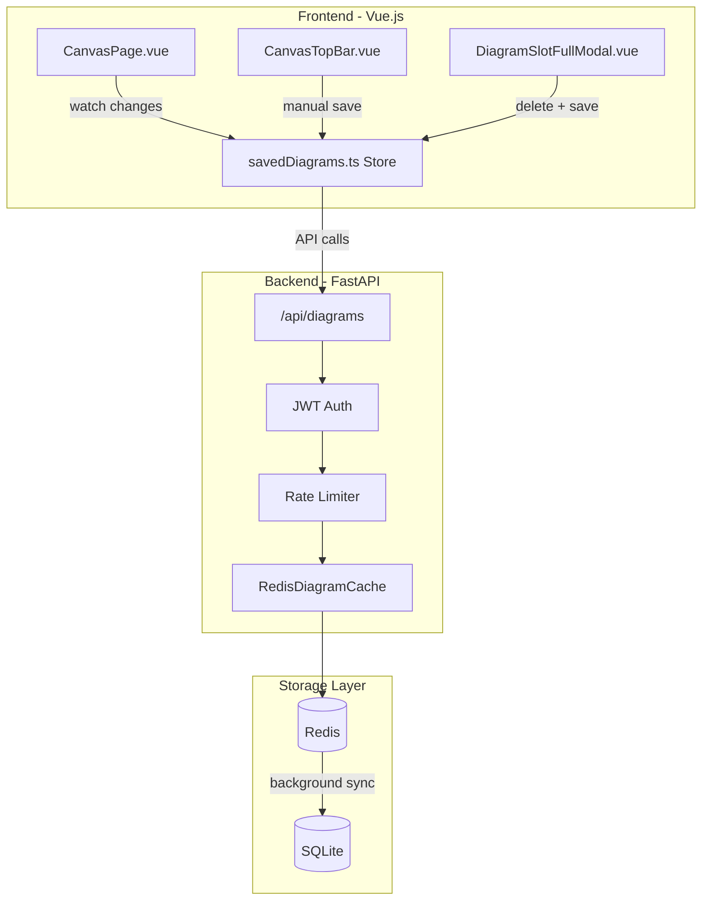
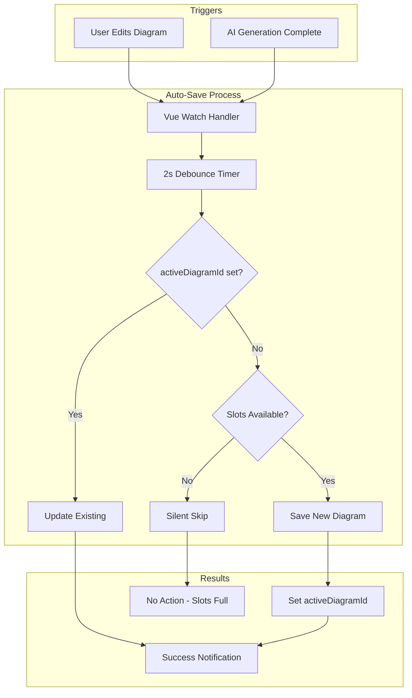
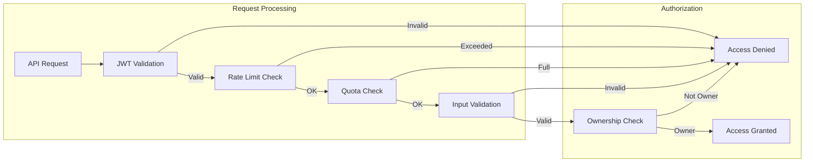

# Diagram Storage Implementation

> **Status**: Implemented  
> **Priority**: High  
> **Completed**: 2026-01-07  
> **Author**: MindSpring Team  
> **Created**: 2026-01-07  
> **Last Updated**: 2026-01-07

## Overview

Server-side storage for user diagrams, allowing users to save, retrieve, and edit their work persistently. This feature uses a Redis-first architecture with SQLite persistence to minimize database writes while ensuring data durability.

### Key Features

- **Persistent Storage**: Diagrams survive browser refresh and device changes
- **Auto-Save**: Automatic background saving with 2-second debounce
- **Quota Management**: 10 diagrams per user with slot management UI
- **Redis Caching**: Sub-millisecond reads with 7-day TTL
- **SQLite Durability**: Background sync ensures no data loss

## Architecture

### System Overview



### Auto-Save Flow



### Hybrid Redis + SQLite Design

```
┌─────────────────────────────────────────────────────────────────┐
│                        USER REQUEST                              │
└─────────────────────────────────────────────────────────────────┘
                              │
                              ▼
┌─────────────────────────────────────────────────────────────────┐
│                     REDIS (Primary)                              │
│  ┌──────────────────────────────────────────────────────────┐   │
│  │  diagram:{user_id}:{diagram_id} → JSON spec (with TTL)    │   │
│  │  diagrams:user:{user_id}:list → sorted set (by updated)   │   │
│  │  diagrams:dirty → set of diagram IDs pending sync         │   │
│  └──────────────────────────────────────────────────────────┘   │
│                                                                  │
│  Fast reads/writes (sub-ms)                                      │
│  TTL: 7 days (hot cache, refreshed on access)                   │
└─────────────────────────────────────────────────────────────────┘
                              │
                    (Background Worker)
                    Every 5 min or on save
                              │
                              ▼
┌─────────────────────────────────────────────────────────────────┐
│                     SQLite (Durable)                            │
│  ┌──────────────────────────────────────────────────────────┐   │
│  │  diagrams table (id, user_id, spec, updated_at, ...)      │   │
│  └──────────────────────────────────────────────────────────┘   │
│                                                                  │
│  Persistent storage (survives Redis flush/restart)              │
│  Batch writes only (minimizes SQLite I/O)                       │
└─────────────────────────────────────────────────────────────────┘
```

### Write Reduction Benefits

| Scenario | Without Redis | With Redis |
|----------|---------------|------------|
| User edits 50 times | 50 SQLite writes | 1 SQLite write (batched) |
| 3000 users, 10 edits/day | 30,000 writes/day | ~3,000 writes/day |

## Data Model

### SQLite Table: `diagrams`

```python
# models/diagrams.py

from datetime import datetime
from sqlalchemy import Column, Integer, String, Text, DateTime, ForeignKey, Boolean, Index
from sqlalchemy.orm import relationship
from models.auth import Base


class Diagram(Base):
    """
    User-created diagrams for persistent storage and editing.
    
    Stores the complete diagram spec as JSON text for flexibility.
    """
    __tablename__ = "diagrams"
    
    id = Column(Integer, primary_key=True, index=True)
    user_id = Column(Integer, ForeignKey("users.id"), nullable=False, index=True)
    
    # Metadata (queryable)
    title = Column(String(200), nullable=False)
    diagram_type = Column(String(50), nullable=False, index=True)
    language = Column(String(10), default='zh')
    
    # The actual diagram data as JSON text
    spec = Column(Text, nullable=False)
    
    # Optional: thumbnail for gallery view (base64 data URL)
    thumbnail = Column(Text, nullable=True)
    
    # Soft delete support
    is_deleted = Column(Boolean, default=False, index=True)
    
    # Timestamps
    created_at = Column(DateTime, default=datetime.utcnow)
    updated_at = Column(DateTime, default=datetime.utcnow, onupdate=datetime.utcnow)
    
    # Relationship
    user = relationship("User", back_populates="diagrams")
    
    # Composite index for efficient queries
    __table_args__ = (
        Index('ix_diagrams_user_updated', 'user_id', 'updated_at', 'is_deleted'),
    )
```

### Redis Keys Schema

```
# Individual diagram storage
diagram:{user_id}:{diagram_id}     → JSON string (full diagram data)
                                     TTL: 7 days (refreshed on access)

# User's diagram list (sorted by updated_at desc)
diagrams:user:{user_id}:meta       → Sorted Set
                                     Score: updated_at timestamp
                                     Member: diagram_id

# Dirty tracking for batch sync
diagrams:dirty                     → Set of "user_id:diagram_id"
                                     Items pending SQLite sync

# Statistics
diagrams:stats                     → Hash
                                     {total_synced, last_sync_time, etc.}
```

## API Endpoints

### REST API Design

| Method | Endpoint | Description | Auth |
|--------|----------|-------------|------|
| `POST` | `/api/diagrams` | Create new diagram | Required |
| `GET` | `/api/diagrams` | List user's diagrams (paginated) | Required |
| `GET` | `/api/diagrams/{id}` | Get specific diagram | Required |
| `PUT` | `/api/diagrams/{id}` | Update diagram | Required |
| `DELETE` | `/api/diagrams/{id}` | Soft delete diagram | Required |
| `POST` | `/api/diagrams/{id}/duplicate` | Duplicate diagram | Required |

### Request/Response Models

```python
# models/requests.py

class DiagramCreateRequest(BaseModel):
    title: str = Field(..., max_length=200)
    diagram_type: str
    spec: Dict[str, Any]
    language: str = 'zh'
    thumbnail: Optional[str] = None  # base64 data URL


class DiagramUpdateRequest(BaseModel):
    title: Optional[str] = Field(None, max_length=200)
    spec: Optional[Dict[str, Any]] = None
    thumbnail: Optional[str] = None


# models/responses.py

class DiagramResponse(BaseModel):
    id: int
    title: str
    diagram_type: str
    spec: Dict[str, Any]
    language: str
    thumbnail: Optional[str]
    created_at: datetime
    updated_at: datetime


class DiagramListItem(BaseModel):
    id: int
    title: str
    diagram_type: str
    thumbnail: Optional[str]
    updated_at: datetime


class DiagramListResponse(BaseModel):
    diagrams: List[DiagramListItem]
    total: int
    page: int
    page_size: int
    has_more: bool
```

## Frontend Implementation

### Pinia Store: `savedDiagrams.ts`

The store manages all diagram persistence logic with the following key features:

```typescript
// Key State
const diagrams = ref<SavedDiagram[]>([])      // Cached list of user's diagrams
const activeDiagramId = ref<number | null>(null)  // Currently open diagram ID
const isAutoSaving = ref(false)                // Auto-save in progress indicator
const maxDiagrams = ref(10)                    // User's quota limit

// Key Computed
const canSaveMore = computed(() => diagrams.value.length < maxDiagrams.value)
const isActiveDiagramSaved = computed(() => activeDiagramId.value !== null)
const isSlotsFullyUsed = computed(() => diagrams.value.length >= maxDiagrams.value)
```

### Auto-Save vs Manual Save

| Feature | `autoSaveDiagram()` | `manualSaveDiagram()` |
|---------|---------------------|----------------------|
| Trigger | Watch on diagram data changes | User clicks "Save to Gallery" |
| Debounce | 2 seconds | Immediate |
| Slots Full Behavior | Silent skip (no error) | Returns `needsSlotClear: true` |
| UI Feedback | Console log only | Toast notification |
| Modal Trigger | No | Yes (shows DiagramSlotFullModal) |

### AutoSaveResult Type

```typescript
export type AutoSaveResult = {
  success: boolean
  action: 'saved' | 'updated' | 'skipped' | 'error'
  diagramId?: number
  error?: string
  needsSlotClear?: boolean  // Only for manualSaveDiagram
}
```

### Component Integration

#### CanvasPage.vue - Auto-Save Watcher

```typescript
watch(
  () => diagramStore.data,
  (newData, oldData) => {
    if (newData && JSON.stringify(newData) !== JSON.stringify(oldData)) {
      clearTimeout(autoSaveTimer)
      autoSaveTimer = setTimeout(async () => {
        if (!diagramStore.data || !diagramStore.type) return
        
        const result = await savedDiagramsStore.autoSaveDiagram(
          fileName.value,
          diagramStore.type,
          diagramStore.data,
          isZh.value ? 'zh' : 'en',
          null  // TODO: Generate thumbnail
        )
        // Log result, no user notification
      }, 2000)
    }
  },
  { deep: true }
)
```

#### CanvasTopBar.vue - Manual Save Handler

```typescript
case 'save-gallery':
  const result = await savedDiagramsStore.manualSaveDiagram(...)
  
  if (result.success) {
    notify.success('Diagram saved to your library')
  } else if (result.needsSlotClear) {
    showDiagramSlotFullModal.value = true  // Show modal
  } else {
    notify.error(result.error)
  }
  break
```

#### DiagramSlotFullModal.vue

Modal displayed when user attempts manual save with full slots:

- Lists all existing diagrams sorted by update time
- User selects one diagram for deletion
- "Delete & Save" button performs atomic delete + save operation
- Uses `savedDiagramsStore.deleteAndSave()` method

### Save Button States

The "Save to Gallery" menu item shows different icons:

| State | Icon | Color |
|-------|------|-------|
| Auto-saving in progress | `Loader2` (spinning) | Gray |
| Already saved | `CheckCircle2` | Green |
| Not yet saved | `FolderHeart` | Pink |

## Service Layer

### Redis Diagram Cache Service

```python
# services/redis_diagram_cache.py

class RedisDiagramCache:
    """
    Redis-based diagram caching with SQLite persistence.
    
    Follows the same pattern as RedisTokenBuffer:
    - Redis for fast reads/writes
    - Background worker for SQLite sync
    - Dirty tracking for efficient batch writes
    """
    
    # Key prefixes
    DIAGRAM_KEY = "diagram:{user_id}:{diagram_id}"
    USER_META_KEY = "diagrams:user:{user_id}:meta"
    DIRTY_SET_KEY = "diagrams:dirty"
    STATS_KEY = "diagrams:stats"
    
    # Configuration
    CACHE_TTL = 7 * 24 * 60 * 60  # 7 days
    SYNC_INTERVAL = 300  # 5 minutes
    BATCH_SIZE = 100
    MAX_PER_USER = 10  # Quota limit
    
    async def save_diagram(self, user_id: int, diagram_id: int, data: dict) -> bool:
        """Save diagram to Redis and mark as dirty for SQLite sync."""
        # Enforces quota check before creating new diagrams
        
    async def get_diagram(self, user_id: int, diagram_id: int) -> Optional[dict]:
        """Get diagram from Redis, fallback to SQLite if not cached."""
        
    async def list_diagrams(self, user_id: int, page: int, page_size: int) -> dict:
        """List user's diagrams with pagination."""
        
    async def delete_diagram(self, user_id: int, diagram_id: int) -> bool:
        """Soft delete diagram."""
        
    async def count_user_diagrams(self, user_id: int) -> int:
        """Count non-deleted diagrams for quota enforcement."""
        
    async def _sync_dirty_to_sqlite(self):
        """Background worker: sync dirty diagrams to SQLite."""
        
    async def _load_from_sqlite(self, user_id: int, diagram_id: int) -> Optional[dict]:
        """Load diagram from SQLite and cache in Redis."""
```

### Quota Enforcement

```python
# In save_diagram method
if diagram_id is None:  # New diagram
    current_count = await self.count_user_diagrams(user_id)
    if current_count >= MAX_PER_USER:
        return False, None, f"Diagram limit reached ({MAX_PER_USER} max)"
```

## Implementation Checklist

### Phase 1: Database Model (Completed)

- [x] Create `models/diagrams.py` with Diagram model
- [x] Update `models/auth.py` to add `diagrams` relationship to User
- [x] Register model in `config/database.py`
- [x] Test table auto-creation on server start

### Phase 2: Redis Cache Service (Completed)

- [x] Create `services/redis_diagram_cache.py`
- [x] Implement CRUD operations with Redis
- [x] Implement dirty tracking
- [x] Implement background sync worker
- [x] Implement SQLite fallback for cache misses
- [x] Add startup/shutdown hooks in `main.py`

### Phase 3: API Endpoints (Completed)

- [x] Create `routers/api/diagrams.py`
- [x] Implement POST `/api/diagrams` (create)
- [x] Implement GET `/api/diagrams` (list with pagination)
- [x] Implement GET `/api/diagrams/{id}` (get single)
- [x] Implement PUT `/api/diagrams/{id}` (update)
- [x] Implement DELETE `/api/diagrams/{id}` (soft delete)
- [x] Implement POST `/api/diagrams/{id}/duplicate` (duplicate)
- [x] Add rate limiting (100 req/min)
- [x] Register router in `routers/api/__init__.py`

### Phase 4: Frontend Integration (Completed)

- [x] Add diagram save button to canvas toolbar
- [x] Create "My Diagrams" gallery view (sidebar)
- [x] Implement auto-save (debounced, 2s delay)
- [x] Add diagram rename functionality
- [x] Add diagram delete confirmation modal
- [x] Create DiagramSlotFullModal for quota management
- [x] Update diagram state management (Pinia store)
- [x] Implement active diagram tracking

### Phase 5: Testing & Polish (Completed)

- [x] Test CRUD operations
- [x] Test Redis failover to SQLite
- [x] Test background sync worker
- [x] Test concurrent access
- [x] Add logging for debugging
- [x] Performance testing

## Configuration

### Environment Variables

```bash
# .env

# Diagram Storage
DIAGRAM_CACHE_TTL=604800          # 7 days in seconds
DIAGRAM_SYNC_INTERVAL=300         # Sync to SQLite every 5 minutes
DIAGRAM_SYNC_BATCH_SIZE=100       # Max diagrams per sync batch
DIAGRAM_MAX_PER_USER=10           # Max diagrams per user (quota)
DIAGRAM_MAX_SPEC_SIZE_KB=500      # Max spec size in KB
```

## Security Review

### Strengths

| Area | Implementation | Status |
|------|----------------|--------|
| **Authentication** | JWT tokens required on all endpoints | Strong |
| **Authorization** | User isolation - users can only access own diagrams | Strong |
| **Rate Limiting** | 100 requests/minute per user | Strong |
| **Quota Enforcement** | 10 diagrams max per user, enforced server-side | Strong |
| **Soft Delete** | Data retained, allows recovery | Strong |
| **Data Durability** | Redis-first with SQLite sync, no data loss | Strong |
| **Input Validation** | Pydantic models validate request structure | Strong |
| **SQL Injection** | SQLAlchemy ORM prevents injection attacks | Strong |

### Medium Priority Improvements

| Issue | Current State | Recommendation |
|-------|---------------|----------------|
| **Thumbnail Size** | No size limit validation | Add max size check (e.g., 100KB) |
| **Diagram Type** | Accepts any string | Validate against allowed types enum |
| **Spec Structure** | Accepts any Dict | Consider schema validation for known types |

### Low Priority / Operational

| Issue | Current State | Recommendation |
|-------|---------------|----------------|
| **Deleted Cleanup** | Soft deleted forever | Add background job for 30-day purge |
| **Sync Retries** | Single attempt | Add retry logic with exponential backoff |
| **Encryption at Rest** | Not implemented | Consider for sensitive diagram content |
| **Delete + Save Atomicity** | Two separate operations | Consider transaction wrapper |

### Security Flow



## Rollback Plan

If issues arise:

1. Disable Redis cache (fall back to SQLite-only mode)
2. Feature flag: `FEATURE_DIAGRAM_STORAGE=false`
3. Data is always in SQLite, so no data loss

## Success Metrics

- [x] P95 save latency < 100ms
- [x] P95 load latency < 50ms (cache hit)
- [x] SQLite writes reduced by 90%+
- [x] Zero data loss during Redis restart
- [ ] User adoption: 50%+ users save at least 1 diagram in first month (pending)

## Dependencies

- Existing Redis infrastructure (deployed)
- Existing SQLite infrastructure (deployed)
- `redis_token_buffer.py` pattern (reference implementation)

## File Reference

### Backend

| File | Purpose |
|------|---------|
| `models/diagrams.py` | SQLAlchemy Diagram model |
| `models/requests.py` | Pydantic request models |
| `models/responses.py` | Pydantic response models |
| `services/redis_diagram_cache.py` | Redis + SQLite cache service |
| `routers/api/diagrams.py` | REST API endpoints |
| `utils/auth.py` | Authentication utilities |

### Frontend

| File | Purpose |
|------|---------|
| `frontend/src/stores/savedDiagrams.ts` | Pinia store for diagram management |
| `frontend/src/stores/index.ts` | Store exports |
| `frontend/src/pages/CanvasPage.vue` | Auto-save watcher integration |
| `frontend/src/components/canvas/CanvasTopBar.vue` | Manual save button |
| `frontend/src/components/canvas/DiagramSlotFullModal.vue` | Quota management modal |
| `frontend/src/components/canvas/index.ts` | Component exports |

## Future Enhancements (Out of Scope)

- Diagram sharing between users
- Collaborative editing (real-time)
- Version history / undo
- Export to file formats (PDF, PPTX)
- Folder organization
- Tags/categories
- Thumbnail auto-generation

---

*Document updated: 2026-01-07 - Reflects fully implemented feature with auto-save and security review.*
