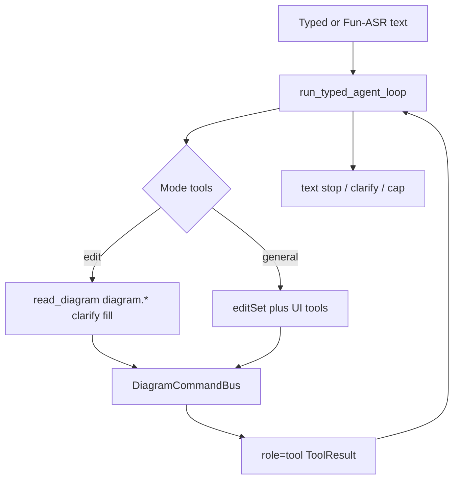

# Kitty agent gap-close plan

Status: **implemented** (2026-09-09). Typed loop is the only Kitty edit brain. Qwen-Omni realtime duplex is gone.

Phased plan to close Kitty’s remaining agent-behavior gaps without adopting pi, LangGraph, or a hosted DashScope agent. Shipped work: typed-path discipline (smaller tools, shorter prompt, compact memory, clarify over heuristics), honest auto-complete observations, and thinking-edit FAB UX.

## Rule

Do **not** embed pi, LangGraph, or a DashScope hosted agent. Keep the existing OpenAI-compatible loop in [`services/kitty/agent_loop/`](../../services/kitty/agent_loop/) and the verified DiagramCommandBus. Steal pi’s discipline: few tools, short prompt, the model sees what just happened.

Keyboard and Fun-ASR committed `{type:"text"}` both enter [`run_typed_agent_loop`](../../services/kitty/agent_loop/loop.py) via [`_handle_text_inbound`](../../services/kitty/session/event_handlers.py). There is no Omni `function_call` event path.

## Phase 1 — Typed core

Highest behavior value. Stay inside `agent_loop/` + memory.

### 1a. Split tool schemas by mode

[`loop_tool_schemas(mode)`](../../services/kitty/agent_loop/tools.py):

- **edit:** `read_diagram`, structural `diagram.*`, `node_action.clarify_options`, `node_action.auto_complete_branch`, and whole-map `auto_complete` (kept for “改主题再补完整图” / five-maps).
- **general:** edit set + leftover UI tools (`select_node`, panels, `open_desktop_canvas`, …).

### 1b. Shrink the system prompt

[`build_system_prompt`](../../services/kitty/agent_loop/messages.py) is short identity only. “When to use X” lives on each tool’s JSON `description`. Canvas fill-after-`add_node` stays **server behavior**.

[`render_library_prompt`](../../services/kitty/routing/node_action_library.py) remains for the leftover one-shot node-action parser only.

### 1c. Compact memory into the next turn

[`KittySessionMemory.compact_for_loop`](../../services/kitty/session/memory.py) sends last tool observation + previous user line. The 20-turn deque stays for debug / one-sentence persist.

### 1d. Prefer clarify over heuristics

- Empty tools / step cap in **edit** and no successful mutate → default `clarify_options` menu (2–3 short suggestions). No regex guess.
- Heuristics only for LLM **timeout / provider error** and only for obvious single-intent phrases.
- Thinking-coins stay fail-closed.

## Phase 2 — Prompt/tool follow-through

Library dump is not injected into the typed loop. Leftover `render_library_prompt` is a short catalog for the one-shot parser.

## Phase 3 — Honest auto-complete observe

`auto_complete` / `auto_complete_branch` return `{status: started}` and arm a pending observe. Canvas generate-done sends `{type:"auto_complete_done"}` for a second observation (`finished` / `failed`). No fake `applied`. Other thinking-map types stay `verify_required=false` until FE postconditions exist.

## Phase 4 — Voice

1. Fun-ASR commit → same `run_typed_agent_loop`.
2. Omni duplex files removed (`event_loop.py`, `context_refresh.py`, `omni_client_access.py`).
3. Thinking FAB phase while the loop runs (`thinking` → `active`).
4. Tests cover ASR-commit → loop, not Omni multi-round.

## Out of scope (all phases)

- pi / OpenClaw / `@mariozechner/pi-agent-core`
- LangGraph / Qwen-Agent / DashScope hosted Agent
- Bash, browser, MCP, session-tree coding extensions
- Expanding verified diagram types in the first ship

## Checklist

- [x] Phase 1: split `loop_tool_schemas` by edit/general; shrink `build_system_prompt`; stop injecting `render_library_prompt`
- [x] Phase 1: compact memory into initial messages; prefer clarify/fail over heuristics except timeout + obvious phrases
- [x] Phase 1: extend `test_kitty_agent_loop*.py` for schema split, prompt size, compact memory, heuristic demotion
- [x] Phase 2: trim leftover library-prompt dump; drop execution-order wording from the typed loop
- [x] Phase 3: honest auto-complete observations (`started` / `finished`); no new verify types
- [x] Phase 4: retire Omni `function_call` as edit brain; add thinking-edit UX
