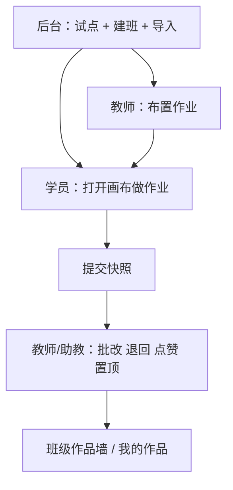
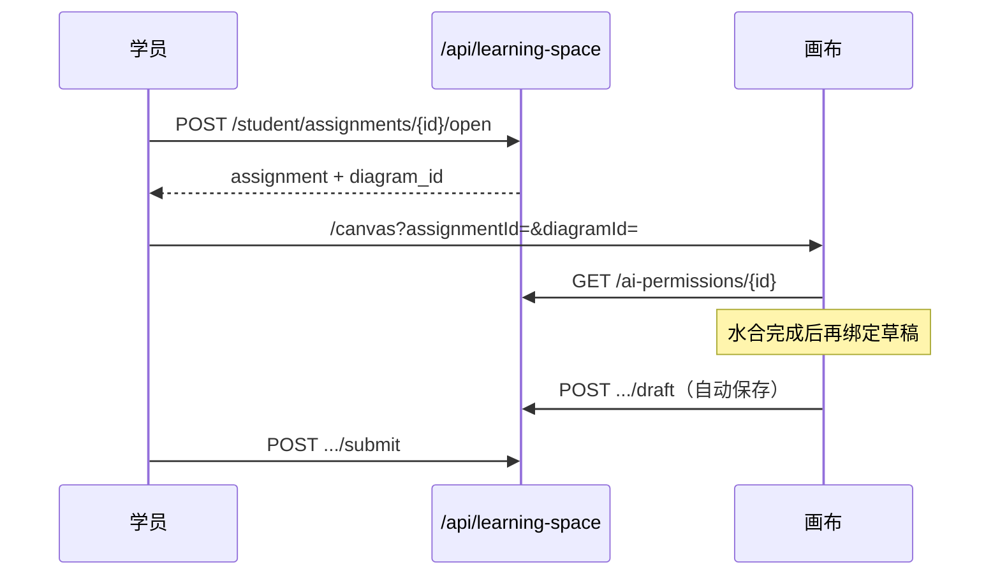

# 学习空间

学习空间是面向班级的图示作业系统：后台开通试点教师、建班、导入学生；教师布置作业、批改；学生（或培训班已有帐号）在画布上完成并提交。

与「迈特学习法」（`FEATURE_MATE_LEARNING`）无关。

**开关：** `FEATURE_STUDENT_LEARNING_SPACE`（默认开）。管理面板 → 功能；路由前缀 `/api/learning-space`（关闭时 404）。  
**入口：** 桌面 `/learning-space`，移动 `/m/learning-space`。  
**管理：** 管理面板 → 学习空间（子页：试点教师 / 班级管理）。超级管理员、教研员、专家、学校管理员拥有 `tab.learning_space.view` / `.edit`，可在其面板范围内建班（学校管理员仅本组织；专家仅其邀请的学校）。

---

## 角色一览

| 身份 | 如何产生 | 登录 | 做作业 | 批改 | 布置作业 |
|---|---|---|---|---|---|
| 班级学生 | 后台「导入学生」新建 `role=student` | 班级码 + 姓名 + 密码 | 是 | 否 | 否 |
| 导入学员 | 「导入已有帐号」写入 membership `learner` | 原手机号 / 邮箱 | 是 | 否 | 否 |
| 助教 | 编辑班级 → 添加助教，`assistant` | 原帐号 | 否（本班） | 是 | 否 |
| 任课教师 | 已启用试点，且为本班 `teacher_user_id` | 原帐号 | 否（除非另班学员） | 是 | 是 |
| 超管 / 教研员 / 专家 / 学校管理员 | 平台或学校帐号 | 原帐号 | — | 否（除非另是本班教师/助教） | 管理面板建班（`tab.learning_space.edit`）；教师端「创建班级」只是进该页 |

班级学生侧栏**只保留** MindGraph 与学习空间。开关短暂失效时，学生仍能进学习空间；其它身份需要开关打开。

同一人可以既是某班试点教师、又是另一班导入学员：顶栏切换「批改 / 做作业」。

---

## 后台

先开通试点，再创建班级并导入人员。

### 试点教师

搜索已注册帐号（学生除外，可按学校筛选）→「设为试点」。须已绑定组织。可启用 / 停用 / 删除。停用后该教师侧栏不再出现学习空间；班级数据仍保留。

### 班级

创建时自动生成班级码（4–16 位字母数字，避开易混字符）。可改名、改人数上限（默认 60）、改班级码、停用/开启、轮换班级码（旧码立即失效）。停用后该班学生无法用班级码登录，已登录会话会被踢出。

列表列：班级名、班级码、教师、人数、**作业次数**（已发布、不含草稿）、**提交份数**（状态为已提交）、状态。

人数 = 班级学生 + 导入学员；**助教不计入上限**。

### 导入学生（新建帐号）

每行一个姓名 → 预览初始密码（姓名拼音首字母 + `123`）→ 导入。

- 写入 `role=student`，`learning_class_id` 指向本班，组织 = 班级组织。
- 合成邮箱 `s{class}.{id}@student.learning.local`。
- `must_change_password=true`，首次进入必须改密才能打开作业。
- 同班姓名唯一。失败码：`empty_name`、`duplicate_name_in_file`、`duplicate_name_in_class`、`class_full`。

登录：`POST /api/auth/login/student`（班级码 + 姓名 + 密码 + 验证码）。

### 导入已有帐号（培训班）

不改 `users.role` 和组织。体验版导入后仍是体验版，侧栏出现学习空间，可完成作业。

每行一个手机号。匹配：原样 → 纯数字 → 唯一命中的后 11 位。

失败码：`not_found`、`classroom_student`、`is_class_teacher`、`already_member`、`already_assistant`、`class_full`。

### 助教

编辑班级用手机号添加。可批改，不能布置/删除作业。把本班学员设为助教会把 membership 从 `learner` 升为 `assistant`。

### 查看详情

花名册：ID、姓名、身份（班级学生 / 导入学员 / 助教）、所属组织/学校、手机号、初始密码（仅班级学生）、需改密。可重置班级学生密码、导出 CSV。

---

## 教师端

页签：工作台、作业、班级。

- **工作台：** 待批改、未交、进行中作业等摘要；布置入口（仅任课教师）。
- **作业：** 列表、筛选、打开提交墙、批改。
- **班级：** 花名册、班级码（给学生登录）。超管 / 教研员 / 专家 / 学校管理员若不是本班教师，这里可以是空的；「创建班级」进入管理面板建班，不走教师布置/批改接口。

### 布置作业

选班级、标题、要求说明、截止时间；可选迟交。截止日期显示在学员作业列表（`remind_24h` 仅保留字段，不发推送）。

附件：说明图片（最多 6 张）、模板图示（图库或 `.mg`）、额外参考图示。

**这份图示怎么用**（存在 `ai_permissions.template_role`）：

| 取值 | 学生打开时 |
|---|---|
| `scaffold` | 复制教师图为作答底稿（推荐学习单） |
| `reference` | 空白同类型图，教师图仅作参考 |
| `none` | 无教师模板，空白开画 |

可存为 **草稿**（学生看不到）或直接 **发布**。删除作业会级联删除提交，不可恢复。

### AI 权限

总开关 `ai_assist`。细项：主题生成、文件生成、网页生成、语音纪要、头脑风暴、对话改图、子图、节点解释、思维讲堂。未勾选的能力在作业画布上前后端都会拦截。

另可配置评价维度（如理解、应用、评价、创新），批改时按维度打分。

### 批改

提交状态：`draft`（进行中）→ `submitted`（已提交）→ `returned`（退回修改，学生可再交）。

可打分、评语、点赞、置顶、按人延期、退回。作品墙按置顶再按提交时间排序。助教与任课教师均可批改。

---

## 学员端

页签：首页、班级作业、我的作品。

1. 班级学生改密（如需要）。
2. 看作业要求（说明、图片、模板/参考图）。
3. **去做作业** → 画布 `?assignmentId=&diagramId=`。
4. 文件名锁定为 `{姓名}_{作业标题}`。
5. 自动保存后把草稿图绑定到该作业（再次进入打开**最新草稿**，不是旧图）。
6. 提交后教师可见；退回后可继续改再交。

已截止且未允许迟交时，不能再改/再交。

---

## 作业画布

画布顶栏「返回学习空间」。AI 受作业权限约束。顶栏作业文件名在草稿水合完成前不覆盖，避免绑到空图。

---

## 数据

迁移：`0121` 主表与学生字段 → `0122` 说明图片 → `0123` 批改字段 → `0124` membership → `0125` 按学校 RLS + 作业/提交/成员 `organization_id` → `0126` 管理面板按可读学校隔离（不含 panel legacy 全校可见）→ `0127` 学员/助教 JOIN 列限定到本表。

| 表 | 作用 |
|---|---|
| `learning_pilot_teachers` | 试点授权（每用户一条） |
| `learning_classes` | 班级、班级码、任课教师、人数上限 |
| `learning_assignments` | 作业、模板图 id、`ai_permissions`、`instruction_images` |
| `learning_submissions` | 每人每作业一条：草稿图、提交快照、批改 |
| `learning_class_memberships` | 已有帐号：`learner` / `assistant` |

班级学生只靠 `users.learning_class_id` + `role=student`，**不写** membership。  
班级状态：`active` / `archived`。作业：`draft` / `active` / `closed`。

RLS：按学校隔离。`rls_org_visible(organization_id)`，外加任课教师 / 班级学生 / membership 参与者回退（导入学员、助教的帐号组织可能与班级不同）。系统模式用于登录按班级码查找、后台唯一班级码等跨校操作。管理面板不再用「任意已登录 / 任意 panel」看完全库。

说明图片：字节进腾讯云 COS（`COS_LEARNING_SPACE_*`），库里只存 `lsimg:` 短引用。COS 未配置时才落本地 `static/learning_space/images/`。下载走 `/api/learning-space/instruction-images/{assignment_id}/{index}`（鉴权后 302 到 COS 预签名，不 302 到任意 http）。同一引用被多份作业共用时，删除一份不会删 COS 对象。`.mg` 仍解析为教师图库图示，不占服务器磁盘。建议 COS 对该前缀设生命周期，清理未绑定作业的上传。

---

## API（`/api/learning-space`）

**后台：** 搜索教师；试点 CRUD；班级 CRUD / 轮换码；导入学生与已有帐号（均含 preview）；花名册；重置班级学生密码。

**教师：** 班级列表（含助教班 + `can_publish`）；花名册；布置/删除作业；作业与提交列表；退回 / 延期 / 批改；提交预览；模板预览。

**学员：** 作业列表、班级作品墙、打开作业、绑定草稿、提交；班级学生改密。

**公共：** `GET /me/context`（`role`、`can_learn`、`can_review`、`can_publish`、`can_manage_classes`）。教师端由试点 / 助教决定；建班只走管理后台（`tab.learning_space.edit` + 面板 RLS）。教师 API 用登录用户 RLS，不提升为 system。`GET /ai-permissions/{id}`。

学员作业接口同时接受班级学生与 `learner`。布置/删除仅任课教师。列出作业与批改允许助教。

登录学生：`POST /api/auth/login/student`。

---

## 前端主要文件

| 路径 | 用途 |
|---|---|
| `pages/LearningSpacePage.vue` | 教师 / 学员壳 |
| `components/learningSpace/*` | 布置、要求、批改、状态、顶栏 |
| `components/admin/AdminLearningSpace*.vue` | 管理试点与班级 |
| `utils/learningSpaceApi.ts` | 前端 API |
| `stores/learningAssignmentCanvas.ts` | 作业画布上下文 |
| `composables/learningSpace/useLearningAiGate.ts` | 画布 AI 门禁 |
| `locales/messages/zh/learningSpace.ts` | 文案（中文为源） |

后端：`services/learning_space/`，`routers/features/learning_space/`，`models/domain/learning_space.py`。

---

## 约束

- 班级学生一人一班（`learning_class_id`），同班姓名唯一。
- 已有帐号用 membership，不改平台角色。
- 助教不占人数、不能布置作业。
- 本班任课教师不能再导入为学员。
- 草稿对学生不可见（猜 id 也 404）。
- 停用班级后：班级学生会话被踢；导入学员保留原帐号会话，但作业接口按班级状态拒绝。
- 重置班级学生密码会清缓存并踢掉已登录会话。
- 已提交作业冻结快照；画布 PUT 与自动保存不再改该图。
- 删除作业只删没有被其它作业引用的 COS 对象。
- 开关关闭：接口 404；班级学生仍显示学习空间入口。

---

## 上线检查

1. 迁移至少到 `0127`。
2. 确认 `FEATURE_STUDENT_LEARNING_SPACE` 为开（默认开；`.env` 里写 `False` 仍会关）。
3. 生产打开 `COS_LEARNING_SPACE_ENABLED` 与 COS 凭证，避免说明图落本地盘。
4. 设试点 → 建班 → 导入学生和/或已有帐号。
5. 教师发布作业（底稿 / 参考 / 附件 / AI）。
6. 班级学生：班级码登录 → 改密 → 做作业 → 提交。
7. 导入学员：原帐号登录 → 侧栏学习空间 → 完成作业。
8. 助教只能批改；班级列表作业数与提交数正确；详情里导入学员显示组织/学校。
9. 停用班级后班级学生无法继续登录；导入学员打不开该班作业。
