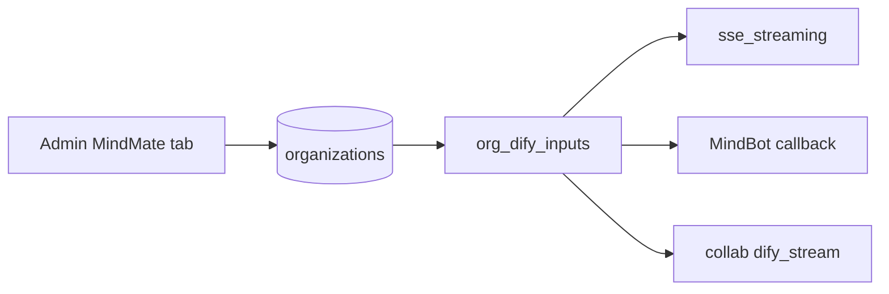

# MindMate — four Dify persona inputs

Implementation plan for the laptop. **Not done yet.** Conversation remap and API-key cutover stay parked.

Dify Start-node variables (already on the unified Chatflow): `mg_agent_name`, `mg_agent_alias`, `mg_school_name`, `mg_school_blurb`. MindGraph must send them on every chat from the school org row. Extra `inputs` keys are ignored by clone apps that have no Start vars.

## What we send

| Dify Start variable | Source | Not privatized (trial / incomplete 私有化) | Privatized |
|---------------------|--------|------------------------------------------|------------|
| `mg_agent_name` | `mindmate_agent_name` | `"MindMate"` | saved name |
| `mg_agent_alias` | new `mindmate_agent_alias` | `"MindMate"` | saved alias, else agent name |
| `mg_school_name` | `display_name` or `name` | always school name | same |
| `mg_school_blurb` | new `mindmate_school_blurb` | `""` unless set | saved blurb or `""` |

Gate: existing [`organization_is_privatized`](../../utils/auth/org_privatization.py) (name + avatar + dedicated Dify key). Do not send a leftover typed name when 私有化 is incomplete.

Keep existing `mg_dify_user` / `mg_conversation_id`. Overwrite reserved `mg_*` after MindBot `dify_inputs_json`.

## Schema + admin

Alembic **`0137`** after current head [`rev_0136`](../../alembic/versions/rev_0136_user_quick_access_prompt_specs.py) (re-check head before writing the revision):

- `organizations.mindmate_agent_alias` — `String(10)`, nullable
- `organizations.mindmate_school_blurb` — `Text`, nullable

Wire on [`Organization`](../../models/domain/auth.py). Save/list through [`organization_mindmate_branding.py`](../../routers/auth/admin/organization_mindmate_branding.py) (`apply_mindmate_branding_on_update`, `mindmate_branding_list_fields`). Extend the update gate in [`organizations.py`](../../routers/auth/admin/organizations.py) (today only name/avatar).

Admin: [`AdminSchoolDifySettings.vue`](../../frontend/src/components/admin/AdminSchoolDifySettings.vue) next to 智能体名称 — alias + blurb; school name stays on the General tab (`name` / `display_name`). i18n: add keys in [`zh/admin.ts`](../../frontend/src/locales/messages/zh/admin.ts) first, `en`, insert-only fill for other locales; `npm run i18n:check-banners` then `i18n:check-keys` from `frontend/`.

Redis org cache ([`redis_org_cache.py`](../../services/redis/cache/redis_org_cache.py)) must serialize the new columns if injection hydrates from cache; otherwise stream paths load the org row.

## Inject helper + three paths

New [`services/dify/org_dify_inputs.py`](../../services/dify/org_dify_inputs.py): `persona_inputs_for_org(org) -> dict[str, str]`.

Merge in:

- [`routers/api/sse_streaming.py`](../../routers/api/sse_streaming.py) — load org by `current_user.organization_id`
- [`services/mindbot/pipeline/callback.py`](../../services/mindbot/pipeline/callback.py) — load org by `cfg.organization_id`; merge after `dify_inputs_json`
- [`services/features/mindmate_collab/dify_stream.py`](../../services/features/mindmate_collab/dify_stream.py) — load org by `org_id`; extend `inputs={...}`

No frontend chat change. Browser must not be the source of these keys.

## Tests

- Helper: not privatized → both name/alias `MindMate`; privatized → saved fields; school name fallback `display_name` → `name`
- Branding update accepts alias/blurb length rules
- One stream/callback test that `inputs` contain the four keys

Do not run `npm run build`. Scoped backend tests while iterating; `./scripts/ci-local.sh` only when preparing a commit.

## Checklist

- [ ] Alembic 0137 + `Organization`: `mindmate_agent_alias` (≤10), `mindmate_school_blurb`
- [ ] Save/list/i18n + AdminSchoolDifySettings alias and blurb fields
- [ ] `org_dify_inputs` helper; inject sse_streaming, MindBot callback, collab stream
- [ ] Unit tests for defaults (MindMate vs privatized) and inputs merge

## Parked (not this slice)

- Dify Docker conversation remap (old `conversation_id`s onto the unified app **before** any mass key cutover)
- Mass `DIFY_API_KEY` / org key cutover
- Changing the privatization rule
- Editing Dify YAML in this repo
