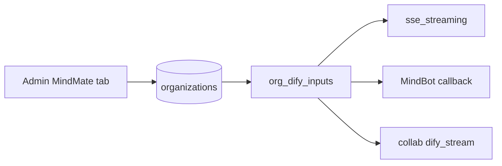

# MindMate — Dify persona inputs

School persona lives on the organization row. One shared Dify chatflow receives three Start variables on every chat. Conversation remap and API-key cutover stay parked.

Dify Start-node variables sent by MindGraph: `mg_agent_name`, `mg_agent_alias`, `mg_school_name`. Do not send `mg_school_blurb`. The two school clones (`远二启慧星`, `八一思行者`) only differ by `env.name` (formal name plus 小名) and `env.school`. `env.strategictools` and `env.visualizationtools` stay on the workflow. Extra `inputs` keys are ignored by clone apps that have no Start vars.

## What we send

| Dify Start variable | Source | Not privatized (trial / incomplete 私有化) | Privatized |
|---------------------|--------|------------------------------------------|------------|
| `mg_agent_name` | `mindmate_agent_name` | `"MindMate"` | saved name |
| `mg_agent_alias` | `mindmate_agent_alias` | `"MindMate"` | saved alias, else agent name |
| `mg_school_name` | `display_name` or `name` | always school name | same |

Gate: existing [`organization_is_privatized`](../../utils/auth/org_privatization.py) (name + avatar + dedicated Dify key). Do not send a leftover typed name when 私有化 is incomplete.

Keep existing `mg_dify_user` / `mg_conversation_id`. Overwrite the three persona keys after MindBot `dify_inputs_json` and after any browser `inputs`.

## Schema + admin

Alembic [`rev_0137`](../../alembic/versions/rev_0137_organization_mindmate_agent_alias.py):

- `organizations.mindmate_agent_alias` — `String(10)`, nullable

Wired on [`Organization`](../../models/domain/auth.py). Save/list through [`organization_mindmate_branding.py`](../../routers/auth/admin/organization_mindmate_branding.py). The update gate in [`organizations.py`](../../routers/auth/admin/organizations.py) includes the alias.

组织管理 → 编辑 → MindMate鉴权 ([`AdminSchoolDifySettings.vue`](../../frontend/src/components/admin/AdminSchoolDifySettings.vue)) sets 智能体名称, 智能体别名, 学校名称 (`display_name`), and the avatar. School name is the same column as 常规 tab 「更改组织名字」. i18n keys live in [`zh/admin.ts`](../../frontend/src/locales/messages/zh/admin.ts) and [`en/admin.ts`](../../frontend/src/locales/messages/en/admin.ts); other locales were filled from English.

Chat paths load the organization row. The Redis org cache ([`redis_org_cache.py`](../../services/redis/cache/redis_org_cache.py)) also stores the alias so a later cache read does not drop it. A hash written before that field existed is a cache miss and is reloaded. Persona injection does not use the cache, because the hash does not include Dify credentials required by the privatization gate.

## Inject helper

[`services/dify/org_dify_inputs.py`](../../services/dify/org_dify_inputs.py): `persona_inputs_for_org`, `apply_persona_inputs`, `apply_persona_inputs_for_organization_id`.

Merged after `mg_dify_user` / `mg_conversation_id` in:

- [`routers/api/sse_streaming.py`](../../routers/api/sse_streaming.py)
- [`services/mindbot/pipeline/callback.py`](../../services/mindbot/pipeline/callback.py)
- [`services/features/mindmate_collab/dify_stream.py`](../../services/features/mindmate_collab/dify_stream.py)

No frontend chat change. The browser is not the source of these keys.

## Checklist

- [x] Alembic 0137 + `Organization.mindmate_agent_alias` (≤10). No blurb column.
- [x] Save/list/i18n + MindMate鉴权 fields: agent name, alias, school name, avatar
- [x] `org_dify_inputs` helper; inject sse_streaming, MindBot callback, collab stream
- [x] Unit tests for defaults (MindMate vs privatized) and inputs merge

## Parked (not this slice)

- Dify Docker conversation remap (old `conversation_id`s onto the unified app **before** any mass key cutover)
- Mass `DIFY_API_KEY` / org key cutover
- Changing the privatization rule
- Editing Dify YAML in this repo
