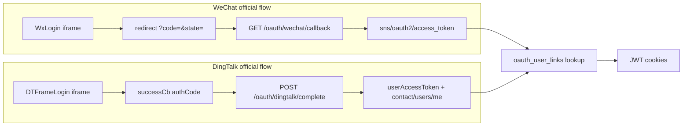

# OAuth QR login (WeChat + DingTalk)

MindGraph supports **WeChat Open Platform 网站应用** and **DingTalk OAuth 2.0 扫码登录** for end-user sign-in. This is separate from Gewe (admin WeChat bot) and from MindBot pair-code binding.

## Feature flag (off by default)

| Variable | Default | Purpose |
|----------|---------|---------|
| `FEATURE_OAUTH_LOGIN` | **`False`** | Master switch; when off, `/api/auth/oauth/*` is gated and the frontend hides all QR login / OAuth bind UI |
| `WECHAT_OAUTH_APP_ID` | *(empty)* | Global WeChat 网站应用 AppID — required only when feature is on |
| `WECHAT_OAUTH_APP_SECRET` | *(empty)* | Global WeChat AppSecret |

The public flags API exposes `feature_oauth_login` (defaults to `false` when unset). Set `FEATURE_OAUTH_LOGIN=True` in `.env` to enable platform-wide.

## Official API references

Cross-check implementation against these docs (do **not** use legacy DingTalk `oapi.dingtalk.com` / `ddLogin.js` 0.0.5):

| Provider | Official docs | MindGraph usage |
|----------|---------------|-----------------|
| WeChat 网站应用 | [网站应用微信登录](https://developers.weixin.qq.com/doc/oplatform/Website_App/WeChat_Login/Wechat_Login.html) | `wxLogin.js`, scope `snsapi_login`, callback `?code=&state=` |
| WeChat UnionID | [授权后接口 UnionID](https://developers.weixin.qq.com/doc/oplatform/Website_App/WeChat_Login/Authorized_Interface_Calling_UnionID.html) | Store `unionid` (fallback `openid`) in `oauth_user_links` |
| DingTalk OAuth 2.0 | [统一授权登录第三方网站](https://developers.dingtalk.com/document/app/use-dingtalk-account-to-log-on-to-third-party-websites-1) | `ddlogin.js` 0.21.0, `DTFrameLogin`, `prompt: "consent"` |
| DingTalk user token | [获取用户 token (userAccessToken)](https://open.dingtalk.com/document/development/obtain-user-token) | `POST api.dingtalk.com/v1.0/oauth2/userAccessToken` with `authCode` **immediately** |
| DingTalk profile | [获取用户通讯录个人信息](https://open.dingtalk.com/document/orgapp/tutorial-obtaining-user-personal-information) | `GET contact/users/me` → `unionId` |
| DingTalk corp scope | [获取登录用户的访问凭证](https://open.dingtalk.com/document/development/obtain-identity-credentials) | When `dingtalk_corp_id` set: scope `openid corpid`, validate `corpId` from token response |

### End-to-end flow (matches official embed + server exchange)

## Login behavior

- **Pre-linked users only** — scan succeeds at the identity provider but MindGraph returns `oauth_not_linked` until the user binds under **账户 → 账户绑定** (or an admin pre-links).
- **Login UI** — Login modal: 忘记密码 \| 验证码登录 \| **二维码登录** → `OAuthQrLoginModal` (hidden when `feature_oauth_login` is false).
- **Org context** — QR login requires a valid school **invitation code** (`?invite=` on `/auth` or the register form field).

## Account bindings (three providers)

| Provider | Mechanism | Purpose |
|----------|-----------|---------|
| MindBot | Pair-code (`DingTalkPairModal`) | Save diagrams to DingTalk via robot |
| WeChat | OAuth bind (`GET /oauth/wechat/bind/start`) | QR sign-in to MindGraph |
| DingTalk | OAuth bind (`POST /oauth/dingtalk/bind/complete`) | QR sign-in to MindGraph |

## Admin UI (组织管理)

Per-school toggles and **DingTalk AppKey / AppSecret / CorpId** live under **组织管理 → 编辑学校 → 其他设置** (General tab), not a separate tab. WeChat per-school is a toggle only (credentials are global in `.env`). Saving **其他设置** persists org fields and OAuth config together.

## Data model

- **`organization_oauth_configs`** — per org: WeChat toggle, DingTalk AppKey/Secret, optional `dingtalk_corp_id`.
- **`oauth_user_links`** — maps `(org_id, provider, external_id)` → `user_id`. Stores WeChat `unionid` and DingTalk `unionId`.

## API routes (`/api/auth/oauth`)

| Route | Auth | Purpose |
|-------|------|---------|
| `GET /providers?invite=` | Public | Enabled providers + public widget params |
| `GET /wechat/start`, `/wechat/callback` | Public / redirect | WeChat login |
| `GET /dingtalk/start`, `POST /dingtalk/complete` | Public | DingTalk login (prefer JS `authCode` POST) |
| `GET /links`, `DELETE /links/{provider}` | Session | Self-bind status / unbind |
| `GET /wechat/bind/start`, `/wechat/bind/callback` | Session | WeChat self-bind |
| `GET /dingtalk/bind/start`, `POST /dingtalk/bind/complete` | Session | DingTalk self-bind |

Admin: `GET/PUT /api/auth/admin/organizations/{id}/oauth-config`.

## Callback URLs

Configure in external consoles (DingTalk requires **exact** URL match):

- WeChat **授权回调域**: production domain only (e.g. `mindgraph.example.com`)
- WeChat redirect: `https://{domain}/api/auth/oauth/wechat/callback`
- DingTalk **钉钉登录与分享**: `https://{domain}/api/auth/oauth/dingtalk/callback`

## Security

- Redis OAuth `state` — 10 minute TTL, one-time use (matches WeChat `code` lifetime).
- DingTalk `authCode` — exchange immediately on receipt; no retry queue.
- When `dingtalk_corp_id` is set, validate `corpId` from the token response (`oauth_corp_mismatch` on mismatch).
- Production guard warns when OAuth is enabled without HTTPS `EXTERNAL_BASE_URL`.

## Operator checklist

### WeChat (MindGraph operator, once)

1. Register **网站应用** at [open.weixin.qq.com](https://open.weixin.qq.com) — see [Wechat_Login](https://developers.weixin.qq.com/doc/oplatform/Website_App/WeChat_Login/Wechat_Login.html).
2. Set **授权回调域** to your production domain.
3. Set `WECHAT_OAUTH_APP_ID` / `WECHAT_OAUTH_APP_SECRET` in `.env` and `FEATURE_OAUTH_LOGIN=True`.
4. Enable WeChat login per school: **组织管理 → 其他设置 → 扫码登录**.

### DingTalk (per school, with school IT)

1. Create **企业内部应用** with **登录第三方网站 / 扫码登录** — see [DingTalk OAuth doc](https://developers.dingtalk.com/document/app/use-dingtalk-account-to-log-on-to-third-party-websites-1).
2. In **钉钉登录与分享**, set redirect URL to the DingTalk callback above (**exact match**).
3. Apply **个人权限**: `permission-open_app_api_base`, `Contact.User.Read` (+ 个人手机号信息权限 if storing `mobile`).
4. Provide AppKey, AppSecret, optional CorpId to MindGraph admin.
5. Enter credentials in **组织管理 → 其他设置 → 扫码登录** and enable DingTalk login.

## Code ↔ official doc audit (verified in repo)

| Official requirement | Doc source | Code location | Status |
|---------------------|------------|---------------|--------|
| WxLogin + `snsapi_login` + `self_redirect` | [Wechat_Login](https://developers.weixin.qq.com/doc/oplatform/Website_App/WeChat_Login/Wechat_Login.html) | `useOAuthQrLogin.ts` (`wxLogin.js`, scope, stylelite) | Match |
| Callback `?code=&state=` | WeChat doc | `router.py` `wechat_oauth/callback` | Match |
| `GET sns/oauth2/access_token` | WeChat doc | `wechat_oauth_client.py` | Match |
| Store `unionid` (fallback `openid`) | [UnionID doc](https://developers.weixin.qq.com/doc/oplatform/Website_App/WeChat_Login/Authorized_Interface_Calling_UnionID.html) | `WechatOauthClient.resolve_external_id` | Match |
| `ddlogin.js` 0.21.0 + `DTFrameLogin` | [DingTalk tutorial](https://open.dingtalk.com/document/orgapp/tutorial-obtaining-user-personal-information) | `useOAuthQrLogin.ts` | Match |
| `prompt: "consent"` required | DingTalk OAuth doc | `useOAuthQrLogin.ts` | Match |
| JS callback returns `authCode` (not `code`) | DingTalk doc | `useOAuthQrLogin.ts` → POST `/dingtalk/complete` | Match |
| `POST …/oauth2/userAccessToken` body `{ clientId, clientSecret, code, grantType }` | [userAccessToken](https://open.dingtalk.com/document/development/obtain-user-token) | `dingtalk_oauth_client.py` | Match |
| `GET contact/users/me` + `x-acs-dingtalk-access-token` | DingTalk doc | `dingtalk_oauth_client.py` | Match |
| Store DingTalk `unionId` | DingTalk doc | `oauth_login_service.exchange_dingtalk_identity` | Match |
| Iframe embed `scope: openid` only (not `openid corpid`) | DingTalk tutorial | `oauth_login_service._dingtalk_scope_for_config` | Match (fixed) |
| No legacy `oapi.dingtalk.com` OAuth | — | OAuth module only uses `api.dingtalk.com` | Match |
| State TTL 10 min (WeChat code lifetime) | WeChat doc | `oauth_constants.OAUTH_STATE_TTL_SECONDS = 600` | Match |

Regression tests: `tests/test_oauth_official_alignment.py`, `tests/test_oauth_login.py`.

## Error handling and user notifications

Backend exposes stable `oauth_*` codes via redirects (`/auth?error=…`) and JSON `detail` on POST complete endpoints. Internal client codes (`wechat_exchange_failed`, etc.) are normalized in `normalize_oauth_error_code()` before reaching the client.

| Code | Meaning | Frontend toast |
|------|---------|----------------|
| `oauth_not_linked` | No bind for this WeChat/DingTalk identity | Warning — bind under Account linking |
| `oauth_external_taken` | Identity already linked to another user | Warning |
| `oauth_invalid_state` | Expired or invalid Redis state | Error — rescan |
| `oauth_corp_mismatch` | DingTalk corpId ≠ school config | Error |
| `oauth_exchange_failed` | Token/userinfo exchange failed | Error |
| `oauth_disabled` | Feature off or provider disabled | Error |

Frontend: `useOAuthRouteFeedback` in `App.vue` handles `/auth?error=…` (login) and `/?error=…` / `/?oauth_bind=wechat|dingtalk` (bind); `useOAuthQrLogin.ts` handles DingTalk JS POST and QR start failures. Shared mapping in `oauthLoginUi.ts`. Query params are stripped after toast.

**Note:** MindBot robot/media still uses `oapi.dingtalk.com` — that is a separate DingTalk OpenAPI feature, not OAuth QR login.

## Related docs

- MindBot pair binding: [`dingtalk_account_binding.md`](dingtalk_account_binding.md)
- Production deploy: [`production_security_deploy.md`](production_security_deploy.md)
