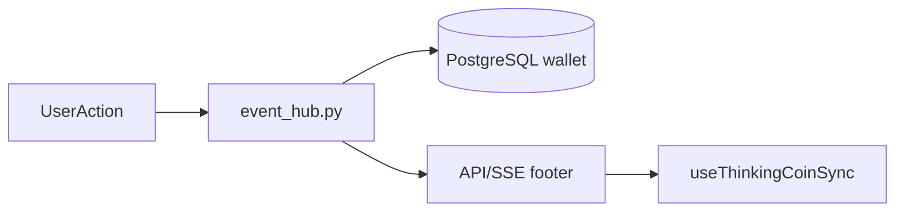

# Thinking Coins (思维币)

Production economy for **all members of trial-tier organizations** when `FEATURE_THINKING_COINS=true`.

## Eligibility

- Feature flag: `FEATURE_THINKING_COINS` (default off)
- User must belong to an organization (`organization_id` matches org)
- Org effective tier: trial (`SCHOOL_TIER_TRIAL`)
- Role-agnostic: teacher, school admin, platform roles, and other org members on trial all qualify

## Architecture



- **Awaited path:** LLM pre-flight, post-success debit, client-event earn when the HTTP/SSE response must include balance.
- **Async path:** structured mutation audit logs via `asyncio.create_task` (never blocks callers).

## Billing rules

| Request type | Default cost |
|--------------|--------------|
| mindmate | 6 |
| diagram_generation | 15 |
| autocomplete, node_palette, canvas_translate, voice_omni | 4 |

Multi-LLM batches (`stream_progressive`) debit **once** per user gesture using `thinking_coin_mode=batch_inner` on inner streams.

Canvas translate batch/stream endpoints assert once and settle once per action.

WebSocket Omni debits once per session when token usage was recorded.

## API footer schema

Mutating endpoints may include:

```json
{
  "thinking_coins": {
    "eligible": true,
    "balance": 142,
    "credited": 10,
    "debited": 0,
    "earn_events": [{"slug": "daily_diagram_export", "amount": 10}],
    "completed_slugs_today": ["daily_checkin"]
  }
}
```

Frontend: `applyThinkingCoinMutation()` in `frontend/src/composables/auth/useThinkingCoinSync.ts`.

## Deferred features

- **Referral** (`referral_register`): inactive until invite attribution exists.
- **Publish case** (`publish_case`): shown as coming soon; no moderation credit path yet.
- **custom_cta** admin tasks: rejected until a runtime handler exists.

## Rollout

1. Deploy with flag off.
2. Enable in staging; smoke earn/spend flows.
3. Enable production flag; monitor 402 rate and ledger errors.
