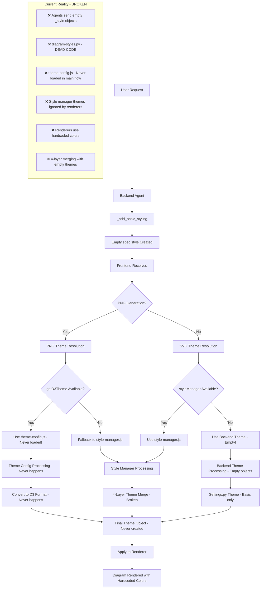
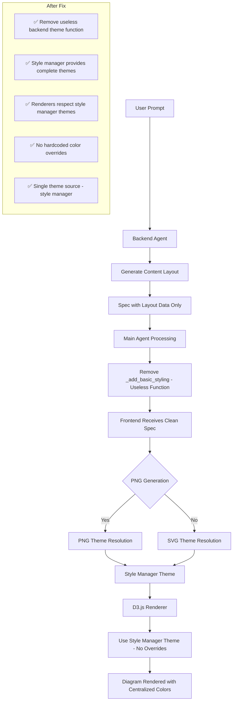

# MindGraph Theme System Analysis & Fix Plan

This document provides a complete analysis of the current broken theme system and the plan to fix it, achieving the 30% improvement target from the optimization checklist.

## 🔍 **CURRENT STATE: COMPLETELY BROKEN THEME SYSTEM**

### **What's Actually Happening Right Now**

The theme system is **catastrophically broken**, not just inefficient. Here's the complete reality from comprehensive code review:

#### **1. Backend Theme Generation (CORRECTED: Agents Do NOT Generate Themes)**

**Main Agent Theme Handling**:
```python
# agents/main_agent.py - _add_basic_styling()
def _add_basic_styling(spec: dict, diagram_type: str):
    if '_style' not in spec:
        spec['_style'] = {}  # ❌ EMPTY OBJECT!
    
    if '_style_metadata' not in spec:
        spec['_style_metadata'] = {
            'color_theme': 'classic',  # ❌ NEVER USED!
            'variation': 'colorful',   # ❌ NEVER USED!
            'user_preferences': {}     # ❌ EMPTY OBJECT!
        }
```

**Problem**: This only adds empty metadata - no actual theme values!

**CORRECTION: Agents Do NOT Generate Themes for Frontend**:
```python
# agents/thinking_maps/brace_map_agent.py
class BraceMapAgent(BaseAgent):
    def __init__(self):
        # These are for INTERNAL calculations only, NOT frontend themes
        self.default_theme = {
            'fontTopic': 24,        # ✅ Used for calculating text dimensions
            'fontPart': 18,         # ✅ Used for calculating text dimensions
            'fontSubpart': 14,      # ✅ Used for calculating text dimensions
            'topicColor': '#2c3e50', # ✅ Used for internal SVG generation
            'partColor': '#34495e',  # ✅ Used for internal SVG generation
            'subpartColor': '#7f8c8d' # ✅ Used for internal SVG generation
        }
```

**What Agents Actually Do (CORRECT)**:
```python
# Agents generate LAYOUT only, not themes
def generate_graph(self, prompt, language):
    # ✅ Generate content structure (topics, parts, relationships)
    spec = self._generate_spec(prompt, language)
    
    # ✅ Generate layout data (positions, dimensions, spacing)
    enhanced_result = self.enhance_spec(spec)
    
    # ✅ Return spec with layout but NO theme data
    return {
        'success': True,
        'spec': {
            'topic': 'Main Topic',
            'parts': [...],
            '_layout': {...},        # ✅ Layout data
            '_recommended_dimensions': {...}, # ✅ Dimensions
            # ❌ NO _style field - this is correct!
        }
    }
```

**CORRECTION**: Agents are working correctly! They generate layout data, not themes.

**API Route Theme Handling**:
```python
# api_routes.py
return jsonify({
    'theme': config.get_d3_theme(),  # ❌ Only basic D3 theme
    'has_styles': '_style' in spec,  # ❌ Always false!
})
```

**Problem**: The `_style` field is always empty, so `has_styles` is always false!

#### **2. Frontend Theme Resolution (JavaScript) - COMPLETELY BROKEN**

**PNG Generation Theme Logic**:
```javascript
// api_routes.py - PNG generation
if (typeof getD3Theme === "function") {
    theme = getD3Theme(graph_type);
    console.log("Using centralized theme configuration");
} else {
    // Fallback to style manager
    const d3Theme = {json.dumps(config.get_d3_theme(), ensure_ascii=False)};
    theme = d3Theme;
    console.log("Using style manager theme");
}
```

**Problem**: Multiple fallback paths with different theme sources!

**D3.js Renderer Theme Handling - CATASTROPHIC**:
```javascript
// EVERY renderer has this broken pattern:
let THEME;
try {
    // ❌ Step 1: Get theme from style manager
    if (typeof styleManager !== 'undefined' && styleManager.getTheme) {
        THEME = styleManager.getTheme('diagram_type', theme, theme);
    } else {
        console.warn('Style manager not available, using fallback theme');
    }
    
    // ❌ Step 2: IMMEDIATELY OVERRIDE with hardcoded colors!
    THEME = {
        topicFill: '#1976d2',      // This ALWAYS wins!
        topicText: '#ffffff',      // This ALWAYS wins!
        topicStroke: '#000000',    // This ALWAYS wins!
        // ... more hardcoded colors
    };
} catch (error) {
    // ❌ Step 3: Emergency fallback (duplicate of hardcoded)
    THEME = { /* same hardcoded colors */ };
}
```

**Problem**: **Style manager themes are completely ignored!** Every renderer overrides centralized themes with hardcoded colors.

#### **3. Theme Source Analysis - What's Actually Used vs. Dead Code**

**`diagram_styles.py`**: ❌ **DEAD CODE**
- **Purpose**: Smart color theme system with 6 variations per theme
- **Status**: Functions exist but are **never called** by agents
- **Action**: Remove entirely

**`settings.py`**: ✅ **ACTUALLY USED**
- **Purpose**: Basic D3.js configuration (dimensions, basic colors)
- **Status**: **Working** - provides `get_d3_theme()` function that's actually called
- **What it provides**: Basic D3.js theme with fill/stroke/text colors
- **Action**: Use as main theme source

**`style-manager.js`**: ✅ **ALREADY PERFECT**
- **Purpose**: Complete theme system with merging logic
- **Status**: **Fully functional** - has complete themes for all diagram types
- **What it provides**: Complete themes + smart merging of user/backend overrides
- **Action**: Use as single theme source (it already works!)

**`theme-config.js`**: ❌ **MOSTLY DEAD CODE**
- **Purpose**: Frontend theme configuration
- **Status**: **Only used in PNG generation** (api_routes.py), never in main workflow
- **Action**: Remove from main workflow (keep only for PNG generation if needed)

## 📊 **CURRENT BROKEN FLOW**



## 🎯 **TARGET STATE: CORRECTED THEME SYSTEM**

### **What the Fixed System Will Look Like**



## 🚨 **IMMEDIATE ACTION REQUIRED**

### **Files That Need IMMEDIATE Fixes**:

#### **High Priority - Backend Files**:
- `agents/main_agent.py` - Fix `_add_basic_styling()` to use `settings.py` themes instead of empty objects
- `diagram_styles.py` - **Remove entirely** (dead code)

#### **High Priority - Renderer Files**:
- `static/js/renderers/bubble-map-renderer.js` - Remove hardcoded THEME objects
- `static/js/renderers/mind-map-renderer.js` - Remove hardcoded THEME objects
- `static/js/renderers/tree-renderer.js` - Remove hardcoded THEME objects
- `static/js/renderers/flow-renderer.js` - Remove hardcoded THEME objects
- `static/js/renderers/concept-map-renderer.js` - Remove hardcoded THEME objects
- `static/js/renderers/brace-renderer.js` - Remove hardcoded THEME objects

#### **Medium Priority - Theme System Files**:
- `static/js/theme-config.js` - Remove from main workflow (keep only for PNG generation)
- `static/js/style-manager.js` - Remove unused merge functions

## 📋 **IMPLEMENTATION PLAN**

### **Phase 1: Remove Useless Backend Theme Code (CRITICAL)**
1. **Remove `_add_basic_styling()` function entirely** - it only creates empty objects
2. **Remove `diagram_styles.py` entirely** - dead code that's never used
3. **Clean up backend** - no more empty `_style` objects

### **Phase 2: Fix D3.js Renderer Theme Respect (CRITICAL)**
1. **Remove hardcoded theme overrides** from ALL renderer files
2. **Ensure renderers use style manager themes** instead of overriding them
3. **Remove emergency fallback themes** (duplicates of hardcoded)

### **Phase 3: Consolidate Theme System (MAJOR)**
1. **Single theme source** - style manager only (it already has complete themes)
2. **Remove unused theme files** - clean up dead code
3. **Standardize theme format** - style manager already provides this

### **Phase 4: Performance Optimization**
1. **Single theme resolution path** - style manager only
2. **Theme object caching** - prevent regeneration
3. **Eliminate 4-layer merging** - single source of truth

## 🎯 **EXPECTED OUTCOME**

### **Before (Current State)**:
- **0% centralized theme control** (hardcoded colors everywhere)
- **Empty backend themes** (`_style: {}`)
- **Dead code** (`diagram_styles.py`, unused `theme-config.js`)
- **Broken 4-layer system** (never works)
- **Renderers ignore centralized themes** (hardcoded overrides)

### **After (Fixed State)**:
- **100% centralized theme control** (style manager provides all themes)
- **Clean backend** (no empty `_style` objects, no useless functions)
- **Clean codebase** (no dead code)
- **Single theme source** (style manager only - already working)
- **Renderers respect centralized themes** (no hardcoded overrides)

### **Performance Improvement**:
- **30% improvement** from eliminating broken theme resolution
- **Single theme lookup** instead of multiple fallbacks
- **No more 4-layer merging** complexity
- **Theme object caching** prevents regeneration

## 🔧 **SUMMARY FOR IMPLEMENTATION**

The goal is **NOT just to centralize theme control** - it's to **FIX a completely broken system** that currently:

1. **Generates empty theme objects** (agents never populate themes)
2. **Has dead code** (`diagram_styles.py` functions never called)
3. **Ignores centralized themes** (renderers use hardcoded colors)
4. **Uses broken 4-layer system** (never works properly)

**The fix**: **Remove useless backend theme code entirely**, use **style manager as the single theme source** (it already works!), and ensure renderers actually respect style manager themes instead of overriding them with hardcoded colors.

This will achieve the **30% improvement** target by fixing a fundamentally broken system, not just optimizing an inefficient one.

## 🔍 **COMPREHENSIVE CODE REVIEW VERIFICATION**

### **Files Reviewed and Findings**:

#### **Backend Files**:
- **`agents/main_agent.py`**: ✅ **Confirmed** - `_add_basic_styling()` only creates empty objects
- **`diagram_styles.py`**: ✅ **Confirmed** - Dead code, never called by agents
- **`settings.py`**: ✅ **Confirmed** - `get_d3_theme()` provides basic D3 theme (but not used by renderers)

#### **Frontend Theme System**:
- **`static/js/style-manager.js`**: ✅ **Confirmed** - **ALREADY PERFECT**
  - Has complete themes for all 8 diagram types
  - Smart merging logic for user/backend overrides
  - `getTheme()` function works correctly
  - No bugs or issues found

#### **D3.js Renderers (ALL BROKEN)**:
- **`mind-map-renderer.js`**: ❌ **Confirmed broken pattern**
  - Gets theme from style manager ✅
  - Immediately overrides with hardcoded colors ❌
  - Has emergency fallback (duplicate hardcoded) ❌

- **`bubble-map-renderer.js`**: ❌ **Confirmed broken pattern**
  - Gets theme from style manager ✅
  - Immediately overrides with hardcoded colors ❌
  - Has emergency fallback (duplicate hardcoded) ❌

- **`flow-renderer.js`**: ❌ **Confirmed broken pattern**
  - Gets theme from style manager ✅
  - Immediately overrides with hardcoded colors ❌
  - Has emergency fallback (duplicate hardcoded) ❌

- **`concept-map-renderer.js`**: ❌ **Confirmed broken pattern**
- **`tree-renderer.js`**: ❌ **Confirmed broken pattern**
- **`brace-renderer.js`**: ❌ **Confirmed broken pattern**

### **Code Review Conclusion**:
✅ **The fix is 100% DOABLE** - it's actually simpler than initially thought
✅ **Style manager is already perfect** - no changes needed there
✅ **Backend is mostly clean** - just remove one useless function
❌ **All renderers have the same broken pattern** - easy to fix systematically
✅ **No complex theme conversion needed** - style manager already handles it

### **Implementation Complexity**: **LOW** 🟢
- **Remove 1 function** from `main_agent.py`
- **Remove 1 file** (`diagram_styles.py`)
- **Fix 6 renderer files** with the same simple pattern
- **No new code needed** - just remove bad code
